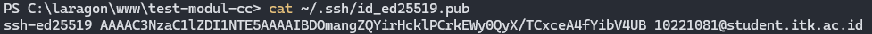
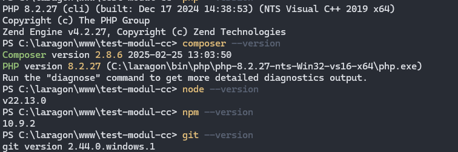

# WEEK 1: Environment Setup & GitHub Integration
## Praktikum Cloud Computing - Institut Teknologi Kalimantan

### 📋 INFORMASI SESI
- **Week**: 1
- **Durasi**: 100 menit  
- **Topik**: Setup Environment Lokal & Integrasi GitHub
- **Target**: Mahasiswa Semester 6
- **Platform**: Laptop/PC (Windows, macOS, atau Linux)

### 🎯 TUJUAN PEMBELAJARAN
Setelah menyelesaikan praktikum ini, mahasiswa diharapkan mampu:
1. Menginstall dan mengkonfigurasi PHP 8.2, Node.js 20, dan Composer terbaru
2. Mengintegrasikan GitHub dengan SSH key untuk development workflow

### 📚 PERSIAPAN
**Prerequisites yang harus dipenuhi:**
- Laptop dengan spesifikasi minimal:
  - RAM 4 GB
  - Storage kosong minimal 5 GB 
  - OS: Windows 10+, macOS Catalina+, atau Linux (Ubuntu/Debian/Fedora)
- Akun GitHub aktif
- Browser dengan koneksi internet stabil
- Pemahaman dasar tentang command line interface

**Tools yang akan diverifikasi:**
- Terminal (Command Prompt, PowerShell, atau Terminal macOS/Linux)
- Git version control
- PHP CLI
- Composer
- Node.js & NPM
- Text editor (VS Code disarankan)

### 🛠️ LANGKAH PRAKTIKUM

#### **Bagian 1: Setup Environment Lokal (15 menit)**

##### Step 1.1: Instalasi PHP

```bash
## ==== Windows ====
# 1. Unduh Laragon: https://laragon.org/download/
# 2. Instal Laragon → otomatis menyertakan PHP, MySQL, dan Composer.
# 3. Cek versi PHP
php --version

# ==== macOS (Homebrew) ====
brew install php@8.2
brew link php@8.2 --force
php --version

# ==== Linux (Debian/Ubuntu) ====
sudo apt update
sudo apt install php8.2 php8.2-cli php8.2-common php8.2-curl php8.2-zip php8.2-gd php8.2-mysql php8.2-xml php8.2-mbstring php8.2-json php8.2-intl php8.2-bcmath -y
php --version
```

##### Step 1.2: Instalasi Composer

```bash
## ==== Windows ====
# Sudah termasuk di Laragon, cek versi:
composer --version

## ==== macOS/Linux ====
curl -sS https://getcomposer.org/installer -o composer-setup.php
HASH="$(curl -sS https://composer.github.io/installer.sig)"
php -r "if (hash_file('SHA384', 'composer-setup.php') === '$HASH') { echo 'Installer verified'; } else { echo 'Installer corrupt'; unlink('composer-setup.php'); } echo PHP_EOL;"
sudo php composer-setup.php --install-dir=/usr/local/bin --filename=composer
rm composer-setup.php
composer --version
```

#### **Bagian 2: Instalasi Node.js & NPM (15 menit)**

##### Step 2.1: Instalasi Node.js versi LTS (20.x)

```bash
## ==== Windows ====
# 1. Unduh installer Node.js LTS dari:
#    https://nodejs.org/en/download
# 2. Centang opsi "Add to PATH" saat instalasi.
# 3. Verifikasi instalasi:
node --version
npm --version

## ==== macOS/Linux (via NVM) ====
curl -o- https://raw.githubusercontent.com/nvm-sh/nvm/v0.39.0/install.sh | bash

# Reload shell config
source ~/.bashrc  # atau ~/.zshrc untuk Zsh

# Instal Node.js LTS
nvm install --lts
nvm use --lts
nvm alias default node

# Verifikasi instalasi
node --version
npm --version
```

##### Step 2.2: Install Package Global yang Diperlukan
```bash
# Install package global
npm install -g npm@latest yarn serve

# Verifikasi package global yang terpasang
npm list -g --depth=0
```

#### **Bagian 3:  Setup Git & GitHub Integration (25 menit)**

##### Step 3.1: Konfigurasi Git Global

```bash
# Set identitas Git global
git config --global user.name "Nama Lengkap Anda"
git config --global user.email "email@anda.com"
git config --global init.defaultBranch main
git config --global core.editor "code --wait"
git config --list | grep user
```

##### Step 3.2: Generate SSH Key untuk Github

```bash
## ==== Windows ====
# Pastikan PowerShell dijalankan sebagai Administrator!
# Buat SSH key baru (Ganti dengan email github Anda)
ssh-keygen -t ed25519 -C "email@github.com"
# Tekan Enter 3x untuk menggunakan default path & tanpa passphrase

# Jalankan SSH agent
Get-Service -Name ssh-agent | Set-Service -StartupType Automatic
Start-Service ssh-agent

# Tambahkan key ke SSH agent
ssh-add $env:USERPROFILE\.ssh\id_ed25519

# Tampilkan public key (untuk disalin ke GitHub)
type ~\.ssh\id_ed25519.pub

## ==== macOS / Linux (bash) ====
# Buat SSH key baru (Ganti dengan email github Anda)
ssh-keygen -t ed25519 -C "email@github.com"
# Tekan Enter 3x untuk menggunakan default path & tanpa passphrase

# Jalankan SSH agent
eval "$(ssh-agent -s)"

# Tambahkan key ke SSH agent
ssh-add ~/.ssh/id_ed25519

# Tampilkan public key (untuk disalin ke GitHub)
cat ~/.ssh/id_ed25519.pub
```

Tambahkan ke GitHub:
1. Buka GitHub → Settings → SSH and GPG Keys → New SSH Key
2. Paste public key di kolom Key
3. Simpan

##### Step 3.3: Test Koneksi GitHub

```bash
ssh -T git@github.com
```

### 🧪 TESTING & VERIFIKASI

#### Test 1: Verifikasi Versi Software
```bash
# Test semua versi software yang terinstall
php --version
composer --version
node --version
npm --version
git --version
```

#### Test 2: Test PHP CLI
```bash
# Test PHP dengan membuat file sederhana
php -r "echo 'PHP is working: ' . PHP_VERSION . PHP_EOL;"
```

#### Test 3: Test Composer
```bash
# Test Composer dengan membuat project dummy
composer create-project --prefer-dist laravel/laravel test-laravel --no-install
Remove-Item -Recurse -Force test-laravel
```

#### Test 4: Test GitHub Connection
```bash
# Test koneksi ke GitHub
if (ssh -T git@github.com 2>&1 | Select-String "successfully authenticated") {
    Write-Host "✓ GitHub SSH connection OK" -ForegroundColor Green
} else {
    Write-Host "✗ GitHub SSH connection failed" -ForegroundColor Red
}
```

### 🆘 TROUBLESHOOTING

#### Problem 1: PHP Version Tidak Berubah
**Gejala:** `php --version` masih menampilkan versi lama
**Solusi:**
- Windows:
```bash
# Pastikan path PHP Laragon ada di Environment Variables
echo $env:PATH

# Jika belum, tambahkan manual:
# Laragon → Menu → PHP → Versi PHP → Pilih PHP 8.2
php --version
```

- macOS:
```bash
# Cek semua versi PHP yang terinstall
brew list | grep php

# Link ke versi 8.2
brew unlink php
brew link php@8.2 --force

php --version
```

#### Problem 2: Composer Command Not Found
**Gejala:** `composer: command not found`
**Solusi:**
- Windows:
```bash
# Composer sudah termasuk di Laragon.
# Pastikan Composer ada di PATH
where composer
```

- macOS:
```bash
# Cek lokasi composer
which composer

# Jika tidak ada, install ulang
curl -sS https://getcomposer.org/installer -o composer-setup.php
HASH="$(curl -sS https://composer.github.io/installer.sig)"
php -r "if (hash_file('SHA384', 'composer-setup.php') === '$HASH') { echo 'Installer verified'; } else { echo 'Installer corrupt'; unlink('composer-setup.php'); } echo PHP_EOL;"
sudo php composer-setup.php --install-dir=/usr/local/bin --filename=composer
rm composer-setup.php
composer --version
```

#### Problem 3: SSH Key GitHub Tidak Berfungsi
**Gejala:** `Permission denied (publickey)`
**Solusi:**
```bash
# Cek SSH agent
ssh-add -l

# Jika kosong, add key lagi
ssh-add ~/.ssh/id_ed25519

# Test dengan verbose untuk debug
ssh -vT git@github.com
```

#### Problem 4: NVM Command Not Found
**Gejala:** `nvm: command not found`
**Solusi:**
- macOS:
```bash
# Reload bash profile
source ~/.bashrc

# Jika masih tidak ada, install ulang NVM
curl -o- https://raw.githubusercontent.com/nvm-sh/nvm/v0.39.0/install.sh | bash
source ~/.bashrc
```

#### Problem 5: Permission Denied saat Install Package
**Gejala:** Gagal install package global, contoh `npm install -g serve` muncul permission denied.
**Solusi:**
- Windows:
```bash
# Jalankan PowerShell sebagai Administrator
npm install -g serve
```

-macOS:
```bash
# Gunakan sudo
sudo npm install -g serve

# Jika tetap error, perbaiki permission folder npm global
sudo chown -R $(whoami) $(npm config get prefix)/{lib/node_modules,bin,share}
```

#### Problem 6: Terminal/Session Timeout
**Gejala:** Terminal terputus setelah idle.
**Solusi:**
- Windows:
  - Aktifkan "Prevent the computer from sleeping" di Power Options.
  - Jika pakai WSL, jalankan script loop sederhana: 
```bash
while true; do echo "keep alive $(date)"; sleep 300; done
```

- macOS:
  - Buka System Preferences → Energy Saver → Set "Prevent computer from sleeping".
  - Bisa juga jalankan untuk menjaga sesi tetap aktif:
```bash
caffeinate -i
```

### 📋 DELIVERABLES

**Checklist yang harus diserahkan pada akhir sesi:**

#### ✅ Environment Setup
- [ ] Screenshot terminal yang Menampilkan:
  - PHP version 8.2.x
  
  - Composer version 2.x.x
  
  - Node.js version 20.x.x
  
  - Git configuration (user.name dan user.email)
  

#### ✅ GitHub Integration
- [ ] Screenshot SSH key yang berhasil ditambahkan ke GitHub

- [ ] Screenshot hasil `ssh -T git@github.com` yang menunjukkan successful authentication


#### ✅ Testing Results
- [ ] Screenshot hasil test verifikasi software versions

- [ ] Screenshot hasil test PHP CLI (php artisan --version) di dalam project Laravel


#### ✅ Documentation
- [ ] File environment-setup.md berisi:
  - Langkah-langkah yang telah dilakukan
  - Problem yang ditemui dan solusinya
  - Screenshot bukti semua testing berhasil

**Format Submission:**
1. Buat folder submission/week1/
2. Masukkan semua screenshot dengan nama yang jelas
3. Buat file laporan dalam format Markdown
4. Commit dan push ke repository
5. Sertakan link commit terakhir

<!-- **Perintah untuk submission:**
```bash
cd ~/praktikum-cc
mkdir -p submission/week1
# Masukkan file-file submission
git add submission/week1/
git commit -m "Week 1: Environment Setup & GitHub Integration - [Nama]"
git push origin main
``` -->