# WEEK 1: Environment Setup & GitHub Integration
## Praktikum Cloud Computing - Institut Teknologi Kalimantan

### 📋 INFORMASI SESI
- **Week**: 1
- **Durasi**: 100 menit  
- **Topik**: Setup Environment Cloud Shell & Integrasi GitHub
- **Target**: Mahasiswa Semester 6
- **Platform**: Google Cloud Shell
- **Repository**: github.com/aidilsaputrakirsan/praktikum-cc

### 🎯 TUJUAN PEMBELAJARAN
Setelah menyelesaikan praktikum ini, mahasiswa diharapkan mampu:
1. Mengakses dan mengonfigurasi Google Cloud Shell dengan optimal
2. Menginstall dan mengkonfigurasi PHP 8.2, Node.js 20, dan Composer terbaru
3. Mengintegrasikan GitHub dengan SSH key untuk development workflow
4. Mengkonfigurasi environment variables dan alias untuk produktivitas
5. Memahami persistent storage dan customize environment di Cloud Shell
6. Melakukan clone repository dan setup awal project structure

### 📚 PERSIAPAN
**Prerequisites yang harus dipenuhi:**
- Akun Google Cloud Platform (GCP) aktif
- Akun GitHub aktif
- Browser dengan koneksi internet stabil
- Pemahaman dasar tentang command line interface

**Tools yang akan diverifikasi:**
- Google Cloud Shell
- Git version control
- SSH key generation
- Text editor (nano/vim)

### 🛠️ LANGKAH PRAKTIKUM

#### **Bagian 1: Akses dan Konfigurasi Google Cloud Shell (15 menit)**

##### Step 1.1: Membuka Google Cloud Shell
```bash
# Akses Google Cloud Console
# URL: https://console.cloud.google.com

# Klik tombol "Activate Cloud Shell" di pojok kanan atas
# Tunggu hingga terminal Cloud Shell aktif (biasanya 30-60 detik)
```

##### Step 1.2: Verifikasi Environment Default
```bash
# Periksa informasi sistem operasi
cat /etc/os-release
# Output expected: Debian GNU/Linux 11 (bullseye)

# Cek direktori home dan storage
pwd
# Output: /home/[username]

# Lihat disk space yang tersedia (5GB persistent)
df -h $HOME
# Pastikan ada ruang kosong minimal 4GB untuk project
```

##### Step 1.3: Update Sistem dan Package Manager
```bash
# Update daftar package (sebagai user biasa, bukan root)
sudo apt-get update

# Upgrade package yang sudah terinstall
sudo apt-get upgrade -y

# Install utility tambahan yang diperlukan
sudo apt-get install -y curl wget unzip tree htop
```

#### **Bagian 2: Konfigurasi PHP Environment (20 menit)**

##### Step 2.1: Verifikasi dan Update PHP
```bash
# Cek versi PHP yang terinstall
php --version
# Jika masih PHP 7.x, kita perlu upgrade ke PHP 8.2

# Install PHP 8.2 dan ekstensi yang diperlukan untuk Laravel
sudo apt-get install -y ca-certificates apt-transport-https software-properties-common wget curl lsb-release
wget -O /etc/apt/trusted.gpg.d/php.gpg https://packages.sury.org/php/apt.gpg
echo "deb https://packages.sury.org/php/ $(lsb_release -sc) main" | sudo tee /etc/apt/sources.list.d/php.list
sudo apt-get update

# Install PHP 8.2 dengan ekstensi Laravel
sudo apt-get install -y php8.2 \
  php8.2-cli \
  php8.2-common \
  php8.2-curl \
  php8.2-zip \
  php8.2-gd \
  php8.2-mysql \
  php8.2-xml \
  php8.2-mbstring \
  php8.2-json \
  php8.2-intl \
  php8.2-bcmath
```

##### Step 2.2: Set PHP 8.2 sebagai Default
```bash
# Update alternatives untuk menggunakan PHP 8.2
sudo update-alternatives --install /usr/bin/php php /usr/bin/php8.2 1
sudo update-alternatives --set php /usr/bin/php8.2

# Verifikasi PHP versi terbaru
php --version
# Output expected: PHP 8.2.x

# Test PHP CLI dengan command sederhana
php -r "echo 'PHP is working: ' . PHP_VERSION . PHP_EOL;"
```

##### Step 2.3: Install dan Konfigurasi Composer
```bash
# Download Composer installer
curl -sS https://getcomposer.org/installer -o composer-setup.php

# Verifikasi installer dengan hash
HASH="$(curl -sS https://composer.github.io/installer.sig)"
php -r "if (hash_file('SHA384', 'composer-setup.php') === '$HASH') { echo 'Installer verified'; } else { echo 'Installer corrupt'; unlink('composer-setup.php'); } echo PHP_EOL;"

# Install Composer secara global
sudo php composer-setup.php --install-dir=/usr/local/bin --filename=composer

# Hapus file installer
rm composer-setup.php

# Verifikasi instalasi Composer
composer --version
# Output expected: Composer version 2.x.x
```

#### **Bagian 3: Konfigurasi Node.js Environment (15 menit)**

##### Step 3.1: Update Node.js dengan NVM
```bash
# Cek versi Node.js yang terinstall
node --version

# Jika versi kurang dari 18, update menggunakan NVM
# Install NVM (Node Version Manager)
curl -o- https://raw.githubusercontent.com/nvm-sh/nvm/v0.39.0/install.sh | bash

# Reload bash profile untuk mengenali nvm command
source ~/.bashrc

# Install Node.js versi LTS terbaru (v20)
nvm install --lts
nvm use --lts

# Set sebagai default
nvm alias default node

# Verifikasi instalasi
node --version
# Output expected: v20.x.x

npm --version
# Output expected: 10.x.x
```

##### Step 3.2: Install Package Global yang Diperlukan
```bash
# Install package global untuk development
npm install -g npm@latest  # Update npm ke versi terbaru
npm install -g yarn        # Alternative package manager
npm install -g serve       # Static file server untuk testing

# Verifikasi instalasi package global
npm list -g --depth=0
```

#### **Bagian 4: Setup Git dan GitHub Integration (25 menit)**

##### Step 4.1: Konfigurasi Git Global
```bash
# Set konfigurasi Git global (ganti dengan data Anda)
git config --global user.name "Nama Lengkap Anda"
git config --global user.email "email@anda.com"

# Set default branch name ke 'main'
git config --global init.defaultBranch main

# Set default editor (opsional)
git config --global core.editor nano

# Verifikasi konfigurasi
git config --list | grep user
```

##### Step 4.2: Generate SSH Key untuk GitHub
```bash
# Generate SSH key pair (ganti email dengan email GitHub Anda)
ssh-keygen -t ed25519 -C "email@github.com"
# Tekan Enter 3x untuk menggunakan default location dan tanpa passphrase

# Start SSH agent
eval "$(ssh-agent -s)"

# Add SSH private key ke SSH agent
ssh-add ~/.ssh/id_ed25519

# Tampilkan public key untuk dicopy ke GitHub
cat ~/.ssh/id_ed25519.pub
# Copy seluruh output untuk step selanjutnya
```

##### Step 4.3: Menambahkan SSH Key ke GitHub
```bash
# Instruksi manual (dilakukan di browser):
# 1. Buka GitHub.com, login ke akun Anda
# 2. Klik profile picture → Settings
# 3. Klik "SSH and GPG keys" di sidebar kiri
# 4. Klik "New SSH key"
# 5. Title: "Cloud Shell - [Tanggal Hari Ini]"
# 6. Paste SSH public key yang sudah dicopy
# 7. Klik "Add SSH key"

# Test koneksi SSH ke GitHub
ssh -T git@github.com
# Jika berhasil, akan muncul: "Hi [username]! You've successfully authenticated"
```

##### Step 4.4: Clone Repository Praktikum
```bash
# Pindah ke direktori home
cd ~

# Clone repository praktikum menggunakan SSH
git clone git@github.com:aidilsaputrakirsan/praktikum-cc.git

# Masuk ke direktori repository
cd praktikum-cc

# Verifikasi remote repository
git remote -v

# Cek status repository
git status
```

#### **Bagian 5: Kustomisasi Environment Cloud Shell (15 menit)**

##### Step 5.1: Membuat Custom Environment Script
```bash
# Buat file customize environment
nano ~/.customize_environment
```

**Isi file ~/.customize_environment:**
```bash
#!/bin/bash
# Customize script untuk Cloud Shell - Praktikum CC ITK

# Update dan install packages
apt-get update
apt-get install -y tree htop

# Create project directories
mkdir -p $HOME/workspace
mkdir -p $HOME/projects
mkdir -p $HOME/scripts

echo "Cloud Shell customization completed!"
```

```bash
# Buat file executable
chmod +x ~/.customize_environment
```

##### Step 5.2: Setup Bashrc Aliases dan Functions
```bash
# Backup bashrc original
cp ~/.bashrc ~/.bashrc.backup

# Tambahkan aliases dan functions
cat >> ~/.bashrc << 'EOF'

# === Praktikum Cloud Computing Aliases ===
alias ll='ls -alF'
alias la='ls -A'
alias l='ls -CF'
alias ..='cd ..'
alias ...='cd ../..'
alias h='history'
alias c='clear'

# Laravel aliases
alias pa='php artisan'
alias pas='php artisan serve'
alias pam='php artisan migrate'
alias pams='php artisan migrate:status'
alias pac='php artisan cache:clear'

# Composer aliases
alias ci='composer install'
alias cu='composer update'
alias cr='composer require'

# NPM aliases
alias ni='npm install'
alias nr='npm run'
alias nd='npm run dev'
alias nb='npm run build'

# Git aliases
alias gs='git status'
alias ga='git add'
alias gc='git commit'
alias gp='git push'
alias gl='git log --oneline'
alias gb='git branch'

# Project shortcuts
alias gotoproj='cd ~/praktikum-cc'
alias workspace='cd ~/workspace'

# Functions
function mkcd() {
    mkdir -p "$1" && cd "$1"
}

function gitacp() {
    git add .
    git commit -m "$1"
    git push
}

echo "Environment loaded - Praktikum Cloud Computing ITK"
EOF

# Reload bashrc
source ~/.bashrc
```

##### Step 5.3: Setup Project Directory Structure
```bash
# Masuk ke direktori praktikum
gotoproj

# Buat struktur direktori untuk semua week
mkdir -p week1/{setup,docs}
mkdir -p week2/{laravel-app,configs}
mkdir -p week3/{database,migrations}
mkdir -p week4/{crud-create-read,api}
mkdir -p week5/{crud-update-delete,frontend}
mkdir -p week6/{api,authentication}
mkdir -p week7/{auth,authorization}
mkdir -p week8/{production,deployment}

# Buat file README untuk week 1
cat > week1/README.md << 'EOF'
# Week 1: Environment Setup & GitHub Integration

## Completed Tasks
- [x] Google Cloud Shell setup
- [x] PHP 8.2 installation
- [x] Node.js 20 installation  
- [x] Composer installation
- [x] Git configuration
- [x] SSH key generation
- [x] GitHub integration
- [x] Environment customization

## Next Steps
- Week 2: Laravel installation
- Week 2: Tailwind CSS setup
EOF

# Lihat struktur yang telah dibuat
tree -L 3
```

### 🧪 TESTING & VERIFIKASI

#### Test 1: Verifikasi Versi Software
```bash
# Test semua versi software yang terinstall
echo "=== Software Version Check ==="
echo "PHP Version: $(php --version | head -n 1)"
echo "Composer Version: $(composer --version)"
echo "Node.js Version: $(node --version)"
echo "NPM Version: $(npm --version)"
echo "Git Version: $(git --version)"
```

#### Test 2: Test PHP CLI
```bash
# Test PHP dengan membuat file sederhana
cat > /tmp/test-php.php << 'EOF'
<?php
echo "PHP Test berhasil!\n";
echo "Version: " . PHP_VERSION . "\n";
echo "Extensions loaded: " . count(get_loaded_extensions()) . "\n";

// Test ekstensi yang diperlukan Laravel
$required_extensions = ['curl', 'zip', 'gd', 'mysql', 'xml', 'mbstring', 'json'];
echo "Checking Laravel required extensions:\n";
foreach ($required_extensions as $ext) {
    echo "- $ext: " . (extension_loaded($ext) ? "✓" : "✗") . "\n";
}
EOF

php /tmp/test-php.php
```

#### Test 3: Test Composer
```bash
# Test Composer dengan membuat project dummy
cd /tmp
composer create-project --prefer-dist laravel/laravel test-laravel --no-install
cd test-laravel
echo "Composer test berhasil! Laravel project created."
rm -rf /tmp/test-laravel
```

#### Test 4: Test GitHub Connection
```bash
# Test koneksi ke GitHub
ssh -T git@github.com 2>&1 | grep -q "successfully authenticated" && echo "✓ GitHub SSH connection OK" || echo "✗ GitHub SSH connection failed"

# Test git operations
cd ~/praktikum-cc
git status
echo "Git repository status OK"
```

#### Test 5: Test Environment Aliases
```bash
# Test aliases yang telah dibuat
echo "Testing aliases:"
alias pa &>/dev/null && echo "✓ PHP Artisan alias OK" || echo "✗ pa alias not found"
alias ci &>/dev/null && echo "✓ Composer install alias OK" || echo "✗ ci alias not found"
alias gs &>/dev/null && echo "✓ Git status alias OK" || echo "✗ gs alias not found"
```

### 🆘 TROUBLESHOOTING

#### Problem 1: PHP Version Tidak Berubah
**Gejala:** `php --version` masih menampilkan versi lama
**Solusi:**
```bash
# Cek semua versi PHP yang terinstall
ls /usr/bin/php*

# Set ulang alternatives
sudo update-alternatives --config php
# Pilih PHP 8.2

# Atau set manual
sudo ln -sf /usr/bin/php8.2 /usr/bin/php
```

#### Problem 2: Composer Command Not Found
**Gejala:** `composer: command not found`
**Solusi:**
```bash
# Cek lokasi composer
which composer

# Jika tidak ada, install ulang
curl -sS https://getcomposer.org/installer | php
sudo mv composer.phar /usr/local/bin/composer
sudo chmod +x /usr/local/bin/composer
```

#### Problem 3: SSH Key GitHub Tidak Berfungsi
**Gejala:** `Permission denied (publickey)`
**Solusi:**
```bash
# Cek SSH agent
ssh-add -l

# Jika kosong, add key lagi
ssh-add ~/.ssh/id_ed25519

# Test dengan verbose untuk debug
ssh -vT git@github.com
```

#### Problem 4: NVM Command Not Found
**Gejala:** `nvm: command not found`
**Solusi:**
```bash
# Reload bash profile
source ~/.bashrc

# Jika masih tidak ada, install ulang NVM
curl -o- https://raw.githubusercontent.com/nvm-sh/nvm/v0.39.0/install.sh | bash
source ~/.bashrc
```

#### Problem 5: Permission Denied saat Install Package
**Gejala:** `Permission denied` saat apt-get install
**Solusi:**
```bash
# Pastikan menggunakan sudo
sudo apt-get update
sudo apt-get install [package-name]

# Jika masih error, cek user permissions
whoami
groups
```

#### Problem 6: Cloud Shell Timeout
**Gejala:** Session terputus saat sedang bekerja
**Solusi:**
```bash
# Aktifkan web preview untuk keep-alive
python3 -m http.server 8080 &

# Atau buat script keep-alive
while true; do
    echo "keeping alive $(date)"
    sleep 300
done &
```

### 📋 DELIVERABLES

**Checklist yang harus diserahkan pada akhir sesi:**

#### ✅ Environment Setup
- [ ] Screenshot Google Cloud Shell terminal yang Menampilkan:
  - PHP version 8.2.x
  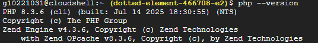
  - Composer version 2.x.x
  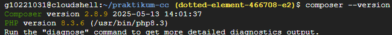
  - Node.js version 20.x.x
  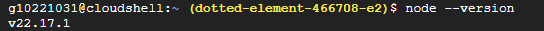
  - Git configuration (user.name dan user.email)
  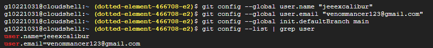

#### ✅ GitHub Integration
- [ ] Screenshot SSH key yang berhasil ditambahkan ke GitHub
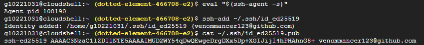
- [ ] Screenshot hasil `ssh -T git@github.com` yang menunjukkan successful authentication
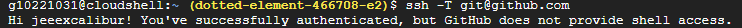
- [ ] Screenshot repository praktikum-cc yang berhasil di-clone
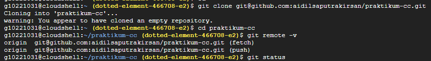
#### ✅ Project Structure 
- [ ] Screenshot hasil `tree` command yang menampilkan struktur direktori week1-week8 pada praktikum-cc
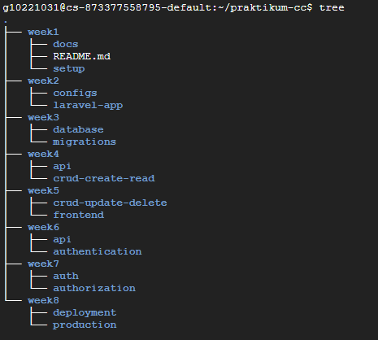
- [ ] File week1/README.md yang berisi completed tasks
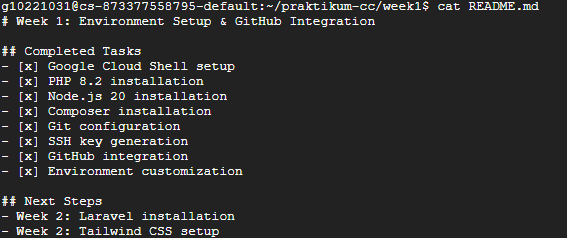
#### ✅ Testing Results
- [ ] Screenshot hasil test verifikasi software versions
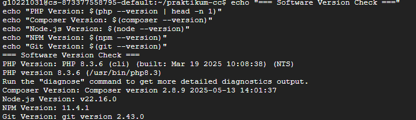
- [ ] Screenshot hasil test PHP CLI dengan ekstensi Laravel
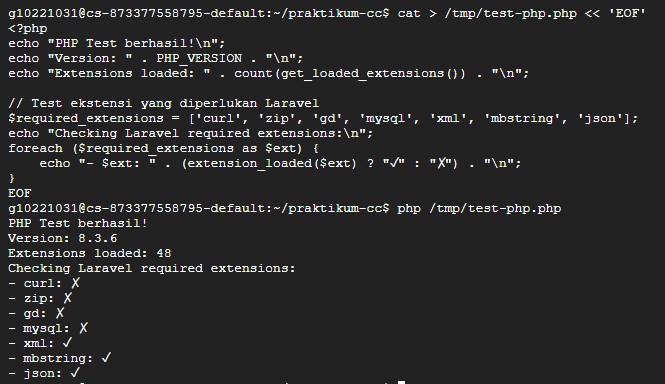
- [ ] Screenshot hasil test aliases yang berfungsi
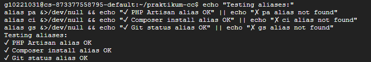

#### ✅ Documentation
- [ ] File environment-setup.md berisi:
  - Langkah-langkah yang telah dilakukan
  - Problem yang ditemui dan solusinya
  - Screenshot bukti semua testing berhasil

**Format Submission:**
1. Buat folder submission/week1/
2. Masukkan semua screenshot dengan nama yang jelas
3. Buat file laporan dalam format Markdown
4. Commit dan push ke repository
5. Sertakan link commit terakhir

**Perintah untuk submission:**
```bash
cd ~/praktikum-cc
mkdir -p submission/week1
# Masukkan file-file submission
git add submission/week1/
git commit -m "Week 1: Environment Setup & GitHub Integration - [Nama]"
git push origin main
```