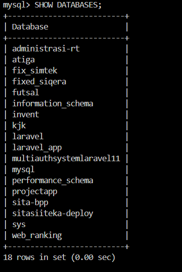
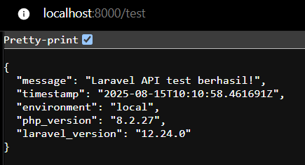

# WEEK 2: Laravel Installation & Tailwind CSS Setup
## Praktikum Cloud Computing - Institut Teknologi Kalimantan

### 📋 INFORMASI SESI
- **Week**: 2
- **Durasi**: 100 menit  
- **Topik**: Instalasi Laravel Framework & Setup Tailwind CSS
- **Target**: Mahasiswa Semester 6
- **Platform**: Laptop/PC (Windows, macOS, atau Linux)

### 🎯 TUJUAN PEMBELAJARAN
Setelah menyelesaikan praktikum ini, mahasiswa diharapkan mampu:
1. Menginstall Laravel framework versi terbaru menggunakan Composer
2. Mengkonfigurasi database MySQL di Cloud Shell environment
3. Memahami struktur direktori dan file konfigurasi Laravel
4. Menginstall dan mengkonfigurasi Tailwind CSS dengan Laravel
5. Membuat dan mengkustomisasi layout template dengan Tailwind CSS
6. Menjalankan development server dan melakukan testing dasar
7. Memahami Laravel Artisan commands dan workflow development

### 📚 PERSIAPAN
**Prerequisites yang harus dipenuhi:**
- Week 1 telah selesai dengan sempurna
- PHP 8.2, Composer, dan Node.js sudah terinstall
- Git dan GitHub integration sudah berfungsi

**Verifikasi Environment:**
```bash
# Pastikan semua tools tersedia
php --version    # PHP 8.2.x
composer --version  # Composer 2.x.x
node --version   # Node.js 20.x.x
npm --version    # npm 10.x.x
```

### 🛠️ LANGKAH PRAKTIKUM

#### **Bagian 1: Setup Database MySQL (20 menit)**

##### Step 1.1: Pastikan MySQL Berjalan
```bash
# Laragon: MySQL otomatis start saat Laragon dijalankan.
# XAMPP: Pastikan MySQL diaktifkan lewat Control Panel XAMPP.
# Cek versi MySQL (opsional):

mysql --version
```

##### Step 1.2: Login ke MySQL
```bash
# Untuk Laragon:
mysql -u root -p
# Tekan ENTER jika tidak ada password (default Laragon kosong)

# Untuk XAMPP default:
mysql -u root
```

##### Step 1.3: Membuat Database dan User untuk Laravel
**Di dalam MySQL console, jalankan commands berikut:**
```sql
-- Membuat database untuk Laravel
CREATE DATABASE laravel_app CHARACTER SET utf8mb4 COLLATE utf8mb4_unicode_ci;

-- Membuat user khusus Laravel (gunakan password sesuai kebutuhan)
CREATE USER 'laravel_user'@'localhost' IDENTIFIED BY 'Praktikum123!';

-- Memberikan privilege penuh
GRANT ALL PRIVILEGES ON laravel_app.* TO 'laravel_user'@'localhost';

-- Terapkan perubahan
FLUSH PRIVILEGES;

-- Verifikasi
SHOW DATABASES;
SELECT User, Host FROM mysql.user WHERE User = 'laravel_user';

-- Keluar dari MySQL
EXIT;
```

##### Step 1.4: Test Koneksi Database
```bash
# Test koneksi dengan user laravel_user
mysql -u laravel_user -p laravel_app
# Masukkan password: Praktikum123!

# Jika cara sebelumnya tidak bisa, coba gunakan ini 
mysql -u laravel_user -p --protocol=TCP laravel_app
# Masukkan password: Praktikum123!

# Jika berhasil login, jalankan test query
SHOW TABLES;
# Output: Empty set (karena belum ada tables)

# Exit dari MySQL
EXIT;
```

#### **Bagian 2: Instalasi Laravel Framework (25 menit)**

##### Step 2.1: Membuat Project Laravel Baru
```bash
# Masuk ke direktori jika menggunakan Laragon
cd C:\laragon\www

# Atau jika menggunakan XAMPP
cd C:\xampp\htdocs

# Install Laravel menggunakan Composer create-project
composer create-project laravel/laravel laravel-app

# Masuk ke direktori project Laravel
cd laravel-app

# Verifikasi struktur direktori Laravel
tree
# Pastikan ada direktori: app, bootstrap, config, database, public, resources, routes, storage, tests, vendor
```

##### Step 2.2: Konfigurasi Environment Laravel
```bash
# Generate application key
php artisan key:generate
```

**Update konfigurasi database di file .env:**
```bash
# === Database Configuration ===
DB_CONNECTION=mysql
DB_HOST=127.0.0.1
DB_PORT=3306
DB_DATABASE=laravel_app
DB_USERNAME=laravel_user
DB_PASSWORD=Praktikum123!

# === Application Configuration ===
APP_NAME="Praktikum CC ITK"
APP_ENV=local
APP_DEBUG=true
APP_URL=http://localhost:8000

# === Cache Configuration ===
CACHE_DRIVER=file
FILESYSTEM_DISK=local
QUEUE_CONNECTION=sync
SESSION_DRIVER=file
SESSION_LIFETIME=120
```

##### Step 2.3: Test Konfigurasi Database Laravel
```bash
# Test koneksi database dengan Artisan command
php artisan migrate:status

# Jika ERROR Migration table not found artinya koneksi berhasil dan jalankan migration default Laravel
php artisan migrate

# Verifikasi tables sudah dibuat di database
mysql -u laravel_user -p laravel_app -e "SHOW TABLES;" 
# Atau jika error bisa menggunakan 
mysql -u laravel_user --password=Praktikum123! --protocol=TCP laravel_app -e "SHOW TABLES;"
# Output harus menampilkan tables: failed_jobs, migrations, password_reset_tokens, personal_access_tokens, users

# Create storage symbolic link untuk file uploads
php artisan storage:link

# Verify storage link created
dir public/storage
```

##### Step 2.4: Menjalankan Server Laravel
```bash
# Jalankan Laravel development server
php artisan serve --host=0.0.0.0 --port=8000
# Server akan berjalan di background

# Dalam terminal terpisah, test server response
curl -I localhost:8000
# Expected response: HTTP/1.1 200 OK

# Stop server dengan Ctrl+C

# Buka browser dan akses
http://localhost:8000
```


#### **Bagian 3: Instalasi dan Konfigurasi Tailwind CSS (30 menit)**

##### Step 3.1: Install Tailwind CSS via NPM
```bash
# Pastikan berada di direktori laravel-app
cd laravel-app

# Install dependencies Node.js yang sudah ada
npm install

# Install Tailwind CSS dan dependencies
npm install -D tailwindcss@3.4.1 postcss autoprefixer @tailwindcss/forms

# Generate file konfigurasi Tailwind
npx tailwindcss init -p

# Verifikasi file konfigurasi telah dibuat
ls tailwind.config.js postcss.config.js
```

##### Step 3.2: Konfigurasi Tailwind CSS

**Update Isi file tailwind.config.js:**
```javascript
/** @type {import('tailwindcss').Config} */
export default {
  content: [
    "./resources/**/*.blade.php",
    "./resources/**/*.js",
    "./resources/**/*.vue",
  ],
  theme: {
    extend: {
      // Custom colors untuk branding ITK
      colors: {
        primary: {
          50: '#eff6ff',
          500: '#3b82f6',
          600: '#2563eb',
          700: '#1d4ed8',
        },
        secondary: {
          50: '#f0f9ff',
          500: '#0ea5e9',
          600: '#0284c7',
        }
      },
      // Custom font family
      fontFamily: {
        sans: ['Inter', 'ui-sans-serif', 'system-ui'],
      },
    },
  },
  plugins: [
    require('@tailwindcss/forms'),
  ],
}
```

##### Step 3.3: Setup CSS Files untuk Tailwind

**Update Isi file resources/css/app.css:**
```css
/* Import Tailwind CSS directives */
@tailwind base;
@tailwind components;
@tailwind utilities;

/* Custom base styles */
@layer base {
    html {
        font-family: 'Inter', system-ui, sans-serif;
    }
    
    body {
        @apply bg-gray-50 text-gray-900;
    }
}

/* Custom component classes */
@layer components {
    .btn-primary {
        @apply bg-primary-600 hover:bg-primary-700 text-white font-medium py-2 px-4 rounded-lg transition duration-200;
    }
    
    .btn-secondary {
        @apply bg-gray-200 hover:bg-gray-300 text-gray-800 font-medium py-2 px-4 rounded-lg transition duration-200;
    }
    
    .card {
        @apply bg-white rounded-xl shadow-sm border border-gray-200 p-6;
    }
    
    .input-field {
        @apply border border-gray-300 rounded-lg px-3 py-2 focus:ring-2 focus:ring-primary-500 focus:border-primary-500;
    }
}

/* Custom utility classes */
@layer utilities {
    .text-gradient {
        background: linear-gradient(135deg, #667eea 0%, #764ba2 100%);
        background-clip: text;
        -webkit-background-clip: text;
        -webkit-text-fill-color: transparent;
    }
}
```

##### Step 3.4: Update Vite Configuration

**Update Isi file vite.config.js:**
```javascript
import { defineConfig } from 'vite';
import laravel from 'laravel-vite-plugin';

export default defineConfig({
    plugins: [
        laravel({
            input: [
                'resources/css/app.css',
                'resources/js/app.js'
            ],
            refresh: true,
        }),
    ],
    // Konfigurasi untuk Cloud Shell development
    server: {
        host: '0.0.0.0',
        port: 5173,
        hmr: {
            host: 'localhost',
        },
    },
});
```

#### **Bagian 4: Membuat Layout dan Template (20 menit)**

##### Step 4.1: Membuat Layout Master dengan Tailwind CSS

**Isi file resources/views/layouts/app.blade.php:**
```html
<!DOCTYPE html>
<html lang="{{ str_replace('_', '-', app()->getLocale()) }}">
<head>
    <meta charset="utf-8">
    <meta name="viewport" content="width=device-width, initial-scale=1">
    <meta name="csrf-token" content="{{ csrf_token() }}">

    <title>{{ config('app.name', 'Laravel') }} - @yield('title', 'Home')</title>

    <!-- Fonts -->
    <link rel="preconnect" href="https://fonts.bunny.net">
    <link href="https://fonts.bunny.net/css?family=inter:400,500,600&display=swap" rel="stylesheet" />

    <!-- Scripts dan Styles -->
    @vite(['resources/css/app.css', 'resources/js/app.js'])
</head>
<body class="font-sans antialiased bg-gray-50">
    <!-- Navigation Bar -->
    <nav class="bg-white shadow-sm border-b border-gray-200">
        <div class="max-w-7xl mx-auto px-4 sm:px-6 lg:px-8">
            <div class="flex justify-between h-16">
                <div class="flex items-center">
                    <!-- Logo -->
                    <div class="flex-shrink-0">
                        <h1 class="text-2xl font-bold text-gradient">
                            {{ config('app.name') }}
                        </h1>
                    </div>
                    
                    <!-- Navigation Links -->
                    <div class="hidden md:ml-10 md:flex md:space-x-8">
                        <a href="{{ route('home') }}" class="text-gray-900 hover:text-primary-600 px-3 py-2 text-sm font-medium transition">
                            Home
                        </a>
                        <a href="#" class="text-gray-500 hover:text-primary-600 px-3 py-2 text-sm font-medium transition">
                            About
                        </a>
                        <a href="#" class="text-gray-500 hover:text-primary-600 px-3 py-2 text-sm font-medium transition">
                            Contact
                        </a>
                    </div>
                </div>
                
                <!-- Right Side -->
                <div class="flex items-center space-x-4">
                    <button class="btn-primary">
                        Get Started
                    </button>
                </div>
            </div>
        </div>
    </nav>

    <!-- Page Header -->
    @hasSection('header')
        <header class="bg-white shadow-sm">
            <div class="max-w-7xl mx-auto py-6 px-4 sm:px-6 lg:px-8">
                @yield('header')
            </div>
        </header>
    @endif

    <!-- Main Content -->
    <main class="py-8">
        <div class="max-w-7xl mx-auto px-4 sm:px-6 lg:px-8">
            <!-- Alert Messages -->
            @if(session('success'))
                <div class="mb-6 bg-green-50 border border-green-200 text-green-700 px-4 py-3 rounded-lg" role="alert">
                    {{ session('success') }}
                </div>
            @endif
            
            @if(session('error'))
                <div class="mb-6 bg-red-50 border border-red-200 text-red-700 px-4 py-3 rounded-lg" role="alert">
                    {{ session('error') }}
                </div>
            @endif

            <!-- Page Content -->
            @yield('content')
        </div>
    </main>

    <!-- Footer -->
    <footer class="bg-white border-t border-gray-200 mt-12">
        <div class="max-w-7xl mx-auto py-6 px-4 sm:px-6 lg:px-8">
            <div class="text-center text-gray-500 text-sm">
                © {{ date('Y') }} Praktikum Cloud Computing - Institut Teknologi Kalimantan
            </div>
        </div>
    </footer>
</body>
</html>
```

##### Step 4.2: Membuat Home Page dengan Tailwind CSS

**Update Isi file resources/views/welcome.blade.php:**
```html
@extends('layouts.app')

@section('title', 'Welcome')

@section('header')
    <h1 class="text-3xl font-bold text-gray-900">
        Welcome to Laravel with Tailwind CSS
    </h1>
    <p class="mt-2 text-gray-600">
        Praktikum Cloud Computing - Week 2
    </p>
@endsection

@section('content')
<div class="space-y-8">
    <!-- Hero Section -->
    <div class="card text-center">
        <div class="mb-6">
            <h2 class="text-4xl font-bold text-gradient mb-4">
                Laravel + Tailwind CSS
            </h2>
            <p class="text-xl text-gray-600 max-w-2xl mx-auto">
                Selamat datang di aplikasi Laravel dengan Tailwind CSS yang telah berhasil dikonfigurasi 
                di Google Cloud Shell environment.
            </p>
        </div>
        
        <div class="flex flex-col sm:flex-row gap-4 justify-center items-center">
            <button class="btn-primary">
                Explore Features
            </button>
            <button class="btn-secondary">
                View Documentation
            </button>
        </div>
    </div>

    <!-- Features Grid -->
    <div class="grid md:grid-cols-3 gap-6">
        <!-- Laravel Feature -->
        <div class="card">
            <div class="mb-4">
                <div class="w-12 h-12 bg-red-100 rounded-lg flex items-center justify-center">
                    <svg class="w-6 h-6 text-red-600" fill="currentColor" viewBox="0 0 24 24">
                        <path d="M23.642 5.43a.364.364 0 0 1 .014.1v5.149c0 .135-.073.26-.189.326l-4.323 2.49v4.934a.378.378 0 0 1-.188.326L9.93 23.949a.316.316 0 0 1-.066.02c-.018.006-.037.009-.056.009-.019 0-.038-.003-.056-.009a.317.317 0 0 1-.066-.02l-9.026-5.194A.378.378 0 0 1 .467 18.43v-5.149c0-.135.073-.26.189-.326l4.323-2.49V5.531A.378.378 0 0 1 5.167 5.205L14.193.01a.378.378 0 0 1 .122-.01c.041 0 .082.007.122.01l9.026 5.194a.378.378 0 0 1 .179.236zM9.746 22.607l8.253-4.746v-4.65l-4.323 2.49a.378.378 0 0 1-.189.051.378.378 0 0 1-.189-.051l-3.552-2.044v8.95zm-8.925-9.924v8.95l8.253-4.746v-8.95l-8.253 4.746z"/>
                    </svg>
                </div>
            </div>
            <h3 class="text-xl font-semibold text-gray-900 mb-2">Laravel Framework</h3>
            <p class="text-gray-600">
                PHP framework yang powerful dengan fitur lengkap untuk rapid application development.
            </p>
        </div>

        <!-- Tailwind CSS Feature -->
        <div class="card">
            <div class="mb-4">
                <div class="w-12 h-12 bg-blue-100 rounded-lg flex items-center justify-center">
                    <svg class="w-6 h-6 text-blue-600" fill="currentColor" viewBox="0 0 24 24">
                        <path d="M12.001,4.8c-3.2,0-5.2,1.6-6,4.8c1.2-1.6,2.6-2.2,4.2-1.8c0.913,0.228,1.565,0.89,2.288,1.624 C13.666,10.618,15.027,12,18.001,12c3.2,0,5.2-1.6,6-4.8c-1.2,1.6-2.6,2.2-4.2,1.8c-0.913-0.228-1.565-0.89-2.288-1.624 C16.337,6.182,14.976,4.8,12.001,4.8z M6.001,12c-3.2,0-5.2,1.6-6,4.8c1.2-1.6,2.6-2.2,4.2-1.8c0.913,0.228,1.565,0.89,2.288,1.624 C7.666,17.818,9.027,19.2,12.001,19.2c3.2,0,5.2-1.6,6-4.8c-1.2,1.6-2.6,2.2-4.2,1.8c-0.913-0.228-1.565-0.89-2.288-1.624 C10.337,13.382,8.976,12,6.001,12z"/>
                    </svg>
                </div>
            </div>
            <h3 class="text-xl font-semibold text-gray-900 mb-2">Tailwind CSS</h3>
            <p class="text-gray-600">
                Utility-first CSS framework untuk membangun interface yang modern dan responsive.
            </p>
        </div>

        <!-- Cloud Shell Feature -->
        <div class="card">
            <div class="mb-4">
                <div class="w-12 h-12 bg-green-100 rounded-lg flex items-center justify-center">
                    <svg class="w-6 h-6 text-green-600" fill="currentColor" viewBox="0 0 24 24">
                        <path d="M19.35 10.04A7.49 7.49 0 0 0 12 4C9.11 4 6.6 5.64 5.35 8.04A5.994 5.994 0 0 0 0 14c0 3.31 2.69 6 6 6h13c2.76 0 5-2.24 5-5 0-2.64-2.05-4.78-4.65-4.96z"/>
                    </svg>
                </div>
            </div>
            <h3 class="text-xl font-semibold text-gray-900 mb-2">Google Cloud Shell</h3>
            <p class="text-gray-600">
                Development environment di cloud yang sudah dikonfigurasi dengan semua tools yang diperlukan.
            </p>
        </div>
    </div>

    <!-- System Information -->
    <div class="card">
        <h3 class="text-xl font-semibold text-gray-900 mb-4">System Information</h3>
        <div class="grid md:grid-cols-2 gap-4">
            <div>
                <h4 class="font-medium text-gray-700 mb-2">Environment</h4>
                <ul class="space-y-1 text-sm text-gray-600">
                    <li><span class="font-medium">Laravel Version:</span> {{ app()->version() }}</li>
                    <li><span class="font-medium">PHP Version:</span> {{ PHP_VERSION }}</li>
                    <li><span class="font-medium">Environment:</span> {{ app()->environment() }}</li>
                    <li><span class="font-medium">Debug Mode:</span> {{ config('app.debug') ? 'Enabled' : 'Disabled' }}</li>
                </ul>
            </div>
            <div>
                <h4 class="font-medium text-gray-700 mb-2">Database</h4>
                <ul class="space-y-1 text-sm text-gray-600">
                    <li><span class="font-medium">Connection:</span> {{ config('database.default') }}</li>
                    <li><span class="font-medium">Database:</span> {{ config('database.connections.mysql.database') }}</li>
                    <li><span class="font-medium">Host:</span> {{ config('database.connections.mysql.host') }}</li>
                    <li><span class="font-medium">Port:</span> {{ config('database.connections.mysql.port') }}</li>
                </ul>
            </div>
        </div>
    </div>
</div>
@endsection
```

##### Step 4.3: Update Routes untuk Home Page

**Update Isi file routes/web.php:**
```php
<?php

use Illuminate\Support\Facades\Route;

/*
|--------------------------------------------------------------------------
| Web Routes - Praktikum Cloud Computing ITK
|--------------------------------------------------------------------------
|
| Konfigurasi routes untuk aplikasi web Laravel dengan Tailwind CSS
| Routes ini akan digunakan untuk navigasi antar halaman dalam aplikasi
|
*/

// Route untuk halaman utama (home page)
Route::get('/', function () {
    return view('welcome');
})->name('home');

// Route untuk testing purposes - bisa dihapus nanti
Route::get('/test', function () {
    return response()->json([
        'message' => 'Laravel API test berhasil!',
        'timestamp' => now()->toISOString(),
        'environment' => app()->environment(),
        'php_version' => PHP_VERSION,
        'laravel_version' => app()->version()
    ]);
})->name('test');
```

#### **Bagian 5: Build dan Testing Application (15 menit)**

##### Step 5.1: Build Assets dengan Vite
```bash
# Install dependencies NPM jika belum
npm install

# Build assets untuk development
npm run dev
# Perintah ini akan compile CSS dan JS, biarkan running di background

# Dalam terminal baru, build assets untuk production testing
npm run build

# Verifikasi build files sudah dibuat
dir public/build
```

##### Step 5.2: Menjalankan Laravel Development Server
```bash
# Dalam terminal baru, jalankan Laravel server
cd laravel-app
php artisan serve --host=0.0.0.0 --port=8000

# Server akan berjalan di background
# Akses melalui Browser pada port 8000
http://localhost:8000
```

##### Step 5.3: Testing Aplikasi
```bash
# Test 1: Homepage response
(iwr http://localhost:8000).Content -match "<title>.*</title>"; $matches[0]
# Expected: <title>Praktikum CC ITK - Welcome</title>

# Test 2: API test endpoint  
iwr http://localhost:8000/test | ConvertFrom-Json
# Expected: JSON response dengan system information

# Test 3: CSS compilation check
(iwr http://localhost:8000).Content -match "text-gray-900"
# Should return some results if Tailwind is loaded

# Test 4: Database connection
php artisan migrate:status
# Should show migration status without errors
```

### 🧪 TESTING & VERIFIKASI

#### Test 1: Laravel Installation Verification
```bash
# Verifikasi Laravel framework
cd laravel-app

echo "=== Laravel Installation Test ==="
php artisan --version
php artisan route:list
php artisan config:show app.name
```

#### Test 2: Database Connection Test
```bash
php artisan db:show
```

#### Test 3: Tailwind CSS Compilation Test
```bash
Write-Host "=== Tailwind CSS Test ==="

# 1. Cek Tailwind directives
if (Select-String -Path "resources/css/app.css" -Pattern "@tailwind" -Quiet) {
    Write-Host "✓ Tailwind directives found"
} else {
    Write-Host "✗ Tailwind directives NOT found"
}

# 2. Cek CSS build files
if (Test-Path "public/build/assets/*.css") {
    Write-Host "✓ CSS build files exist"
} else {
    Write-Host "✗ CSS build files NOT found"
}

# 3. Cek JS build files
if (Test-Path "public/build/assets/*.js") {
    Write-Host "✓ JS build files exist"
} else {
    Write-Host "✗ JS build files NOT found"
}

# 4. Cek custom Tailwind classes
if (Select-String -Path "public/build/assets/*.css" -Pattern "text-gray-900" -Quiet) {
    Write-Host "✓ Custom Tailwind classes compiled"
} else {
    Write-Host "✗ Custom Tailwind classes NOT compiled"
}
```

#### Test 4: Web Server Response Test
```bash
# Jalankan Laravel di background
$job = Start-Job { php artisan serve --host=0.0.0.0 --port=8000 }
Start-Sleep -Seconds 3

# Test homepage
try {
    $HTTP_STATUS = (Invoke-WebRequest -Uri http://localhost:8000 -UseBasicParsing).StatusCode
    if ($HTTP_STATUS -eq 200) {
        Write-Host "✓ Homepage responds with HTTP 200"
    } else {
        Write-Host "✗ Homepage failed with HTTP $HTTP_STATUS"
    }
} catch {
    Write-Host "✗ Homepage failed to respond"
}

# Test API endpoint
try {
    $API_RESPONSE = (Invoke-RestMethod -Uri http://localhost:8000/test).message
    if ($API_RESPONSE -eq "Laravel API test berhasil!") {
        Write-Host "✓ API endpoint working"
    } else {
        Write-Host "✗ API endpoint failed"
    }
} catch {
    Write-Host "✗ API endpoint failed"
}

# Stop server Laravel
Stop-Job $job.Id
Receive-Job $job.Id | Out-Null
Remove-Job $job.Id
```

#### Test 5: File Permissions and Structure Test
```bash
Write-Host "=== File Structure and Permissions Test ==="

# Direktori yang wajib ada
$RequiredDirs = @("app", "config", "database", "resources", "routes", "storage", "public")

foreach ($dir in $RequiredDirs) {
    if (Test-Path $dir -PathType Container) {
        Write-Host "✓ Directory $dir exists"
    } else {
        Write-Host "✗ Directory $dir missing"
    }
}

# Cek permission storage & bootstrap/cache
$storageWritable = (Test-Path "storage" -PathType Container) -and ((Get-Item "storage").Attributes -band [IO.FileAttributes]::ReadOnly) -eq 0
$cacheWritable = (Test-Path "bootstrap/cache" -PathType Container) -and ((Get-Item "bootstrap/cache").Attributes -band [IO.FileAttributes]::ReadOnly) -eq 0

if ($storageWritable -and $cacheWritable) {
    Write-Host "✓ Storage directories are writable"
} else {
    Write-Host "✗ Storage directories permission issue"
}

# Cek .env file dan APP_KEY
if ((Test-Path ".env" -PathType Leaf) -and (Select-String -Path ".env" -Pattern "^APP_KEY=" -Quiet)) {
    Write-Host "✓ Environment file configured"
} else {
    Write-Host "✗ Environment file issue"
}
```


### 🆘 TROUBLESHOOTING

#### Problem 1: MySQL Connection Failed
**Gejala:** `SQLSTATE[HY000] [2002] Connection refused`

**Solusi:**
```bash
# Pastikan MySQL berjalan
Get-Service | Where-Object { $_.Name -like "*mysql*" }

# Start MySQL service jika belum jalan
Start-Service -Name "mysql"

# Test koneksi manual
mysql -u laravel_user -p laravel_app -e "SELECT 1"

# Cek MySQL listen di port 3306
netstat -ano | findstr :3306

# Jika MySQL tidak jalan, buka Laragon/XAMPP Control Panel dan start MySQL.
```

#### Problem 2: Composer Dependencies Error
**Gejala:** `Your requirements could not be resolved to an installable set of packages`

**Solusi:**
```bash
# Clear Composer cache
composer clear-cache

# Update Composer
composer self-update

# Install dengan debug
composer install --verbose

# Jika error memory, naikkan limit PHP (sesuaikan path PHP)
php -d memory_limit=2G C:\path\to\composer.phar install
```

#### Problem 3: NPM Install Fails
**Gejala:** `npm ERR! peer dep missing` atau `EACCES permission denied`

**Solusi:**
```bash
# Clear npm cache
npm cache clean --force

# Hapus folder node_modules & package-lock.json
Remove-Item -Recurse -Force node_modules
Remove-Item -Force package-lock.json

# Install ulang
npm install --legacy-peer-deps
```

#### Problem 4: Tailwind CSS Not Loading
**Gejala:** Styles tidak terapply, halaman tampak tanpa styling

**Solusi:**
```bash
# Pastikan Vite dev server jalan (cek proses node)
Get-Process node

# Restart proses build
npm run dev

# Clear cache Laravel
php artisan config:clear
php artisan view:clear
php artisan cache:clear

# Build ulang
npm run build

# Jika masih bermasalah, cek di browser console apakah ada 404 Not Found untuk file CSS/JS.
```

#### Problem 5: Laravel Artisan Commands Fail
**Gejala:** `Could not open input file: artisan`

**Solusi:**
```bash
# Pastikan sedang di folder project Laravel
Get-Location

# Cek file artisan
Get-ChildItem artisan

# Jika file ada tapi error, regenerasi autoload
composer dump-autoload
```

#### Problem 6: Storage Permission Issues
**Gejala:** `The stream or file could not be opened in append mode`

**Solusi:**
```bash
# Pastikan folder storage dan bootstrap/cache bisa ditulis
attrib -R storage\* /S /D
attrib -R bootstrap\cache\* /S /D

# Jika pakai Laragon/XAMPP, error ini jarang terjadi di Windows kecuali folder di-protect antivirus.
```

#### Problem 7: Cloud Shell Preview Not Working
**Gejala:** Web Preview menampilkan error atau tidak dapat mengakses

**Solusi:**
```bash
# Jalankan Laravel di 0.0.0.0
php artisan serve --host=0.0.0.0 --port=8000

# Cek apakah port terbuka
netstat -ano | findstr :8000

# Jika bentrok port, ganti
php artisan serve --host=0.0.0.0 --port=8080
```

### 📋 DELIVERABLES

**Checklist yang harus diserahkan pada akhir sesi:**

#### ✅ Laravel Installation
- [ ] Screenshot `php artisan --version` menampilkan Laravel versi terbaru

- [ ] Screenshot struktur direktori Laravel dengan `dir`

- [ ] Screenshot `php artisan migrate:status` tanpa error

- [ ] Screenshot file .env dengan konfigurasi database yang benar

#### ✅ Database Configuration
- [ ] Screenshot MySQL service status
```sql
if (Get-Process mysqld -ErrorAction SilentlyContinue) {
    Write-Host "✅ MySQL is running"
} else {
    Write-Host "❌ MySQL is not running"
}
```

- [ ] Screenshot database dan tables dengan `SHOW DATABASES` dan `SHOW TABLES` di MySQL




- [ ] Screenshot test koneksi database Laravel berhasil dan hasil `php artisan db:show` test database connection


#### ✅ Tailwind CSS Setup
- [ ] Screenshot file tailwind.config.js dengan konfigurasi lengkap

- [ ] Screenshot `npm list` menampilkan Tailwind CSS terinstall

- [ ] Screenshot hasil `npm run build` berhasil tanpa error

- [ ] Screenshot build files di direktori public/build/


#### ✅ Application Testing
- [ ] Screenshot Laravel development server berjalan di port 8000

- [ ] Screenshot homepage aplikasi dengan styling Tailwind CSS

- [ ] Screenshot API test endpoint `/test` mengembalikan JSON


#### ✅ System Integration
- [ ] Screenshot semua test verification berhasil (5 test suite)
- [ ] Screenshot file routes/web.php dengan route configuration

- [ ] Screenshot layout app.blade.php dengan Tailwind components

- [ ] Screenshot welcome.blade.php dengan custom styling


#### ✅ Documentation
- [ ] File week2/README.md berisi:
  - Langkah instalasi yang dilakukan
  - Konfigurasi database dan environment
  - Setup Tailwind CSS dan custom components
  - Screenshot hasil testing
  - Problem yang ditemui dan solusinya


**Perintah untuk submission:**
1. Buat folder submission/week2/
2. Masukkan semua screenshot dengan nama yang jelas
3. Buat file laporan dalam format Markdown
4. Commit dan push ke repository
5. Sertakan link commit terakhir