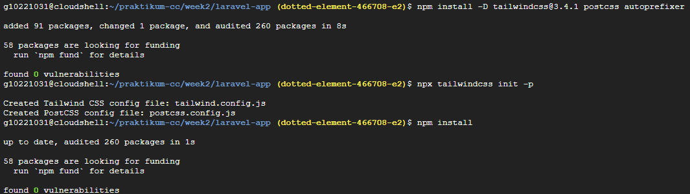

# WEEK 2: Laravel Installation & Tailwind CSS Setup
## Praktikum Cloud Computing - Institut Teknologi Kalimantan

### 📋 INFORMASI SESI
- **Week**: 2
- **Durasi**: 100 menit  
- **Topik**: Instalasi Laravel Framework & Setup Tailwind CSS
- **Target**: Mahasiswa Semester 6
- **Platform**: Google Cloud Shell
- **Repository**: github.com/aidilsaputrakirsan/praktikum-cc

### 🎯 TUJUAN PEMBELAJARAN
Setelah menyelesaikan praktikum ini, mahasiswa diharapkan mampu:
1. Menginstall Laravel framework versi terbaru menggunakan Composer
2. Mengkonfigurasi database MySQL di Cloud Shell environment
3. Memahami struktur direktori dan file konfigurasi Laravel
4. Menginstall dan mengkonfigurasi Tailwind CSS dengan Laravel
5. Membuat dan mengkustomisasi layout template dengan Tailwind CSS
6. Menjalankan development server dan melakukan testing dasar
7. Memahami Laravel Artisan commands dan workflow development

### 📚 PERSIAPAN
**Prerequisites yang harus dipenuhi:**
- Week 1 telah selesai dengan sempurna
- PHP 8.2, Composer, dan Node.js sudah terinstall
- Git dan GitHub integration sudah berfungsi
- Google Cloud Shell environment sudah dikustomisasi

**Verifikasi Environment:**
```bash
# Pastikan semua tools tersedia
php --version    # PHP 8.2.x
composer --version  # Composer 2.x.x
node --version   # Node.js 20.x.x
npm --version    # npm 10.x.x
```

### 🛠️ LANGKAH PRAKTIKUM

#### **Bagian 1: Setup Database MySQL (20 menit)**

##### Step 1.1: Install MySQL Server di Cloud Shell
```bash
# Update package repository
sudo apt-get update

# Install MySQL server dan client
sudo apt-get install -y mysql-server mysql-client

# Start MySQL service
sudo service mysql start

# Verifikasi MySQL service berjalan
sudo systemctl status mysql
```

##### Step 1.2: Konfigurasi MySQL Security
```bash
# Jalankan script secure installation
sudo mysql_secure_installation

# Jawab pertanyaan berikut:
# 1. Set root password? [Y/n]: Y
# 2. New password: Praktikum123!
# 3. Re-enter new password: Praktikum123!
# 4. Remove anonymous users? [Y/n]: Y
# 5. Disallow root login remotely? [Y/n]: Y  
# 6. Remove test database? [Y/n]: Y
# 7. Reload privilege tables? [Y/n]: Y
```

##### Step 1.3: Membuat Database dan User untuk Laravel
```bash
# Login ke MySQL sebagai root
sudo mysql -u root -p
# Masukkan password: Praktikum123!
```

**Di dalam MySQL console, jalankan commands berikut:**
```sql
-- Membuat database untuk aplikasi Laravel
CREATE DATABASE laravel_app CHARACTER SET utf8mb4 COLLATE utf8mb4_unicode_ci;

-- Membuat user khusus untuk Laravel
CREATE USER 'laravel_user'@'localhost' IDENTIFIED BY 'Praktikum123!';


-- Memberikan privilege penuh ke database laravel_app
GRANT ALL PRIVILEGES ON laravel_app.* TO 'laravel_user'@'localhost';

-- Refresh privileges
FLUSH PRIVILEGES;

-- Verifikasi database dan user sudah dibuat
SHOW DATABASES;
SELECT User, Host FROM mysql.user WHERE User = 'laravel_user';

-- Exit dari MySQL console
EXIT;
```

##### Step 1.4: Test Koneksi Database
```bash
# Test koneksi dengan user laravel_user
mysql -u laravel_user -p laravel_app
# Masukkan password: Praktikum123!

# Jika cara sebelumnya tidak bisa, coba gunakan ini 
mysql -u laravel_user -p --protocol=TCP laravel_app
# Masukkan password: Praktikum123!

# Jika berhasil login, jalankan test query
SHOW TABLES;
# Output: Empty set (karena belum ada tables)

# Exit dari MySQL
EXIT;
```

#### **Bagian 2: Instalasi Laravel Framework (25 menit)**

##### Step 2.1: Membuat Project Laravel Baru
```bash
# Masuk ke direktori praktikum
cd ~/praktikum-cc/week2

# Install Laravel menggunakan Composer create-project
composer create-project laravel/laravel laravel-app

# Masuk ke direktori project Laravel
cd laravel-app

# Verifikasi struktur direktori Laravel
tree -L 2
# Pastikan ada direktori: app, bootstrap, config, database, public, resources, routes, storage, tests, vendor
```

##### Step 2.2: Konfigurasi Environment Laravel
```bash
# Copy file environment template
cp .env.example .env

# Generate application key
php artisan key:generate

# Edit file .env untuk konfigurasi database secara langsung di Editor atau menggunakan nano seperti berikut
nano .env
```

**Update konfigurasi database di file .env:**
```bash
# === Database Configuration ===
DB_CONNECTION=mysql
DB_HOST=127.0.0.1
DB_PORT=3306
DB_DATABASE=laravel_app
DB_USERNAME=laravel_user
DB_PASSWORD=laravel_password123

# === Application Configuration ===
APP_NAME="Praktikum CC ITK"
APP_ENV=local
APP_DEBUG=true
APP_URL=http://localhost:8000

# === Cache Configuration ===
CACHE_DRIVER=file
FILESYSTEM_DISK=local
QUEUE_CONNECTION=sync
SESSION_DRIVER=file
SESSION_LIFETIME=120
```

##### Step 2.3: Test Konfigurasi Database Laravel
```bash
# Test koneksi database dengan Artisan command
php artisan migrate:status

# Jika koneksi berhasil, jalankan migration default Laravel
php artisan migrate

# Verifikasi tables sudah dibuat di database
mysql -u laravel_user -p laravel_app -e "SHOW TABLES;" 
# Atau jika error bisa menggunakan 
mysql -u laravel_user --password=Praktikum123! --protocol=TCP laravel_app -e "SHOW TABLES;"
# Output harus menampilkan tables: failed_jobs, migrations, password_reset_tokens, personal_access_tokens, users

# Create storage symbolic link untuk file uploads
php artisan storage:link

# Verify storage link created
ls -la public/storage
```

##### Step 2.4: Setup Laravel Development Server
```bash
# Jalankan Laravel development server
php artisan serve --host=0.0.0.0 --port=8000
# Server akan berjalan di background

# Dalam terminal terpisah, test server response
curl -I localhost:8000
# Expected response: HTTP/1.1 200 OK

# Stop server dengan Ctrl+C
```

#### **Bagian 3: Instalasi dan Konfigurasi Tailwind CSS (30 menit)**

##### Step 3.1: Install Tailwind CSS via NPM
```bash
# Pastikan berada di direktori laravel-app
cd ~/praktikum-cc/week2/laravel-app

# Install dependencies Node.js yang sudah ada
npm install

# Install Tailwind CSS dan dependencies
npm install -D tailwindcss postcss autoprefixer @tailwindcss/forms

# Generate file konfigurasi Tailwind
npx tailwindcss init -p

# Jika langkah sebelumnya gagal, bisa coba gunakan Tailwind versi 3
npm uninstall tailwindcss
npm install -D tailwindcss@3.4.1 postcss autoprefixer
npx tailwindcss init -p
npm install

# Verifikasi file konfigurasi telah dibuat
ls -la tailwind.config.js postcss.config.js
```

##### Step 3.2: Konfigurasi Tailwind CSS


**Isi file tailwind.config.js:**
```javascript
/** @type {import('tailwindcss').Config} */
export default {
  content: [
    "./resources/**/*.blade.php",
    "./resources/**/*.js",
    "./resources/**/*.vue",
  ],
  theme: {
    extend: {
      // Custom colors untuk branding ITK
      colors: {
        primary: {
          50: '#eff6ff',
          500: '#3b82f6',
          600: '#2563eb',
          700: '#1d4ed8',
        },
        secondary: {
          50: '#f0f9ff',
          500: '#0ea5e9',
          600: '#0284c7',
        }
      },
      // Custom font family
      fontFamily: {
        sans: ['Inter', 'ui-sans-serif', 'system-ui'],
      },
    },
  },
  plugins: [
    require('@tailwindcss/forms'),
  ],
}
```

##### Step 3.3: Setup CSS Files untuk Tailwind

**Isi file resources/css/app.css:**
```css
/* Import Tailwind CSS directives */
@tailwind base;
@tailwind components;
@tailwind utilities;

/* Custom base styles */
@layer base {
    html {
        font-family: 'Inter', system-ui, sans-serif;
    }
    
    body {
        @apply bg-gray-50 text-gray-900;
    }
}

/* Custom component classes */
@layer components {
    .btn-primary {
        @apply bg-primary-600 hover:bg-primary-700 text-white font-medium py-2 px-4 rounded-lg transition duration-200;
    }
    
    .btn-secondary {
        @apply bg-gray-200 hover:bg-gray-300 text-gray-800 font-medium py-2 px-4 rounded-lg transition duration-200;
    }
    
    .card {
        @apply bg-white rounded-xl shadow-sm border border-gray-200 p-6;
    }
    
    .input-field {
        @apply border border-gray-300 rounded-lg px-3 py-2 focus:ring-2 focus:ring-primary-500 focus:border-primary-500;
    }
}

/* Custom utility classes */
@layer utilities {
    .text-gradient {
        background: linear-gradient(135deg, #667eea 0%, #764ba2 100%);
        background-clip: text;
        -webkit-background-clip: text;
        -webkit-text-fill-color: transparent;
    }
}
```

##### Step 3.4: Update Vite Configuration

**Isi file vite.config.js:**
```javascript
import { defineConfig } from 'vite';
import laravel from 'laravel-vite-plugin';

export default defineConfig({
    plugins: [
        laravel({
            input: [
                'resources/css/app.css',
                'resources/js/app.js'
            ],
            refresh: true,
        }),
    ],
    // Konfigurasi untuk Cloud Shell development
    server: {
        host: '0.0.0.0',
        port: 5173,
        hmr: {
            host: 'localhost',
        },
    },
});
```

#### **Bagian 4: Membuat Layout dan Template (20 menit)**

##### Step 4.1: Membuat Layout Master dengan Tailwind CSS


**Isi file resources/views/layouts/app.blade.php:**
```html
<!DOCTYPE html>
<html lang="{{ str_replace('_', '-', app()->getLocale()) }}">
<head>
    <meta charset="utf-8">
    <meta name="viewport" content="width=device-width, initial-scale=1">
    <meta name="csrf-token" content="{{ csrf_token() }}">

    <title>{{ config('app.name', 'Laravel') }} - @yield('title', 'Home')</title>

    <!-- Fonts -->
    <link rel="preconnect" href="https://fonts.bunny.net">
    <link href="https://fonts.bunny.net/css?family=inter:400,500,600&display=swap" rel="stylesheet" />

    <!-- Scripts dan Styles -->
    @vite(['resources/css/app.css', 'resources/js/app.js'])
</head>
<body class="font-sans antialiased bg-gray-50">
    <!-- Navigation Bar -->
    <nav class="bg-white shadow-sm border-b border-gray-200">
        <div class="max-w-7xl mx-auto px-4 sm:px-6 lg:px-8">
            <div class="flex justify-between h-16">
                <div class="flex items-center">
                    <!-- Logo -->
                    <div class="flex-shrink-0">
                        <h1 class="text-2xl font-bold text-gradient">
                            {{ config('app.name') }}
                        </h1>
                    </div>
                    
                    <!-- Navigation Links -->
                    <div class="hidden md:ml-10 md:flex md:space-x-8">
                        <a href="{{ route('home') }}" class="text-gray-900 hover:text-primary-600 px-3 py-2 text-sm font-medium transition">
                            Home
                        </a>
                        <a href="#" class="text-gray-500 hover:text-primary-600 px-3 py-2 text-sm font-medium transition">
                            About
                        </a>
                        <a href="#" class="text-gray-500 hover:text-primary-600 px-3 py-2 text-sm font-medium transition">
                            Contact
                        </a>
                    </div>
                </div>
                
                <!-- Right Side -->
                <div class="flex items-center space-x-4">
                    <button class="btn-primary">
                        Get Started
                    </button>
                </div>
            </div>
        </div>
    </nav>

    <!-- Page Header -->
    @hasSection('header')
        <header class="bg-white shadow-sm">
            <div class="max-w-7xl mx-auto py-6 px-4 sm:px-6 lg:px-8">
                @yield('header')
            </div>
        </header>
    @endif

    <!-- Main Content -->
    <main class="py-8">
        <div class="max-w-7xl mx-auto px-4 sm:px-6 lg:px-8">
            <!-- Alert Messages -->
            @if(session('success'))
                <div class="mb-6 bg-green-50 border border-green-200 text-green-700 px-4 py-3 rounded-lg" role="alert">
                    {{ session('success') }}
                </div>
            @endif
            
            @if(session('error'))
                <div class="mb-6 bg-red-50 border border-red-200 text-red-700 px-4 py-3 rounded-lg" role="alert">
                    {{ session('error') }}
                </div>
            @endif

            <!-- Page Content -->
            @yield('content')
        </div>
    </main>

    <!-- Footer -->
    <footer class="bg-white border-t border-gray-200 mt-12">
        <div class="max-w-7xl mx-auto py-6 px-4 sm:px-6 lg:px-8">
            <div class="text-center text-gray-500 text-sm">
                © {{ date('Y') }} Praktikum Cloud Computing - Institut Teknologi Kalimantan
            </div>
        </div>
    </footer>
</body>
</html>
```

##### Step 4.2: Membuat Home Page dengan Tailwind CSS

**Isi file resources/views/welcome.blade.php:**
```html
@extends('layouts.app')

@section('title', 'Welcome')

@section('header')
    <h1 class="text-3xl font-bold text-gray-900">
        Welcome to Laravel with Tailwind CSS
    </h1>
    <p class="mt-2 text-gray-600">
        Praktikum Cloud Computing - Week 2
    </p>
@endsection

@section('content')
<div class="space-y-8">
    <!-- Hero Section -->
    <div class="card text-center">
        <div class="mb-6">
            <h2 class="text-4xl font-bold text-gradient mb-4">
                Laravel + Tailwind CSS
            </h2>
            <p class="text-xl text-gray-600 max-w-2xl mx-auto">
                Selamat datang di aplikasi Laravel dengan Tailwind CSS yang telah berhasil dikonfigurasi 
                di Google Cloud Shell environment.
            </p>
        </div>
        
        <div class="flex flex-col sm:flex-row gap-4 justify-center items-center">
            <button class="btn-primary">
                Explore Features
            </button>
            <button class="btn-secondary">
                View Documentation
            </button>
        </div>
    </div>

    <!-- Features Grid -->
    <div class="grid md:grid-cols-3 gap-6">
        <!-- Laravel Feature -->
        <div class="card">
            <div class="mb-4">
                <div class="w-12 h-12 bg-red-100 rounded-lg flex items-center justify-center">
                    <svg class="w-6 h-6 text-red-600" fill="currentColor" viewBox="0 0 24 24">
                        <path d="M23.642 5.43a.364.364 0 0 1 .014.1v5.149c0 .135-.073.26-.189.326l-4.323 2.49v4.934a.378.378 0 0 1-.188.326L9.93 23.949a.316.316 0 0 1-.066.02c-.018.006-.037.009-.056.009-.019 0-.038-.003-.056-.009a.317.317 0 0 1-.066-.02l-9.026-5.194A.378.378 0 0 1 .467 18.43v-5.149c0-.135.073-.26.189-.326l4.323-2.49V5.531A.378.378 0 0 1 5.167 5.205L14.193.01a.378.378 0 0 1 .122-.01c.041 0 .082.007.122.01l9.026 5.194a.378.378 0 0 1 .179.236zM9.746 22.607l8.253-4.746v-4.65l-4.323 2.49a.378.378 0 0 1-.189.051.378.378 0 0 1-.189-.051l-3.552-2.044v8.95zm-8.925-9.924v8.95l8.253-4.746v-8.95l-8.253 4.746z"/>
                    </svg>
                </div>
            </div>
            <h3 class="text-xl font-semibold text-gray-900 mb-2">Laravel Framework</h3>
            <p class="text-gray-600">
                PHP framework yang powerful dengan fitur lengkap untuk rapid application development.
            </p>
        </div>

        <!-- Tailwind CSS Feature -->
        <div class="card">
            <div class="mb-4">
                <div class="w-12 h-12 bg-blue-100 rounded-lg flex items-center justify-center">
                    <svg class="w-6 h-6 text-blue-600" fill="currentColor" viewBox="0 0 24 24">
                        <path d="M12.001,4.8c-3.2,0-5.2,1.6-6,4.8c1.2-1.6,2.6-2.2,4.2-1.8c0.913,0.228,1.565,0.89,2.288,1.624 C13.666,10.618,15.027,12,18.001,12c3.2,0,5.2-1.6,6-4.8c-1.2,1.6-2.6,2.2-4.2,1.8c-0.913-0.228-1.565-0.89-2.288-1.624 C16.337,6.182,14.976,4.8,12.001,4.8z M6.001,12c-3.2,0-5.2,1.6-6,4.8c1.2-1.6,2.6-2.2,4.2-1.8c0.913,0.228,1.565,0.89,2.288,1.624 C7.666,17.818,9.027,19.2,12.001,19.2c3.2,0,5.2-1.6,6-4.8c-1.2,1.6-2.6,2.2-4.2,1.8c-0.913-0.228-1.565-0.89-2.288-1.624 C10.337,13.382,8.976,12,6.001,12z"/>
                    </svg>
                </div>
            </div>
            <h3 class="text-xl font-semibold text-gray-900 mb-2">Tailwind CSS</h3>
            <p class="text-gray-600">
                Utility-first CSS framework untuk membangun interface yang modern dan responsive.
            </p>
        </div>

        <!-- Cloud Shell Feature -->
        <div class="card">
            <div class="mb-4">
                <div class="w-12 h-12 bg-green-100 rounded-lg flex items-center justify-center">
                    <svg class="w-6 h-6 text-green-600" fill="currentColor" viewBox="0 0 24 24">
                        <path d="M19.35 10.04A7.49 7.49 0 0 0 12 4C9.11 4 6.6 5.64 5.35 8.04A5.994 5.994 0 0 0 0 14c0 3.31 2.69 6 6 6h13c2.76 0 5-2.24 5-5 0-2.64-2.05-4.78-4.65-4.96z"/>
                    </svg>
                </div>
            </div>
            <h3 class="text-xl font-semibold text-gray-900 mb-2">Google Cloud Shell</h3>
            <p class="text-gray-600">
                Development environment di cloud yang sudah dikonfigurasi dengan semua tools yang diperlukan.
            </p>
        </div>
    </div>

    <!-- System Information -->
    <div class="card">
        <h3 class="text-xl font-semibold text-gray-900 mb-4">System Information</h3>
        <div class="grid md:grid-cols-2 gap-4">
            <div>
                <h4 class="font-medium text-gray-700 mb-2">Environment</h4>
                <ul class="space-y-1 text-sm text-gray-600">
                    <li><span class="font-medium">Laravel Version:</span> {{ app()->version() }}</li>
                    <li><span class="font-medium">PHP Version:</span> {{ PHP_VERSION }}</li>
                    <li><span class="font-medium">Environment:</span> {{ app()->environment() }}</li>
                    <li><span class="font-medium">Debug Mode:</span> {{ config('app.debug') ? 'Enabled' : 'Disabled' }}</li>
                </ul>
            </div>
            <div>
                <h4 class="font-medium text-gray-700 mb-2">Database</h4>
                <ul class="space-y-1 text-sm text-gray-600">
                    <li><span class="font-medium">Connection:</span> {{ config('database.default') }}</li>
                    <li><span class="font-medium">Database:</span> {{ config('database.connections.mysql.database') }}</li>
                    <li><span class="font-medium">Host:</span> {{ config('database.connections.mysql.host') }}</li>
                    <li><span class="font-medium">Port:</span> {{ config('database.connections.mysql.port') }}</li>
                </ul>
            </div>
        </div>
    </div>
</div>
@endsection
```

##### Step 4.3: Update Routes untuk Home Page


**Isi file routes/web.php:**
```php
<?php

use Illuminate\Support\Facades\Route;

/*
|--------------------------------------------------------------------------
| Web Routes - Praktikum Cloud Computing ITK
|--------------------------------------------------------------------------
|
| Konfigurasi routes untuk aplikasi web Laravel dengan Tailwind CSS
| Routes ini akan digunakan untuk navigasi antar halaman dalam aplikasi
|
*/

// Route untuk halaman utama (home page)
Route::get('/', function () {
    return view('welcome');
})->name('home');

// Route untuk testing purposes - bisa dihapus nanti
Route::get('/test', function () {
    return response()->json([
        'message' => 'Laravel API test berhasil!',
        'timestamp' => now()->toISOString(),
        'environment' => app()->environment(),
        'php_version' => PHP_VERSION,
        'laravel_version' => app()->version()
    ]);
})->name('test');
```

#### **Bagian 5: Build dan Testing Application (15 menit)**

##### Step 5.1: Build Assets dengan Vite
```bash
# Install dependencies NPM jika belum
npm install

# Build assets untuk development
npm run dev
# Perintah ini akan compile CSS dan JS, biarkan running di background

# Dalam terminal baru, build assets untuk production testing
npm run build

# Verifikasi build files sudah dibuat
ls -la public/build/
```

##### Step 5.2: Menjalankan Laravel Development Server
```bash
# Dalam terminal baru, jalankan Laravel server
cd ~/praktikum-cc/week2/laravel-app
php artisan serve --host=0.0.0.0 --port=8000

# Server akan berjalan di background
# Akses melalui Cloud Shell Web Preview pada port 8000
```

##### Step 5.3: Testing Aplikasi
```bash
# Test 1: Homepage response
curl -s localhost:8000 | grep -o "<title>.*</title>"
# Expected: <title>Praktikum CC ITK - Welcome</title>

# Test 2: API test endpoint  
curl -s localhost:8000/test | jq .
# Expected: JSON response dengan system information

# Test 3: CSS compilation check
curl -s localhost:8000 | grep -o "tailwindcss"
# Should return some results if Tailwind is loaded

# Test 4: Database connection
php artisan migrate:status
# Should show migration status without errors
```

### 🧪 TESTING & VERIFIKASI

#### Test 1: Laravel Installation Verification
```bash
# Verifikasi Laravel framework
cd ~/praktikum-cc/week2/laravel-app

echo "=== Laravel Installation Test ==="
php artisan --version
php artisan route:list
php artisan config:show app.name
```

#### Test 2: Database Connection Test
```bash
echo "=== Database Connection Test ==="
php artisan tinker --execute="
try {
    \DB::connection()->getPdo();
    echo 'Database connection: OK\n';
    echo 'Database name: ' . \DB::connection()->getDatabaseName() . '\n';
    echo 'Tables count: ' . count(\DB::select('SHOW TABLES')) . '\n';
} catch (\Exception \$e) {
    echo 'Database connection failed: ' . \$e->getMessage() . '\n';
}
"
```

#### Test 3: Tailwind CSS Compilation Test
```bash
echo "=== Tailwind CSS Test ==="
# Check if Tailwind directives are compiled
grep -r "@tailwind" resources/css/app.css && echo "✓ Tailwind directives found"

# Check if build files exist
ls public/build/assets/*.css > /dev/null 2>&1 && echo "✓ CSS build files exist"
ls public/build/assets/*.js > /dev/null 2>&1 && echo "✓ JS build files exist"

# Test if Tailwind classes are compiled
grep -r "bg-primary-600" public/build/assets/*.css > /dev/null 2>&1 && echo "✓ Custom Tailwind classes compiled"
```

#### Test 4: Web Server Response Test
```bash
echo "=== Web Server Response Test ==="
# Start server in background if not running
php artisan serve --host=0.0.0.0 --port=8000 &
SERVER_PID=$!
sleep 3

# Test homepage
HTTP_STATUS=$(curl -s -o /dev/null -w "%{http_code}" localhost:8000)
if [ "$HTTP_STATUS" -eq 200 ]; then
    echo "✓ Homepage responds with HTTP 200"
else
    echo "✗ Homepage failed with HTTP $HTTP_STATUS"
fi

# Test API endpoint
API_RESPONSE=$(curl -s localhost:8000/test | jq -r .message 2>/dev/null)
if [ "$API_RESPONSE" = "Laravel API test berhasil!" ]; then
    echo "✓ API endpoint working"
else
    echo "✗ API endpoint failed"
fi

# Clean up
kill $SERVER_PID 2>/dev/null
```

#### Test 5: File Permissions and Structure Test
```bash
echo "=== File Structure and Permissions Test ==="
# Check Laravel directory structure
REQUIRED_DIRS=("app" "config" "database" "resources" "routes" "storage" "public")
for dir in "${REQUIRED_DIRS[@]}"; do
    if [ -d "$dir" ]; then
        echo "✓ Directory $dir exists"
    else
        echo "✗ Directory $dir missing"
    fi
done

# Check file permissions
if [ -w "storage" ] && [ -w "bootstrap/cache" ]; then
    echo "✓ Storage directories are writable"
else
    echo "✗ Storage directories permission issue"
fi

# Check .env file
if [ -f ".env" ] && grep -q "APP_KEY=" .env; then
    echo "✓ Environment file configured"
else
    echo "✗ Environment file issue"
fi
```

### 🆘 TROUBLESHOOTING

#### Problem 1: MySQL Connection Failed
**Gejala:** `SQLSTATE[HY000] [2002] Connection refused`
**Solusi:**
```bash
# Restart MySQL service
sudo systemctl restart mysql
sudo systemctl status mysql

# Check MySQL is listening on port 3306
sudo netstat -tlnp | grep :3306

# Test connection manually
mysql -u laravel_user -p laravel_app -e "SELECT 1"

# If still failing, check MySQL error log
sudo tail -f /var/log/mysql/error.log
```

#### Problem 2: Composer Dependencies Error
**Gejala:** `Your requirements could not be resolved to an installable set of packages`
**Solusi:**
```bash
# Clear Composer cache
composer clear-cache

# Update Composer to latest version
composer self-update

# Install with verbose output for debugging
composer install --verbose

# If memory issues, increase PHP memory limit
php -d memory_limit=2G /usr/local/bin/composer install
```

#### Problem 3: NPM Install Fails
**Gejala:** `npm ERR! peer dep missing` atau `EACCES permission denied`
**Solusi:**
```bash
# Clear npm cache
npm cache clean --force

# Remove node_modules and package-lock.json
rm -rf node_modules package-lock.json

# Install with legacy peer deps
npm install --legacy-peer-deps

# If permission issues, check npm config
npm config get prefix
npm config set prefix ~/.npm-global
```

#### Problem 4: Tailwind CSS Not Loading
**Gejala:** Styles tidak terapply, halaman tampak tanpa styling
**Solusi:**
```bash
# Check Vite dev server is running
ps aux | grep vite

# Restart Vite build process
npm run dev

# Clear Laravel cache
php artisan config:clear
php artisan view:clear
php artisan cache:clear

# Rebuild assets
npm run build

# Check browser console for 404 on CSS files
```

#### Problem 5: Laravel Artisan Commands Fail
**Gejala:** `Could not open input file: artisan`
**Solusi:**
```bash
# Ensure you're in the correct directory
cd ~/praktikum-cc/week2/laravel-app
pwd

# Check artisan file exists and is executable
ls -la artisan
chmod +x artisan

# If corrupted, regenerate via Composer
composer dump-autoload
```

#### Problem 6: Storage Permission Issues
**Gejala:** `The stream or file could not be opened in append mode`
**Solusi:**
```bash
# Fix Laravel storage permissions
sudo chown -R $USER:www-data storage
sudo chown -R $USER:www-data bootstrap/cache
chmod -R 775 storage
chmod -R 775 bootstrap/cache

# Set proper SELinux context if enabled
sudo setsebool -P httpd_can_network_connect 1
```

#### Problem 7: Cloud Shell Preview Not Working
**Gejala:** Web Preview menampilkan error atau tidak dapat mengakses
**Solusi:**
```bash
# Ensure server binds to 0.0.0.0, not 127.0.0.1
php artisan serve --host=0.0.0.0 --port=8000

# Check if port 8000 is available
sudo netstat -tlnp | grep :8000

# Try alternative port if 8000 is busy
php artisan serve --host=0.0.0.0 --port=8080

# Check Cloud Shell firewall settings
gcloud compute firewall-rules list
```

### 📋 DELIVERABLES

**Checklist yang harus diserahkan pada akhir sesi:**

#### ✅ Laravel Installation
- [ ] Screenshot `php artisan --version` menampilkan Laravel versi terbaru

- [ ] Screenshot struktur direktori Laravel dengan `tree -L 2`

- [ ] Screenshot `php artisan migrate:status` tanpa error

- [ ] Screenshot file .env dengan konfigurasi database yang benar

#### ✅ Database Configuration
- [ ] Screenshot MySQL service status `sudo systemctl status mysql` / `sudo service mysql status`

- [ ] Screenshot database dan tables dengan `SHOW DATABASES` dan `SHOW TABLES` di MySQL


- [ ] Screenshot test koneksi database Laravel berhasil dan hasil `php artisan tinker` test database connection


#### ✅ Tailwind CSS Setup
- [ ] Screenshot file tailwind.config.js dengan konfigurasi lengkap

- [ ] Screenshot `npm list` menampilkan Tailwind CSS terinstall

- [ ] Screenshot hasil `npm run build` berhasil tanpa error

- [ ] Screenshot build files di direktori public/build/


#### ✅ Application Testing
- [ ] Screenshot Laravel development server berjalan di port 8000

- [ ] Screenshot homepage aplikasi dengan styling Tailwind CSS

- [ ] Screenshot Web Preview Cloud Shell menampilkan aplikasi
- [ ] Screenshot API test endpoint `/test` mengembalikan JSON

#### ✅ System Integration
- [ ] Screenshot semua test verification berhasil (5 test suite)
- [ ] Screenshot file routes/web.php dengan route configuration
- [ ] Screenshot layout app.blade.php dengan Tailwind components
- [ ] Screenshot welcome.blade.php dengan custom styling

#### ✅ Documentation
- [ ] File week2/README.md berisi:
  - Langkah instalasi yang dilakukan
  - Konfigurasi database dan environment
  - Setup Tailwind CSS dan custom components
  - Screenshot hasil testing
  - Problem yang ditemui dan solusinya

**Format Submission:**
```bash
cd ~/praktikum-cc
mkdir -p submission/week2/{screenshots,configs,docs}

# Copy konfigurasi penting
cp week2/laravel-app/.env submission/week2/configs/
cp week2/laravel-app/tailwind.config.js submission/week2/configs/
cp week2/laravel-app/vite.config.js submission/week2/configs/

# Buat dokumentasi
cat > submission/week2/README.md << 'EOF'
# Week 2: Laravel Installation & Tailwind CSS Setup

## Completed Tasks
- [x] MySQL database setup and configuration
- [x] Laravel framework installation via Composer
- [x] Database connection and migration
- [x] Tailwind CSS installation and configuration
- [x] Custom layout and components creation
- [x] Vite build configuration
- [x] Development server setup
- [x] All verification tests passed

## System Information
- Laravel Version: [version]
- PHP Version: [version]
- Node.js Version: [version]
- MySQL Version: [version]
- Tailwind CSS Version: [version]

## Next Steps
- Week 3: Database design and migration system
- Week 3: Model creation and relationships
EOF

# Commit and push
git add submission/week2/
git commit -m "Week 2: Laravel & Tailwind CSS Setup - [Nama]"
git push origin main
```