# WEEK 3: Database Design & Migration System
## Praktikum Cloud Computing - Institut Teknologi Kalimantan

### 📋 INFORMASI SESI
- **Week**: 3
- **Durasi**: 100 menit  
- **Topik**: Perancangan Database Schema & Sistem Migrasi Laravel
- **Target**: Mahasiswa Semester 6
- **Platform**: Laptop/PC (Windows, macOS, atau Linux)

### 🎯 TUJUAN PEMBELAJARAN
Setelah menyelesaikan praktikum ini, mahasiswa diharapkan mampu:
1. Merancang schema database yang optimal untuk aplikasi web
2. Membuat dan mengelola Laravel migrations untuk version control database
3. Mengimplementasikan Eloquent Models dengan relationships yang tepat
4. Menggunakan Database Seeder dan Factory untuk sample data
5. Memahami konsep foreign key constraints dan referential integrity
6. Melakukan database testing dan validation dengan Laravel tools
7. Mengoptimalkan query database dan indexing strategy

### 📚 PERSIAPAN
**Prerequisites yang harus dipenuhi:**
- Week 1 dan Week 2 telah selesai dengan sempurna
- Laravel framework sudah terinstall dan berfungsi
- MySQL database sudah dikonfigurasi dan dapat diakses
- Understanding dasar tentang database relational dan SQL

**Verifikasi Environment:**
```bash
# Pastikan berada di direktori project Laravel
cd laravel-app

# Verifikasi database connection
php artisan migrate:status

# Verifikasi Laravel version dan database config
php artisan about
```

### 🛠️ LANGKAH PRAKTIKUM

#### **Bagian 1: Perancangan Database Schema (20 menit)**

##### Step 1.1: Analisis Requirements Aplikasi

**Membuat file database/documentation/schema_design.md:**
```markdown
# Database Schema Design - Praktikum CC ITK

## Application Requirements
Aplikasi yang akan dibangun adalah sistem manajemen konten sederhana dengan fitur:
- User authentication dan authorization
- Manajemen artikel/posts dengan kategori
- Sistem komentar untuk setiap artikel
- Tag system untuk kategorisasi content
- Media file management untuk images

## Entity Relationship Design

### 1. Users Table
- Primary entity untuk authentication
- Menyimpan informasi dasar user
- Relationship: One-to-Many dengan Posts, Comments

### 2. Categories Table  
- Kategorisasi utama untuk posts
- Hierarchical structure dengan parent_id
- Relationship: One-to-Many dengan Posts

### 3. Posts Table
- Content utama aplikasi
- Memiliki status publication (draft, published, archived)
- Relationship: Many-to-One dengan Users, Categories
- Relationship: One-to-Many dengan Comments
- Relationship: Many-to-Many dengan Tags

### 4. Comments Table
- Sistem komentar untuk posts
- Support nested comments dengan parent_id
- Relationship: Many-to-One dengan Users, Posts

### 5. Tags Table
- Tagging system untuk posts
- Relationship: Many-to-Many dengan Posts melalui post_tags

### 6. Media Table
- File storage management
- Support multiple file types (images, documents)
- Relationship: Many-to-One dengan Posts

## Database Constraints
- Foreign key constraints untuk referential integrity
- Unique constraints untuk email, slug
- Index untuk performance optimization
- Soft deletes untuk data preservation
```

##### Step 1.2: Database Schema Diagram
```bash
# Install tool untuk database diagram (opsional, untuk dokumentasi)
npm install -g @mermaid-js/mermaid-cli

# Buat file diagram ERD database/documentation/erd.md

# Entity Relationship Diagram

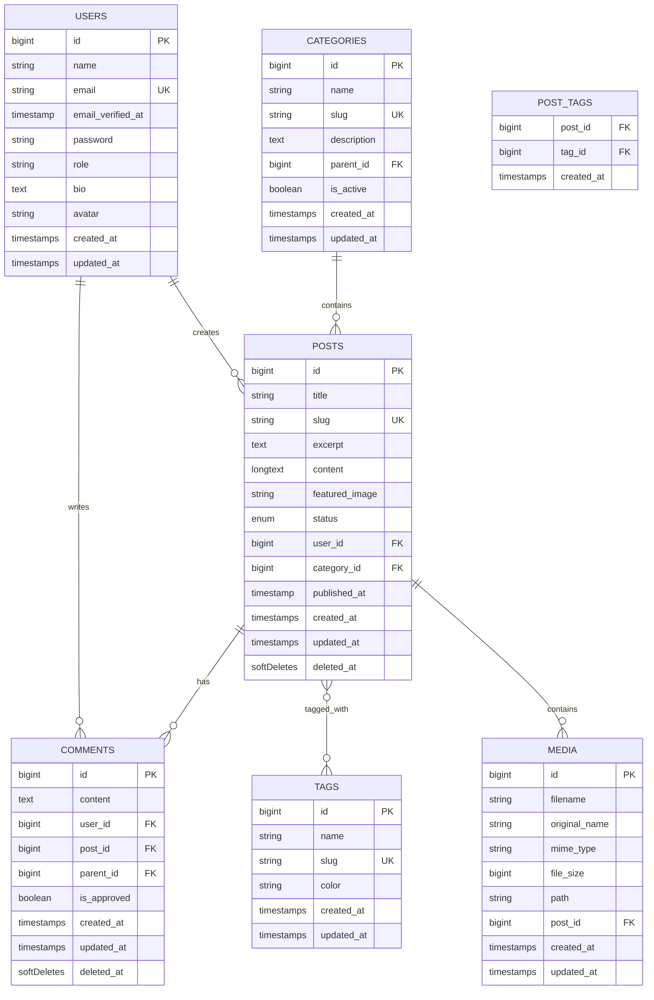

#### **Bagian 2: Membuat Laravel Migrations (25 menit)**

##### Step 2.1: Generate Migration Files
```bash
# Generate migration untuk tabel users (sudah ada, kita akan modify)
# Generate migration untuk categories
php artisan make:migration create_categories_table

# Generate migration untuk posts  
php artisan make:migration create_posts_table

# Generate migration untuk comments
php artisan make:migration create_comments_table

# Generate migration untuk tags
php artisan make:migration create_tags_table

# Generate migration untuk pivot table post_tags
php artisan make:migration create_post_tags_table

# Generate migration untuk media table
php artisan make:migration create_media_table

# Lihat file migration yang telah dibuat
dir database/migrations/
```

##### Step 2.2: Implementasi Migration - Users Table

**UIsi file create_users_table.php:**
```php
<?php

use Illuminate\Database\Migrations\Migration;
use Illuminate\Database\Schema\Blueprint;
use Illuminate\Support\Facades\Schema;

return new class extends Migration
{
    /**
     * Jalankan migration untuk membuat tabel users
     * Tabel ini menyimpan informasi user authentication dan profile
     */
    public function up(): void
    {
        Schema::create('users', function (Blueprint $table) {
            // Primary key auto increment
            $table->id();
            
            // Informasi dasar user
            $table->string('name'); // Nama lengkap user
            $table->string('email')->unique(); // Email unik untuk login
            $table->timestamp('email_verified_at')->nullable(); // Timestamp verifikasi email
            $table->string('password'); // Password ter-hash
            
            // Informasi tambahan user
            $table->enum('role', ['admin', 'editor', 'author', 'subscriber'])
                  ->default('subscriber'); // Role-based access control
            $table->text('bio')->nullable(); // Bio/deskripsi user
            $table->string('avatar')->nullable(); // Path ke avatar image
            $table->boolean('is_active')->default(true); // Status aktif user
            
            // Token untuk remember me functionality
            $table->rememberToken();
            
            // Timestamp created_at dan updated_at
            $table->timestamps();
            
            // Indexing untuk performance
            $table->index('email'); // Index untuk login lookup
            $table->index('role'); // Index untuk role filtering
        });
    }

    /**
     * Rollback migration - hapus tabel users
     */
    public function down(): void
    {
        Schema::dropIfExists('users');
    }
};
```

##### Step 2.3: Implementasi Migration - Categories Table

**Isi file create_categories_table.php:**
```php
<?php

use Illuminate\Database\Migrations\Migration;
use Illuminate\Database\Schema\Blueprint;
use Illuminate\Support\Facades\Schema;

return new class extends Migration
{
    /**
     * Jalankan migration untuk membuat tabel categories
     * Tabel ini untuk kategorisasi posts dengan support hierarchical structure
     */
    public function up(): void
    {
        Schema::create('categories', function (Blueprint $table) {
            // Primary key auto increment
            $table->id();
            
            // Informasi kategori
            $table->string('name'); // Nama kategori
            $table->string('slug')->unique(); // URL-friendly identifier
            $table->text('description')->nullable(); // Deskripsi kategori
            $table->string('color', 7)->default('#3B82F6'); // Hex color untuk UI
            
            // Hierarchical structure - self-referencing foreign key
            $table->unsignedBigInteger('parent_id')->nullable();
            $table->foreign('parent_id')->references('id')->on('categories')
                  ->onDelete('set null'); // Set null jika parent dihapus
            
            // Status dan metadata
            $table->boolean('is_active')->default(true); // Status aktif kategori
            $table->integer('sort_order')->default(0); // Urutan tampilan
            
            // Timestamp created_at dan updated_at
            $table->timestamps();
            
            // Indexing untuk performance
            $table->index('slug'); // Index untuk URL lookup
            $table->index('parent_id'); // Index untuk hierarchical queries
            $table->index(['is_active', 'sort_order']); // Composite index untuk listing
        });
    }

    /**
     * Rollback migration - hapus tabel categories
     */
    public function down(): void
    {
        Schema::dropIfExists('categories');
    }
};
```

##### Step 2.4: Implementasi Migration - Posts Table

**Isi file create_posts_table.php:**
```php
<?php

use Illuminate\Database\Migrations\Migration;
use Illuminate\Database\Schema\Blueprint;
use Illuminate\Support\Facades\Schema;

return new class extends Migration
{
    /**
     * Jalankan migration untuk membuat tabel posts
     * Tabel ini menyimpan konten utama aplikasi (artikel, blog posts)
     */
    public function up(): void
    {
        Schema::create('posts', function (Blueprint $table) {
            // Primary key auto increment
            $table->id();
            
            // Konten post
            $table->string('title'); // Judul post
            $table->string('slug')->unique(); // URL-friendly identifier
            $table->text('excerpt')->nullable(); // Ringkasan post
            $table->longText('content'); // Konten lengkap post (HTML allowed)
            $table->string('featured_image')->nullable(); // Path ke featured image
            
            // Status publikasi
            $table->enum('status', ['draft', 'published', 'archived'])
                  ->default('draft'); // Status publikasi post
            
            // Foreign keys untuk relationships
            $table->unsignedBigInteger('user_id'); // Penulis post
            $table->foreign('user_id')->references('id')->on('users')
                  ->onDelete('cascade'); // Hapus post jika user dihapus
                  
            $table->unsignedBigInteger('category_id'); // Kategori post
            $table->foreign('category_id')->references('id')->on('categories')
                  ->onDelete('restrict'); // Prevent delete category jika ada posts
            
            // Metadata
            $table->timestamp('published_at')->nullable(); // Waktu publikasi
            $table->integer('views_count')->default(0); // Counter views
            $table->boolean('is_featured')->default(false); // Apakah featured post
            $table->boolean('allow_comments')->default(true); // Izinkan komentar
            
            // SEO fields
            $table->string('meta_title')->nullable(); // SEO title
            $table->text('meta_description')->nullable(); // SEO description
            $table->text('meta_keywords')->nullable(); // SEO keywords
            
            // Timestamp created_at dan updated_at
            $table->timestamps();
            
            // Soft deletes untuk data preservation
            $table->softDeletes();
            
            // Indexing untuk performance
            $table->index('slug'); // Index untuk URL lookup
            $table->index(['status', 'published_at']); // Composite index untuk published posts
            $table->index('user_id'); // Index untuk author lookup
            $table->index('category_id'); // Index untuk category filtering
            $table->index('is_featured'); // Index untuk featured posts
            $table->fullText(['title', 'content']); // Full-text search index
        });
    }

    /**
     * Rollback migration - hapus tabel posts
     */
    public function down(): void
    {
        Schema::dropIfExists('posts');
    }
};
```

##### Step 2.5: Implementasi Migration - Comments, Tags, dan Post_Tags

**Isi file create_comments_table.php:**
```php
<?php

use Illuminate\Database\Migrations\Migration;
use Illuminate\Database\Schema\Blueprint;
use Illuminate\Support\Facades\Schema;

return new class extends Migration
{
    /**
     * Migration untuk tabel comments - sistem komentar posts
     */
    public function up(): void
    {
        Schema::create('comments', function (Blueprint $table) {
            $table->id();
            
            // Konten komentar
            $table->text('content'); // Isi komentar
            
            // Foreign keys
            $table->unsignedBigInteger('user_id'); // Penulis komentar
            $table->foreign('user_id')->references('id')->on('users')->onDelete('cascade');
            
            $table->unsignedBigInteger('post_id'); // Post yang dikomentari
            $table->foreign('post_id')->references('id')->on('posts')->onDelete('cascade');
            
            // Nested comments support
            $table->unsignedBigInteger('parent_id')->nullable(); // Reply to comment
            $table->foreign('parent_id')->references('id')->on('comments')->onDelete('cascade');
            
            // Moderation
            $table->boolean('is_approved')->default(false); // Moderasi komentar
            
            $table->timestamps();
            $table->softDeletes(); // Soft delete untuk preservation
            
            // Indexing
            $table->index(['post_id', 'is_approved']); // Comments per post
            $table->index('parent_id'); // Nested comments lookup
        });
    }

    public function down(): void
    {
        Schema::dropIfExists('comments');
    }
};
```

**Isi file create_tags_table.php:**
```php
<?php

use Illuminate\Database\Migrations\Migration;
use Illuminate\Database\Schema\Blueprint;
use Illuminate\Support\Facades\Schema;

return new class extends Migration
{
    /**
     * Migration untuk tabel tags - sistem tagging posts
     */
    public function up(): void
    {
        Schema::create('tags', function (Blueprint $table) {
            $table->id();
            
            $table->string('name'); // Nama tag
            $table->string('slug')->unique(); // URL-friendly identifier
            $table->string('color', 7)->default('#10B981'); // Hex color untuk UI
            $table->text('description')->nullable(); // Deskripsi tag
            
            $table->timestamps();
            
            // Indexing
            $table->index('slug');
        });
    }

    public function down(): void
    {
        Schema::dropIfExists('tags');
    }
};
```

**Isi file create_post_tags_table.php:**
```php
<?php

use Illuminate\Database\Migrations\Migration;
use Illuminate\Database\Schema\Blueprint;
use Illuminate\Support\Facades\Schema;

return new class extends Migration
{
    /**
     * Migration untuk pivot table post_tags - many-to-many relationship
     */
    public function up(): void
    {
        Schema::create('post_tags', function (Blueprint $table) {
            // Composite primary key
            $table->unsignedBigInteger('post_id');
            $table->unsignedBigInteger('tag_id');
            
            // Foreign key constraints
            $table->foreign('post_id')->references('id')->on('posts')->onDelete('cascade');
            $table->foreign('tag_id')->references('id')->on('tags')->onDelete('cascade');
            
            // Prevent duplicate entries
            $table->primary(['post_id', 'tag_id']);
            
            $table->timestamps(); // Track when tag was added to post
            
            // Indexing untuk reverse lookup
            $table->index('tag_id'); // Posts by tag
        });
    }

    public function down(): void
    {
        Schema::dropIfExists('post_tags');
    }
};
```

##### Step 2.6: Implementasi Migration - Media Table

**Isi file create_media_table.php:**
```php
<?php

use Illuminate\Database\Migrations\Migration;
use Illuminate\Database\Schema\Blueprint;
use Illuminate\Support\Facades\Schema;

return new class extends Migration
{
    /**
     * Migration untuk tabel media - file management system
     */
    public function up(): void
    {
        Schema::create('media', function (Blueprint $table) {
            $table->id();
            
            // File information
            $table->string('filename'); // Generated filename
            $table->string('original_name'); // Original uploaded filename
            $table->string('mime_type'); // File MIME type
            $table->unsignedBigInteger('file_size'); // File size in bytes
            $table->string('path'); // Storage path
            $table->json('metadata')->nullable(); // Additional file metadata (dimensions, etc.)
            
            // Relationships
            $table->unsignedBigInteger('post_id')->nullable(); // Associated post
            $table->foreign('post_id')->references('id')->on('posts')->onDelete('set null');
            
            $table->unsignedBigInteger('uploaded_by'); // User who uploaded
            $table->foreign('uploaded_by')->references('id')->on('users')->onDelete('cascade');
            
            // File type categorization
            $table->enum('type', ['image', 'document', 'video', 'audio', 'other'])->default('other');
            
            $table->timestamps();
            
            // Indexing
            $table->index('post_id');
            $table->index('type');
            $table->index('uploaded_by');
        });
    }

    public function down(): void
    {
        Schema::dropIfExists('media');
    }
};
```


#### **Bagian 3: Membuat Eloquent Models (20 menit)**

##### Step 3.1: Generate Model Files
```bash
# Generate models dengan resource controllers (akan digunakan week 4)
php artisan make:model Category -cr
php artisan make:model Post -cr  
php artisan make:model Comment -cr
php artisan make:model Tag -cr
php artisan make:model Media -cr

# Note: User model sudah ada dari Laravel default
# Lihat models yang telah dibuat
dir app/Models/
```

##### Step 3.2: Implementasi User Model

**Isi file app/Models/User.php:**
```php
<?php

namespace App\Models;

// use Illuminate\Contracts\Auth\MustVerifyEmail;
use Illuminate\Database\Eloquent\Factories\HasFactory;
use Illuminate\Foundation\Auth\User as Authenticatable;
use Illuminate\Notifications\Notifiable;

class User extends Authenticatable
{
    use HasFactory, Notifiable;

    /**
     * Atribut yang dapat diisi secara mass assignment
     */
    protected $fillable = [
        'name',        // Nama lengkap user
        'email',       // Email untuk authentication
        'password',    // Password ter-hash
        'role',        // Role user (admin, editor, author, subscriber)
        'bio',         // Bio/deskripsi user
        'avatar',      // Path ke avatar image
        'is_active',   // Status aktif user
    ];

    /**
     * Atribut yang disembunyikan dari serialization
     */
    protected $hidden = [
        'password',         // Jangan expose password
        'remember_token',   // Jangan expose remember token
    ];

    /**
     * Casting atribut ke tipe data yang sesuai
     */
    protected $casts = [
        'email_verified_at' => 'datetime',  // Cast ke Carbon instance
        'password' => 'hashed',             // Auto-hash password saat assignment
        'is_active' => 'boolean',           // Cast ke boolean
    ];

    /**
     * Relationship: User has many Posts
     * Satu user dapat memiliki banyak posts
     */
    public function posts()
    {
        return $this->hasMany(Post::class);
    }

    /**
     * Relationship: User has many Comments
     * Satu user dapat memiliki banyak comments
     */
    public function comments()
    {
        return $this->hasMany(Comment::class);
    }

    /**
     * Relationship: User has many Media uploads
     * Satu user dapat upload banyak media files
     */
    public function mediaUploads()
    {
        return $this->hasMany(Media::class, 'uploaded_by');
    }

    /**
     * Scope: Filter users by role
     * Usage: User::role('admin')->get()
     */
    public function scopeRole($query, $role)
    {
        return $query->where('role', $role);
    }

    /**
     * Scope: Filter active users only
     * Usage: User::active()->get()
     */
    public function scopeActive($query)
    {
        return $query->where('is_active', true);
    }

    /**
     * Accessor: Get full avatar URL
     * Mengembalikan full URL untuk avatar image
     */
    public function getAvatarUrlAttribute()
    {
        if ($this->avatar) {
            return asset('storage/' . $this->avatar);
        }
        
        // Default avatar menggunakan Gravatar
        return 'https://www.gravatar.com/avatar/' . md5(strtolower($this->email)) . '?d=mp&s=150';
    }

    /**
     * Check if user has specific role
     * Usage: $user->hasRole('admin')
     */
    public function hasRole($role)
    {
        return $this->role === $role;
    }

    /**
     * Check if user can perform action based on role
     * Simple role-based authorization
     */
    public function canManagePosts()
    {
        return in_array($this->role, ['admin', 'editor', 'author']);
    }

    public function canManageUsers()
    {
        return $this->role === 'admin';
    }
}
```

##### Step 3.3: Implementasi Category Model

**Isi file app/Models/Category.php:**
```php
<?php

namespace App\Models;

use Illuminate\Database\Eloquent\Factories\HasFactory;
use Illuminate\Database\Eloquent\Model;
use Illuminate\Support\Str;

class Category extends Model
{
    use HasFactory;

    /**
     * Atribut yang dapat diisi secara mass assignment
     */
    protected $fillable = [
        'name',         // Nama kategori
        'slug',         // URL-friendly identifier
        'description',  // Deskripsi kategori
        'color',        // Hex color untuk UI
        'parent_id',    // Parent category ID untuk hierarchical structure
        'is_active',    // Status aktif kategori
        'sort_order',   // Urutan tampilan
    ];

    /**
     * Casting atribut ke tipe data yang sesuai
     */
    protected $casts = [
        'is_active' => 'boolean',   // Cast ke boolean
        'sort_order' => 'integer',  // Cast ke integer
    ];

    /**
     * Boot method untuk auto-generate slug
     */
    protected static function boot()
    {
        parent::boot();

        // Auto-generate slug dari name saat creating
        static::creating(function ($category) {
            if (empty($category->slug)) {
                $category->slug = Str::slug($category->name);
            }
        });

        // Update slug saat name berubah
        static::updating(function ($category) {
            if ($category->isDirty('name')) {
                $category->slug = Str::slug($category->name);
            }
        });
    }

    /**
     * Relationship: Category belongs to Parent Category
     * Self-referencing relationship untuk hierarchical structure
     */
    public function parent()
    {
        return $this->belongsTo(Category::class, 'parent_id');
    }

    /**
     * Relationship: Category has many Child Categories
     * Self-referencing relationship untuk hierarchical structure
     */
    public function children()
    {
        return $this->hasMany(Category::class, 'parent_id')
                   ->orderBy('sort_order');
    }

    /**
     * Relationship: Category has many Posts
     * Satu kategori dapat memiliki banyak posts
     */
    public function posts()
    {
        return $this->hasMany(Post::class);
    }

    /**
     * Scope: Filter active categories only
     * Usage: Category::active()->get()
     */
    public function scopeActive($query)
    {
        return $query->where('is_active', true);
    }

    /**
     * Scope: Get root categories (no parent)
     * Usage: Category::roots()->get()
     */
    public function scopeRoots($query)
    {
        return $query->whereNull('parent_id');
    }

    /**
     * Scope: Order by sort_order
     * Usage: Category::sorted()->get()
     */
    public function scopeSorted($query)
    {
        return $query->orderBy('sort_order');
    }

    /**
     * Get all posts count including from child categories
     * Menghitung total posts di kategori ini dan child categories
     */
    public function getTotalPostsCountAttribute()
    {
        $count = $this->posts()->count();
        
        foreach ($this->children as $child) {
            $count += $child->total_posts_count;
        }
        
        return $count;
    }

    /**
     * Get breadcrumb path untuk hierarchical navigation
     * Returns array of parent categories
     */
    public function getBreadcrumbAttribute()
    {
        $breadcrumb = collect([$this]);
        $parent = $this->parent;
        
        while ($parent) {
            $breadcrumb->prepend($parent);
            $parent = $parent->parent;
        }
        
        return $breadcrumb;
    }
}
```

##### Step 3.4: Implementasi Post Model

**Isi file app/Models/Post.php:**
```php
<?php

namespace App\Models;

use Illuminate\Database\Eloquent\Factories\HasFactory;
use Illuminate\Database\Eloquent\Model;
use Illuminate\Database\Eloquent\SoftDeletes;
use Illuminate\Support\Str;
use Carbon\Carbon;

class Post extends Model
{
    use HasFactory, SoftDeletes;

    /**
     * Atribut yang dapat diisi secara mass assignment
     */
    protected $fillable = [
        'title',            // Judul post
        'slug',             // URL-friendly identifier
        'excerpt',          // Ringkasan post
        'content',          // Konten lengkap
        'featured_image',   // Path ke featured image
        'status',           // Status publikasi
        'user_id',          // Penulis post
        'category_id',      // Kategori post
        'published_at',     // Waktu publikasi
        'views_count',      // Counter views
        'is_featured',      // Featured post flag
        'allow_comments',   // Izinkan komentar
        'meta_title',       // SEO title
        'meta_description', // SEO description
        'meta_keywords',    // SEO keywords
    ];

    /**
     * Casting atribut ke tipe data yang sesuai
     */
    protected $casts = [
        'published_at' => 'datetime',   // Cast ke Carbon instance
        'is_featured' => 'boolean',     // Cast ke boolean
        'allow_comments' => 'boolean',  // Cast ke boolean
        'views_count' => 'integer',     // Cast ke integer
    ];

    /**
     * Boot method untuk auto-generate slug dan set published_at
     */
    protected static function boot()
    {
        parent::boot();

        // Auto-generate slug dari title saat creating
        static::creating(function ($post) {
            if (empty($post->slug)) {
                $post->slug = Str::slug($post->title);
            }
            
            // Set published_at jika status published dan belum di-set
            if ($post->status === 'published' && !$post->published_at) {
                $post->published_at = now();
            }
        });

        // Update slug dan published_at saat updating
        static::updating(function ($post) {
            if ($post->isDirty('title')) {
                $post->slug = Str::slug($post->title);
            }
            
            // Set published_at saat status berubah ke published
            if ($post->isDirty('status') && $post->status === 'published' && !$post->published_at) {
                $post->published_at = now();
            }
        });
    }

    /**
     * Relationship: Post belongs to User (author)
     * Setiap post dimiliki oleh satu user
     */
    public function user()
    {
        return $this->belongsTo(User::class);
    }

    /**
     * Alias untuk relationship user sebagai author
     */
    public function author()
    {
        return $this->user();
    }

    /**
     * Relationship: Post belongs to Category
     * Setiap post masuk dalam satu kategori
     */
    public function category()
    {
        return $this->belongsTo(Category::class);
    }

    /**
     * Relationship: Post has many Comments
     * Satu post dapat memiliki banyak comments
     */
    public function comments()
    {
        return $this->hasMany(Comment::class);
    }

    /**
     * Relationship: Post belongs to many Tags (many-to-many)
     * Satu post dapat memiliki banyak tags
     */
    public function tags()
    {
        return $this->belongsToMany(Tag::class, 'post_tags')->withTimestamps();
    }

    /**
     * Relationship: Post has many Media files
     * Satu post dapat memiliki banyak media files
     */
    public function media()
    {
        return $this->hasMany(Media::class);
    }

    /**
     * Scope: Filter published posts only
     * Usage: Post::published()->get()
     */
    public function scopePublished($query)
    {
        return $query->where('status', 'published')
                    ->where('published_at', '<=', now());
    }

    /**
     * Scope: Filter featured posts
     * Usage: Post::featured()->get()
     */
    public function scopeFeatured($query)
    {
        return $query->where('is_featured', true);
    }

    /**
     * Scope: Order by latest published
     * Usage: Post::latest()->get()
     */
    public function scopeLatest($query)
    {
        return $query->orderBy('published_at', 'desc');
    }

    /**
     * Scope: Search posts by title and content
     * Usage: Post::search('keyword')->get()
     */
    public function scopeSearch($query, $term)
    {
        return $query->where(function ($q) use ($term) {
            $q->where('title', 'LIKE', "%{$term}%")
              ->orWhere('content', 'LIKE', "%{$term}%")
              ->orWhere('excerpt', 'LIKE', "%{$term}%");
        });
    }

    /**
     * Accessor: Get excerpt with fallback
     * Jika excerpt kosong, ambil dari content
     */
    public function getExcerptAttribute($value)
    {
        if ($value) {
            return $value;
        }
        
        // Fallback ke content yang dipotong
        return Str::limit(strip_tags($this->content), 150);
    }

    /**
     * Accessor: Get featured image URL
     */
    public function getFeaturedImageUrlAttribute()
    {
        if ($this->featured_image) {
            return asset('storage/' . $this->featured_image);
        }
        
        return null;
    }

    /**
     * Accessor: Get reading time estimate
     * Estimasi waktu baca berdasarkan jumlah kata
     */
    public function getReadingTimeAttribute()
    {
        $wordCount = str_word_count(strip_tags($this->content));
        $readingTime = ceil($wordCount / 200); // Asumsi 200 kata per menit
        
        return $readingTime . ' min read';
    }

    /**
     * Check if post is published
     */
    public function isPublished()
    {
        return $this->status === 'published' && 
               $this->published_at && 
               $this->published_at <= now();
    }

    /**
     * Increment views count
     */
    public function incrementViews()
    {
        $this->increment('views_count');
    }
}
```

##### Step 3.5: Implementasi Comment, Tag, dan Media Models

**Isi file app/Models/Comment.php (abbreviated untuk space):**
```php
<?php

namespace App\Models;

use Illuminate\Database\Eloquent\Factories\HasFactory;
use Illuminate\Database\Eloquent\Model;
use Illuminate\Database\Eloquent\SoftDeletes;

class Comment extends Model
{
    use HasFactory, SoftDeletes;

    protected $fillable = [
        'content', 'user_id', 'post_id', 'parent_id', 'is_approved'
    ];

    protected $casts = [
        'is_approved' => 'boolean',
    ];

    // Relationships
    public function user() { return $this->belongsTo(User::class); }
    public function post() { return $this->belongsTo(Post::class); }
    public function parent() { return $this->belongsTo(Comment::class, 'parent_id'); }
    public function replies() { return $this->hasMany(Comment::class, 'parent_id'); }

    // Scopes
    public function scopeApproved($query) { return $query->where('is_approved', true); }
    public function scopeRootComments($query) { return $query->whereNull('parent_id'); }
}
```

**Isi file app/Models/Tag.php:**
```php
<?php

namespace App\Models;

use Illuminate\Database\Eloquent\Factories\HasFactory;
use Illuminate\Database\Eloquent\Model;
use Illuminate\Support\Str;

class Tag extends Model
{
    use HasFactory;

    protected $fillable = ['name', 'slug', 'color', 'description'];

    protected static function boot()
    {
        parent::boot();
        static::creating(function ($tag) {
            if (empty($tag->slug)) {
                $tag->slug = Str::slug($tag->name);
            }
        });
    }

    public function posts() { return $this->belongsToMany(Post::class, 'post_tags'); }
}
```

##### Step 3.6: Implementasi Comment, Tag, dan Media Models

**Isi file app/Models/Media.php:**
```php

<?php

namespace App\Models;

use Illuminate\Database\Eloquent\Factories\HasFactory;
use Illuminate\Database\Eloquent\Model;
use Illuminate\Support\Facades\Storage;

class Media extends Model
{
    use HasFactory;

    /**
     * Kolom yang boleh di-mass assign
     */
    protected $fillable = [
        'filename',        // nama file yang disimpan (generated)
        'original_name',   // nama file asli saat upload
        'mime_type',       // MIME type (image/png, application/pdf, dll)
        'file_size',       // ukuran file dalam byte
        'path',            // direktori relatif di storage (mis. 'uploads/posts/1')
        'metadata',        // info tambahan (dimensi, exif, dll) dalam json
        'post_id',         // relasi ke posts (nullable)
        'uploaded_by',     // user yang mengunggah
        'type',            // image|document|video|audio|other
    ];

    /**
     * Casting kolom
     */
    protected $casts = [
        'file_size' => 'integer',
        'metadata'  => 'array',
    ];

    /**
     * Appends (atribut virtual yang ikut diserialisasi)
     */
    protected $appends = [
        'url',          // URL publik file
        'size_human',   // ukuran human-readable
        'icon',         // icon hint untuk UI
    ];

    /* =========================================================================
     | Relationships
     * ========================================================================= */
    public function post()
    {
        return $this->belongsTo(Post::class);
    }

    public function uploader()
    {
        return $this->belongsTo(User::class, 'uploaded_by');
    }

    /* =========================================================================
     | Scopes
     * ========================================================================= */
    public function scopeType($query, string $type)
    {
        return $query->where('type', $type);
    }

    public function scopeImages($query)
    {
        return $query->where('type', 'image');
    }

    public function scopeForPost($query, int $postId)
    {
        return $query->where('post_id', $postId);
    }

    public function scopeUploadedBy($query, int $userId)
    {
        return $query->where('uploaded_by', $userId);
    }

    public function scopeSearch($query, string $term)
    {
        return $query->where(function ($q) use ($term) {
            $q->where('original_name', 'like', "%{$term}%")
              ->orWhere('filename', 'like', "%{$term}%");
        });
    }

    /* =========================================================================
     | Accessors
     * ========================================================================= */

    /**
     * Full relative path yang disimpan di disk "public"
     * Contoh: uploads/posts/1/abcd1234.png
     */
    public function getRelativePathAttribute(): string
    {
        $dir = $this->path ? rtrim($this->path, '/') . '/' : '';
        return $dir . $this->filename;
    }

    /**
     * URL publik file (menggunakan disk "public")
     */
    public function getUrlAttribute(): ?string
    {
        if (! $this->filename) return null;
        return Storage::disk('public')->url($this->relative_path);
    }

    /**
     * Ukuran human readable (KB, MB, dsb)
     */
    public function getSizeHumanAttribute(): ?string
    {
        if ($this->file_size === null) return null;

        $size = (int) $this->file_size;
        $units = ['B','KB','MB','GB','TB'];
        $i = 0;
        while ($size >= 1024 && $i < count($units) - 1) {
            $size /= 1024;
            $i++;
        }
        return round($size, 2) . ' ' . $units[$i];
    }

    /**
     * Icon hint sederhana untuk UI berdasarkan type/mime
     */
    public function getIconAttribute(): string
    {
        return match (true) {
            $this->type === 'image'                        => 'image',
            $this->type === 'video'                        => 'video',
            $this->type === 'audio'                        => 'audio',
            str_contains($this->mime_type ?? '', 'pdf')    => 'file-pdf',
            str_contains($this->mime_type ?? '', 'zip')    => 'file-zip',
            default                                        => 'file',
        };
    }

    /* =========================================================================
     | Helpers
     * ========================================================================= */

    /**
     * Hapus file fisik ketika model dihapus (soft delete tidak menghapus file).
     * Panggil $media->deleteWithFile() untuk menghapus sekaligus file-nya.
     */
    public function deleteWithFile(): bool
    {
        // Hapus file fisik jika ada
        if ($this->filename && Storage::disk('public')->exists($this->relative_path)) {
            Storage::disk('public')->delete($this->relative_path);
        }
        // Hapus record (soft delete jika pakai SoftDeletes)
        return (bool) $this->delete();
    }

    /**
     * Pindahkan file ke folder lain (mis. saat post-id berubah).
     * $newPath contoh: 'uploads/posts/123'
     */
    public function moveTo(string $newPath): bool
    {
        $old = $this->relative_path;
        $new = rtrim($newPath, '/') . '/' . $this->filename;

        if (Storage::disk('public')->exists($old)) {
            Storage::disk('public')->makeDirectory($newPath);
            if (Storage::disk('public')->move($old, $new)) {
                $this->path = $newPath;
                return $this->save();
            }
        }
        return false;
    }
}
```

#### **Bagian 4: Database Seeding dan Testing (15 menit)**

##### Step 4.1: Jalankan Migrations
```bash
# Jalankan semua migrations
php artisan migrate:fresh

# Verifikasi tables telah dibuat
php artisan migrate:status

# Check database tables via MySQL
mysql -u laravel_user -p laravel_app -e "SHOW TABLES;"
```

##### Step 4.2: Membuat Database Seeders
```bash
# Generate seeder files
php artisan make:seeder UserSeeder
php artisan make:seeder CategorySeeder  
php artisan make:seeder TagSeeder
php artisan make:seeder PostSeeder
```

**Isi file DatabaseSeeder.php:**
```php
<?php

namespace Database\Seeders;

use Illuminate\Database\Seeder;

class DatabaseSeeder extends Seeder
{
    /**
     * Seed aplikasi database dengan sample data
     * Urutan seeding penting karena foreign key dependencies
     */
    public function run(): void
    {
        // Jalankan seeders sesuai dependency order
        $this->call([
            UserSeeder::class,      // Users dulu (tidak ada dependencies)
            CategorySeeder::class,  // Categories (tidak ada dependencies)
            TagSeeder::class,       // Tags (tidak ada dependencies)
            PostSeeder::class,      // Posts (depends on users, categories, tags)
        ]);
        
        $this->command->info('Database seeding completed successfully!');
    }
}
```

##### Step 4.3: Implementasi Sample Seeders

**Isi file UserSeeder.php:**
```php
<?php

namespace Database\Seeders;

use App\Models\User;
use Illuminate\Database\Seeder;
use Illuminate\Support\Facades\Hash;

class UserSeeder extends Seeder
{
    public function run(): void
    {
        // Admin user
        User::create([
            'name' => 'Administrator',
            'email' => 'admin@itk.ac.id',
            'password' => Hash::make('admin123'),
            'role' => 'admin',
            'bio' => 'System Administrator',
            'is_active' => true,
            'email_verified_at' => now(),
        ]);

        // Editor user
        User::create([
            'name' => 'Editor ITK',
            'email' => 'editor@itk.ac.id', 
            'password' => Hash::make('editor123'),
            'role' => 'editor',
            'bio' => 'Content Editor',
            'is_active' => true,
            'email_verified_at' => now(),
        ]);

        // Sample authors
        User::factory(5)->create();
    }
}
```

##### Step 4.4: Jalankan Database Seeding
```bash
# Jalankan seeders
php artisan db:seed

# Atau jalankan seeder spesifik
php artisan db:seed --class=UserSeeder

# Verifikasi data telah terisi
php artisan tinker --execute="
echo 'Users: ' . \App\Models\User::count() . PHP_EOL;
echo 'Categories: ' . \App\Models\Category::count() . PHP_EOL;
echo 'Posts: ' . \App\Models\Post::count() . PHP_EOL;
echo 'Tags: ' . \App\Models\Tag::count() . PHP_EOL;
"
```

### 🧪 TESTING & VERIFIKASI

#### Test 1: Database Schema Verification
```bash
Write-Output "=== Database Schema Verification ==="

# Database credentials
$DB_USER = "laravel_user"
$DB_NAME = "laravel_app"

# Expected tables
$EXPECTED_TABLES = @("users", "categories", "posts", "comments", "tags", "post_tags", "media", "migrations")

# Test 1.1: Verify all tables exist
foreach ($table in $EXPECTED_TABLES) {
    $COUNT = mysql -u $DB_USER -p $DB_NAME -e "SELECT COUNT(*) FROM information_schema.tables WHERE table_schema = '$DB_NAME' AND table_name = '$table';" -s -N 2>$null
    if ($COUNT -eq 1) {
        Write-Output "✓ Table $table exists"
    }
    else {
        Write-Output "✗ Table $table missing"
    }
}

# Test 1.2: Verify foreign key constraints
mysql -u $DB_USER -p $DB_NAME -e "
SELECT CONSTRAINT_NAME, TABLE_NAME, COLUMN_NAME, REFERENCED_TABLE_NAME, REFERENCED_COLUMN_NAME 
FROM information_schema.KEY_COLUMN_USAGE 
WHERE REFERENCED_TABLE_SCHEMA = '$DB_NAME';
" 2>$null

if ($LASTEXITCODE -eq 0) {
    Write-Output "✓ Foreign key constraints verified"
}
else {
    Write-Output "✗ Failed to verify foreign key constraints"
}
```

<!-- #### Test 2: Model Relationships Testing
```bash
echo "=== Model Relationships Testing ==="

php artisan tinker --execute="
// Test User -> Posts relationship
\$user = \App\Models\User::first();
if (\$user && \$user->posts() !== null) {
    echo '✓ User->posts relationship working' . PHP_EOL;
} else {
    echo '✗ User->posts relationship failed' . PHP_EOL;
}

// Test Post -> Category relationship  
if (class_exists('\App\Models\Post')) {
    \$post = new \App\Models\Post();
    if (method_exists(\$post, 'category')) {
        echo '✓ Post->category relationship defined' . PHP_EOL;
    } else {
        echo '✗ Post->category relationship missing' . PHP_EOL;
    }
}

// Test Category -> Posts relationship
if (class_exists('\App\Models\Category')) {
    \$category = new \App\Models\Category();
    if (method_exists(\$category, 'posts')) {
        echo '✓ Category->posts relationship defined' . PHP_EOL;
    } else {
        echo '✗ Category->posts relationship missing' . PHP_EOL;
    }
}
"
``` -->

#### Test 2: Migration Rollback and Re-run
```bash
Write-Output "=== Migration Rollback Testing ==="

# Backup current migration status
php artisan migrate:status | Out-File -FilePath migration_status_before.txt

# Test rollback (hati-hati, ini akan menghapus data!)
Write-Output "Testing migration rollback..."
php artisan migrate:rollback --step=3

# Check some tables are dropped
$tablesAfterRollback = (mysql -u laravel_user -p laravel_app -e "SHOW TABLES;" -s 2>$null | Measure-Object).Count
Write-Output "Tables after rollback: $tablesAfterRollback"

# Re-run migrations
php artisan migrate

# Verify tables are back
$tablesAfterMigrate = (mysql -u laravel_user -p laravel_app -e "SHOW TABLES;" -s 2>$null | Measure-Object).Count
Write-Output "Tables after re-migrate: $tablesAfterMigrate"

if ($tablesAfterMigrate -gt $tablesAfterRollback) {
    Write-Output "✓ Migration rollback and re-run successful"
} else {
    Write-Output "✗ Migration rollback test failed"
}
```

<!-- #### Test 4: Database Performance and Indexing
```bash
echo "=== Database Performance Testing ==="

php artisan tinker --execute="
// Test database connection performance
\$start = microtime(true);
\DB::connection()->getPdo();
\$end = microtime(true);
echo 'Database connection time: ' . round((\$end - \$start) * 1000, 2) . 'ms' . PHP_EOL;

// Test query performance with indexing
\$start = microtime(true);
\App\Models\User::where('email', 'admin@itk.ac.id')->first();
\$end = microtime(true);
echo 'Indexed query time: ' . round((\$end - \$start) * 1000, 2) . 'ms' . PHP_EOL;

echo '✓ Database performance tests completed' . PHP_EOL;
"
```

#### Test 5: Data Integrity and Constraints
```bash
echo "=== Data Integrity Testing ==="

php artisan tinker --execute="
try {
    // Test foreign key constraint
    \$post = new \App\Models\Post();
    \$post->title = 'Test Post';
    \$post->content = 'Test content';
    \$post->user_id = 99999; // Non-existent user
    \$post->category_id = 99999; // Non-existent category
    \$post->save();
    echo '✗ Foreign key constraint not working' . PHP_EOL;
} catch (\Exception \$e) {
    echo '✓ Foreign key constraints working properly' . PHP_EOL;
}

// Test unique constraint
try {
    \$user1 = \App\Models\User::create([
        'name' => 'Test User',
        'email' => 'duplicate@test.com',
        'password' => 'password123'
    ]);
    
    \$user2 = \App\Models\User::create([
        'name' => 'Test User 2', 
        'email' => 'duplicate@test.com', // Same email
        'password' => 'password123'
    ]);
    echo '✗ Unique constraint not working' . PHP_EOL;
} catch (\Exception \$e) {
    echo '✓ Unique constraints working properly' . PHP_EOL;
}
"
``` -->

### 🆘 TROUBLESHOOTING

#### Problem 1: Migration Foreign Key Error
**Gejala:** `SQLSTATE[HY000]: General error: 1215 Cannot add foreign key constraint`
**Solusi:**
```bash
# Cek urutan file migration
Get-ChildItem database/migrations | Where-Object { $_.Name -match "users|categories|posts" }

# Pastikan tipe kolom foreign key cocok
mysql -u laravel_user -pYourPassword laravel_app -e "DESCRIBE users;"
mysql -u laravel_user -pYourPassword laravel_app -e "DESCRIBE categories;"
mysql -u laravel_user -pYourPassword laravel_app -e "DESCRIBE posts;"

# Pastikan semua pakai InnoDB
mysql -u laravel_user -pYourPassword laravel_app -e "SELECT table_name, engine FROM information_schema.tables WHERE table_schema = 'laravel_app';"

# Fix engine ke InnoDB dengan migration baru
php artisan make:migration fix_table_engines
```

#### Problem 2: Model Relationship Not Working
**Gejala:** `Call to undefined method relationship()`
**Solusi:**
```bash
# Cek lokasi file model
php artisan tinker --execute @"
echo 'User model path: ' . (new ReflectionClass(\App\Models\User::class))->getFileName() . PHP_EOL;
echo 'Post model path: ' . (new ReflectionClass(\App\Models\Post::class))->getFileName() . PHP_EOL;
"@

# Cek method dalam model
Select-String "public function" app/Models/User.php
Select-String "public function" app/Models/Post.php

# Clear autoload & cache
composer dump-autoload
php artisan clear-compiled
```

#### Problem 3: Seeder Class Not Found
**Gejala:** `Class 'Database\Seeders\UserSeeder' not found`
**Solusi:**
```bash
# Cek namespace dan class di file seeder
Get-Content database/seeders/UserSeeder.php -TotalCount 5

# Regenerasi autoload
composer dump-autoload

# Cek artisan punya command seed
php artisan list | Select-String seed

# Jalankan seeder langsung
php artisan db:seed --class=UserSeeder --verbose
```

#### Problem 4: Migration Stuck or Timeout
**Gejala:** Migration hangs or times out during execution
**Solusi:**
```bash
# Lihat query yang jalan di MySQL
mysql -u root -pYourPassword -e "SHOW FULL PROCESSLIST;"

# Tambah limit memory & waktu PHP
php -d memory_limit=512M -d max_execution_time=300 artisan migrate

# Jalankan migration step by step
php artisan migrate --step

# Cek deadlock di MySQL
mysql -u root -pYourPassword -e "SHOW ENGINE INNODB STATUS\G" | Select-String "LATEST DETECTED DEADLOCK" -Context 0,10
```

#### Problem 5: Eloquent Model Attributes Not Saving
**Gejala:** Model attributes tidak tersimpan ke database
**Solusi:**
```bash
# Lihat fillable di model
php artisan tinker --execute @"
\$model = new \App\Models\Post();
var_dump(\$model->getFillable());
"@

# Cek struktur tabel
mysql -u laravel_user -pYourPassword laravel_app -e "DESCRIBE posts;"

# Test simpan data manual
php artisan tinker --execute @"
\$post = new \App\Models\Post();
\$post->title = 'Test';
\$post->content = 'Test content';
\$post->user_id = 1;
\$post->category_id = 1;
echo 'Before save: ' . \$post->title . PHP_EOL;
\$result = \$post->save();
echo 'Save result: ' . (\$result ? 'success' : 'failed') . PHP_EOL;
"@
```

#### Problem 6: Database Connection Pool Exhaustion
**Gejala:** `Too many connections` error dari MySQL
**Solusi:**
```bash
# Cek jumlah koneksi MySQL
mysql -u root -pYourPassword -e "SHOW STATUS LIKE 'Threads_connected';"
mysql -u root -pYourPassword -e "SHOW VARIABLES LIKE 'max_connections';"

# Edit database config (manual di editor)
notepad .\config\database.php

# Restart service MySQL (pakai Windows Service Manager)
Restart-Service mysql

# Monitoring koneksi realtime
while ($true) {
    mysql -u root -pYourPassword -e "SHOW STATUS LIKE 'Threads_connected';"
    Start-Sleep -Seconds 1
}
```

### 📋 DELIVERABLES

**Checklist yang harus diserahkan pada akhir sesi:**

#### ✅ Database Schema Design
- [ ] File `database/documentation/schema_design.md` dengan complete ER diagram
- [ ] Screenshot hasil `php artisan migrate:status` showing all migrations
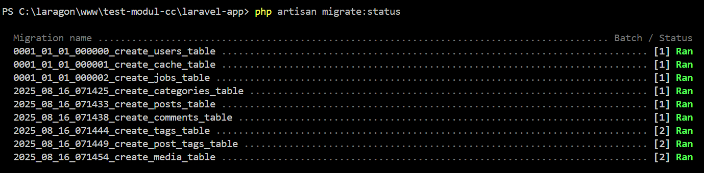
- [ ] Screenshot database tables di MySQL: `SHOW TABLES;`
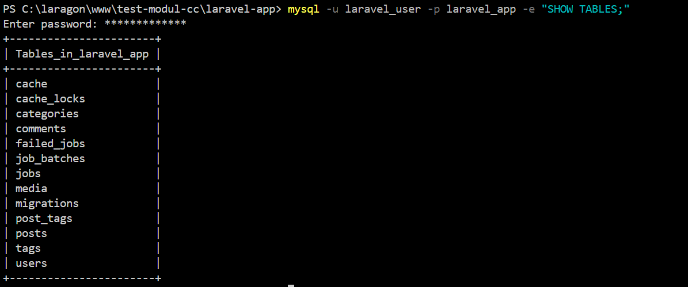
- [ ] Screenshot foreign key relationships: `SHOW CREATE TABLE posts\G;`
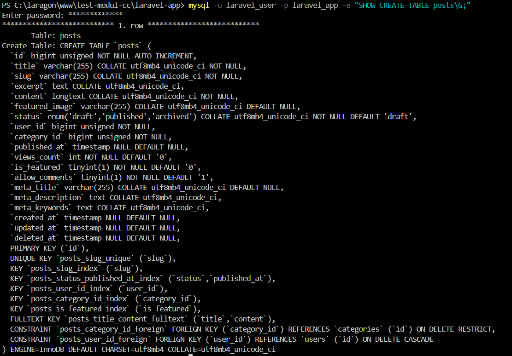

#### ✅ Laravel Migrations
- [ ] 6 migration files dengan proper foreign key constraints
- [ ] Screenshot migration rollback dan re-run berhasil
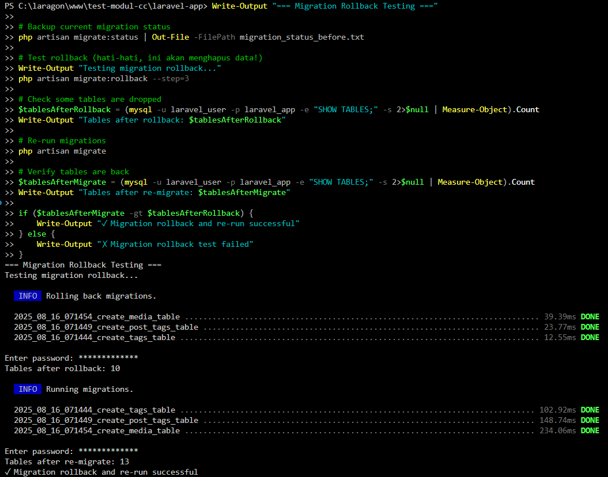
- [ ] Screenshot database after migrations dengan correct data types
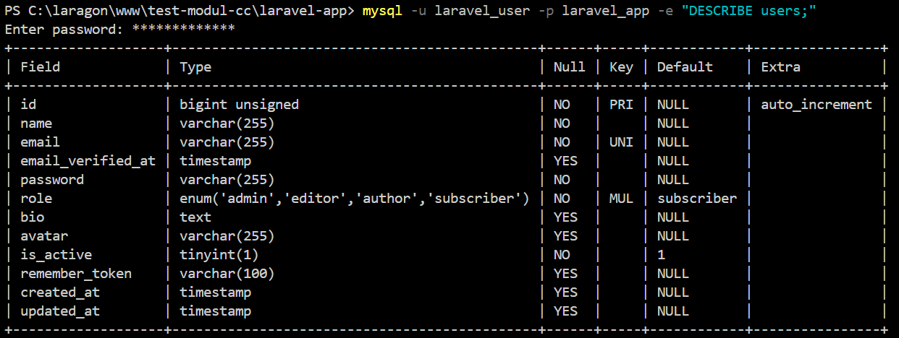
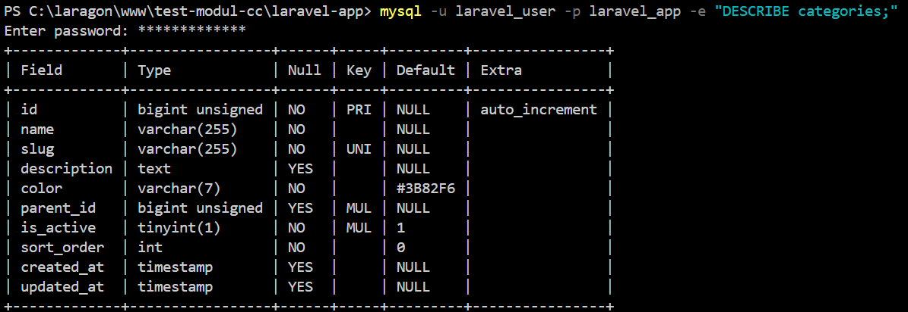
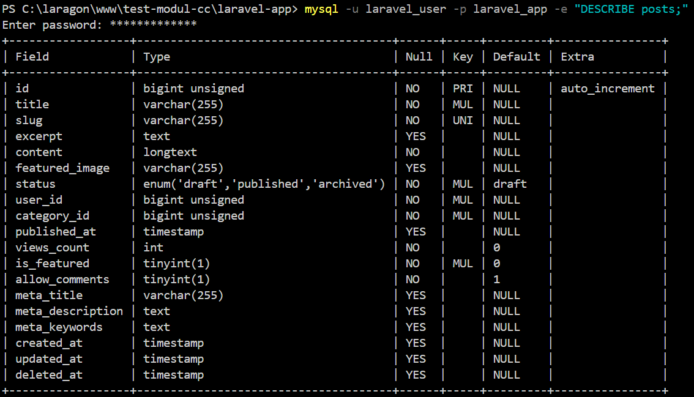
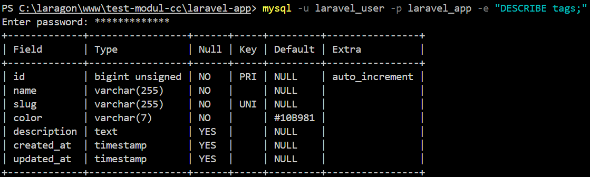
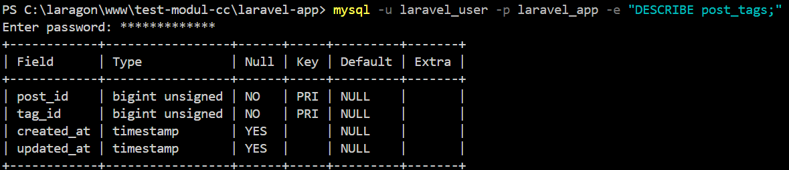
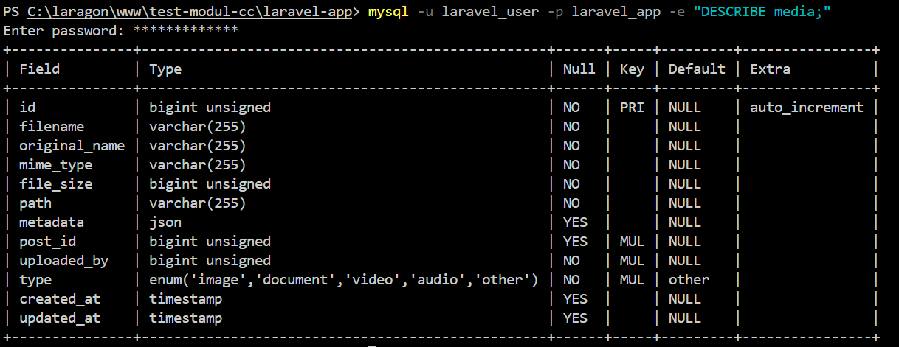
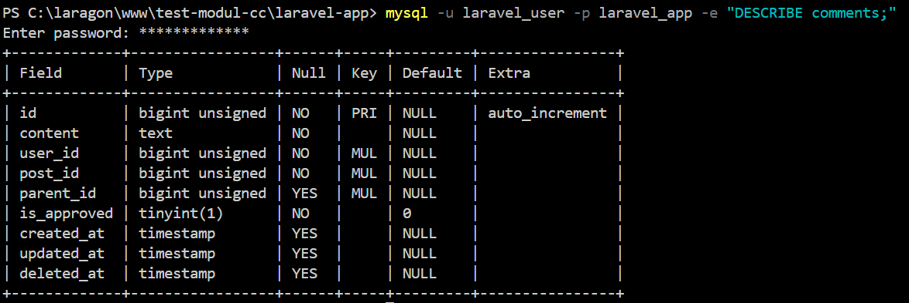
- [ ] File backup migration dengan `php artisan schema:dump`

#### ✅ Database Seeding
- [ ] Screenshot hasil `php artisan db:seed` successful execution
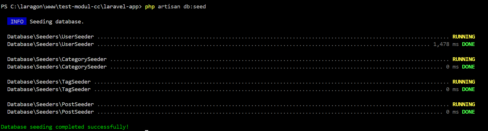
- [ ] Screenshot sample data di database tables
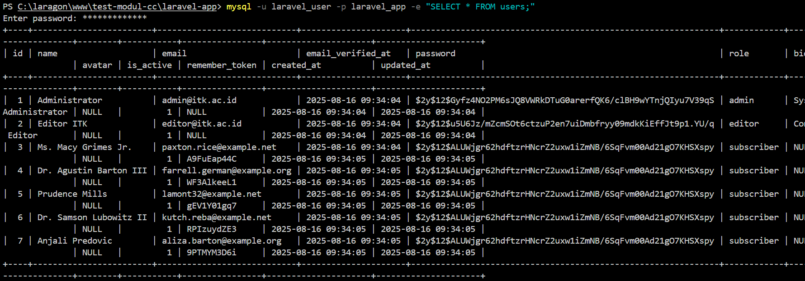
- [ ] Database backup file setelah seeding

#### ✅ Testing & Verification
- [ ] Screenshot 5 test suite results (semua ✓ passed)

#### ✅ Documentation
- [ ] File `week3/README.md` berisi:
  - Database design decisions dan rationale
  - Migration strategy dan execution steps
  - Model relationships explanation
  - Testing results dan performance metrics
  - Troubleshooting issues encountered dan solutions

**Format Submission:**
1. Buat folder submission/week3/
2. Masukkan semua screenshot dengan nama yang jelas
3. Buat file laporan dalam format Markdown
4. Commit dan push ke repository
5. Sertakan link commit terakhir