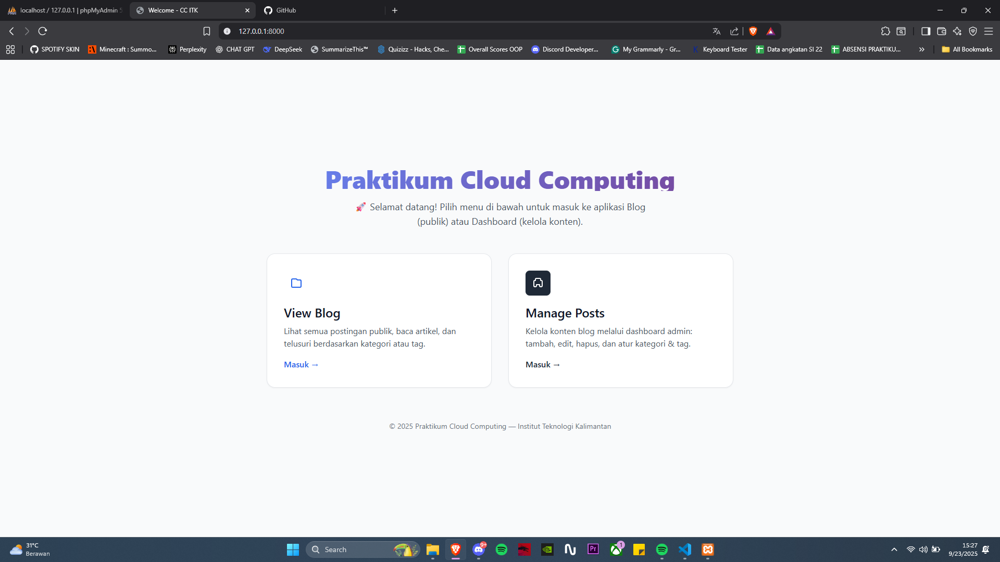

# WEEK 5: CRUD Operations - Implementasi Update, Delete, Tags, Blog, dan Bulk Operations pada Post Management
## Praktikum Cloud Computing - Institut Teknologi Kalimantan

### 📋 INFORMASI SESI
- **Week**: 5
- **Durasi**: 100 menit  
- **Topik**: Advanced CRUD Operations - Update & Delete dengan Relationship Handling
- **Target**: Mahasiswa Semester 6
- **Platform**: Laptop/PC (Windows, macOS, atau Linux)

### 🎯 TUJUAN PEMBELAJARAN
Setelah menyelesaikan praktikum ini, mahasiswa diharapkan mampu:
1. Mahasiswa mampu mengimplementasikan fitur update & delete pada posts.
2. Mahasiswa memahami konsep bulk operations.
3. Mahasiswa mampu mengimplementasikan tags dan blog
4. Mahasiswa dapat melakukan pengujian fitur melalui UI dashboard dan API.

### 📚 PERSIAPAN
**Prerequisites yang harus dipenuhi:**
- Week 1-4 telah completed dengan semua functionality working
- CRUD Create & Read operations sudah functional
- Database relationships sudah proper dengan foreign keys

### Langkah Praktikum
#### 1. Update app/Models/Post.php
```php
<?php

namespace App\Models;

use Illuminate\Database\Eloquent\Model;
use Illuminate\Database\Eloquent\SoftDeletes;

class Post extends Model
{
    use SoftDeletes;

    protected $fillable = [
        'title','slug','excerpt','content','featured_image',
        'status','user_id','category_id','published_at',
        'is_featured','allow_comments',
        'meta_title','meta_description','meta_keywords',
    ];

    protected $casts = [
        'published_at'  => 'datetime',
        'is_featured'   => 'boolean',
        'allow_comments'=> 'boolean',
    ];

    /* ---------- Relationships ---------- */
    public function user()     { return $this->belongsTo(User::class); }
    public function category() { return $this->belongsTo(Category::class); }
    public function tags()     { return $this->belongsToMany(Tag::class, 'post_tags'); }
    public function comments() { return $this->hasMany(Comment::class); }

    /* ---------- Query Scopes ---------- */
    public function scopePublished($q) {
        return $q->where('status','published')
                 ->whereNotNull('published_at')
                 ->where('published_at','<=', now());
    }

    public function scopeFeatured($q) {
        return $q->where('is_featured', true);
    }

    public function scopeSearch($q, string $term = null) {
        if (!filled($term)) return $q;
        $s = trim($term);
        return $q->where(function($x) use ($s) {
            $x->where('title','like',"%{$s}%")
              ->orWhere('excerpt','like',"%{$s}%")
              ->orWhere('content','like',"%{$s}%");
        });
    }

    /* ---------- Helpers ---------- */
    public function isPublished(): bool {
        return $this->status === 'published'
            && $this->published_at
            && $this->published_at->lte(now());
    }

    public function incrementViews(): void {
        // kolom views_count ada di migrasi week 3
        $this->increment('views_count');
    }
}
```

#### 2. app/Models/Category.php
```php
<?php

namespace App\Models;

use Illuminate\Database\Eloquent\Factories\HasFactory;
use Illuminate\Database\Eloquent\Model;
use Illuminate\Support\Str;

class Category extends Model
{
    use HasFactory;

    /**
     * Atribut yang dapat diisi secara mass assignment
     */
    protected $fillable = [
        'name',         // Nama kategori
        'slug',         // URL-friendly identifier
        'description',  // Deskripsi kategori
        'color',        // Hex color untuk UI
        'parent_id',    // Parent category ID untuk hierarchical structure
        'is_active',    // Status aktif kategori
        'sort_order',   // Urutan tampilan
    ];

    /**
     * Casting atribut ke tipe data yang sesuai
     */
    protected $casts = [
        'is_active' => 'boolean',   // Cast ke boolean
        'sort_order' => 'integer',  // Cast ke integer
    ];

    /**
     * Boot method untuk auto-generate slug
     */
    protected static function boot()
    {
        parent::boot();

        // Auto-generate slug dari name saat creating
        static::creating(function ($category) {
            if (empty($category->slug)) {
                $category->slug = Str::slug($category->name);
            }
        });

        // Update slug saat name berubah
        static::updating(function ($category) {
            if ($category->isDirty('name')) {
                $category->slug = Str::slug($category->name);
            }
        });
    }

    /**
     * Relationship: Category belongs to Parent Category
     * Self-referencing relationship untuk hierarchical structure
     */
    public function parent()
    {
        return $this->belongsTo(Category::class, 'parent_id');
    }

    /**
     * Relationship: Category has many Child Categories
     * Self-referencing relationship untuk hierarchical structure
     */
    public function children()
    {
        return $this->hasMany(Category::class, 'parent_id')
                   ->orderBy('sort_order');
    }

    /**
     * Relationship: Category has many Posts
     * Satu kategori dapat memiliki banyak posts
     */

    /**
     * Scope: Filter active categories only
     * Usage: Category::active()->get()
     */
public function posts() { return $this->hasMany(Post::class); }
public function scopeActive($q) { return $q->where('is_active', true); }


    /**
     * Scope: Get root categories (no parent)
     * Usage: Category::roots()->get()
     */
    public function scopeRoots($query)
    {
        return $query->whereNull('parent_id');
    }

    /**
     * Scope: Order by sort_order
     * Usage: Category::sorted()->get()
     */
    public function scopeSorted($query)
    {
        return $query->orderBy('sort_order');
    }

    /**
     * Get all posts count including from child categories
     * Menghitung total posts di kategori ini dan child categories
     */
    public function getTotalPostsCountAttribute()
    {
        $count = $this->posts()->count();
        
        foreach ($this->children as $child) {
            $count += $child->total_posts_count;
        }
        
        return $count;
    }

    /**
     * Get breadcrumb path untuk hierarchical navigation
     * Returns array of parent categories
     */
    public function getBreadcrumbAttribute()
    {
        $breadcrumb = collect([$this]);
        $parent = $this->parent;
        
        while ($parent) {
            $breadcrumb->prepend($parent);
            $parent = $parent->parent;
        }
        
        return $breadcrumb;
    }
}
```

#### 3. Update app/Models/Tag.php

```php
<?php

namespace App\Models;

use Illuminate\Database\Eloquent\Model;

class Tag extends Model
{
    protected $fillable = ['name','slug','description','color','is_active'];

    public function posts() {
        return $this->belongsToMany(Post::class, 'post_tags');
    }

    public function scopeActive($q) {
        return $q->where('is_active', true);
    }
}
```

#### 4. Buat file database migration dengan nama 2025_09_18_000001_add_is_active_to_tags_table.php
```php
<?php

use Illuminate\Database\Migrations\Migration;
use Illuminate\Database\Schema\Blueprint;
use Illuminate\Support\Facades\Schema;

return new class extends Migration {
    public function up(): void
    {
        Schema::table('tags', function (Blueprint $table) {
            $table->boolean('is_active')->default(true)->after('description');
            $table->index('is_active');
        });
    }
    public function down(): void
    {
        Schema::table('tags', function (Blueprint $table) {
            $table->dropIndex(['is_active']);
            $table->dropColumn('is_active');
        });
    }
};
```

#### 5. Buat file database migration dengan nama 
2025_09_20_000001_add_is_active_to_tags_table.php

```php
<?php

use Illuminate\Database\Migrations\Migration;
use Illuminate\Database\Schema\Blueprint;
use Illuminate\Support\Facades\Schema;

return new class extends Migration {
    public function up(): void {
        Schema::table('tags', function (Blueprint $table) {
            if (!Schema::hasColumn('tags', 'is_active')) {
                $table->boolean('is_active')->default(true)->after('color');
                $table->index('is_active');
            }
        });
    }
    public function down(): void {
        Schema::table('tags', function (Blueprint $table) {
            if (Schema::hasColumn('tags', 'is_active')) {
                $table->dropIndex(['is_active']);
                $table->dropColumn('is_active');
            }
        });
    }
};
```
```bash
php artisan migrate:refresh
php artisan db:seed
```

#### 6. Update app/Http/Requests/CategoryRequest.php

```php
<?php

namespace App\Http\Requests;

use Illuminate\Foundation\Http\FormRequest;
use Illuminate\Validation\Rule;

class CategoryRequest extends FormRequest
{
    public function authorize(): bool { return true; }

    public function rules(): array
    {
        $id = $this->route('category')?->id; // null kalau create
        return [
            'name'        => ['required','string','max:100'],
            'slug'        => ['nullable','string','max:120', Rule::unique('categories','slug')->ignore($id)],
            'parent_id'   => ['nullable','exists:categories,id'],
            'is_active'   => ['boolean'],
            'description' => ['nullable','string','max:500'],
        ];
    }

    protected function prepareForValidation(): void
    {
        $this->merge([
            'is_active' => filter_var($this->is_active, FILTER_VALIDATE_BOOL, FILTER_NULL_ON_FAILURE) ?? false,
        ]);
    }
}
```

#### 7. Update app/Http/Requests/TagRequest.php

```php
<?php

namespace App\Http\Requests;

use Illuminate\Foundation\Http\FormRequest;
use Illuminate\Validation\Rule;

class TagRequest extends FormRequest
{
    public function authorize(): bool { return true; }

    public function rules(): array
    {
        $id = $this->route('tag')?->id; // null saat create
        return [
            'name'        => ['required','string','max:100'],
            'slug'        => ['nullable','string','max:120', Rule::unique('tags','slug')->ignore($id)],
            'description' => ['nullable','string','max:500'],
            'color'       => ['nullable','string','max:7'], // e.g. #3B82F6
            'is_active'   => ['sometimes','boolean'],
        ];
    }

    protected function prepareForValidation(): void
    {
        $this->merge([
            'is_active' => filter_var($this->is_active, FILTER_VALIDATE_BOOL, FILTER_NULL_ON_FAILURE) ?? true,
        ]);
    }
}
```

#### 8. Buat file resources/views/blog/index.blade.php

```php 
@extends('layouts.app')
@section('title','Blog')
@section('content')
  <div class="grid md:grid-cols-3 gap-6">
    @foreach($posts as $post)
      <a href="{{ route('blog.show', $post->slug) }}" class="card block hover:shadow-md transition">
        @if($post->featured_image)
          featured_image) }}">
        @endif
        <h3 class="font-semibold text-lg">{{ $post->title }}</h3>
        <p class="text-sm text-gray-600 mt-1">
          {{ $post->category->name ?? 'Uncategorized' }} • {{ $post->published_at?->format('Y-m-d') }}
        </p>
        @if($post->excerpt)
          <p class="mt-2 text-gray-700">{{ Str::limit($post->excerpt, 120) }}</p>
        @endif
      </a>
    @endforeach
  </div>
  <div class="mt-6">{{ $posts->links() }}</div>
@endsection
```
#### 9. Buat file resources/views/blog/show.blade.php

```php
@extends('layouts.app')
@section('title', $post->title)
@section('content')
  <article class="prose max-w-none card">
    <h1>{{ $post->title }}</h1>
    <p class="text-sm text-gray-600">
      {{ $post->category->name ?? 'Uncategorized' }} • by {{ $post->user->name ?? '-' }} •
      {{ $post->published_at?->format('Y-m-d H:i') }}
    </p>
    @if($post->featured_image)
      featured_image) }}">
    @endif
    @if(filled($post->excerpt))
      <div class="p-4 bg-gray-50 border rounded">{{ $post->excerpt }}</div>
    @endif
    <div class="mt-4">{!! nl2br(e($post->content)) !!}</div>

    @if($post->tags->count())
      <div class="mt-6 flex flex-wrap gap-2">
        @foreach($post->tags as $tag)
          <span class="px-2 py-1 text-xs rounded bg-blue-50 text-blue-700 border">#{{ $tag->name }}</span>
        @endforeach
      </div>
    @endif
  </article>
@endsection
```

#### 10. Buat file resources/views/blog/category.blade.php

```php
@extends('layouts.app')
@section('title', 'Category: '.$category->name)
@section('content')
  <h1 class="text-2xl font-bold mb-4">Category: {{ $category->name }}</h1>
  @include('blog.partials.posts-grid', ['posts' => $posts])
@endsection
```

#### 11. Buat file resources/views/blog/tag.blade.php

```php
@extends('layouts.app')
@section('title', 'Tag: '.$tag->name)
@section('content')
  <h1 class="text-2xl font-bold mb-4">Tag: #{{ $tag->name }}</h1>
  @include('blog.partials.posts-grid', ['posts' => $posts])
@endsection
```

#### 12. Buat file resources/views/blog/search.blade.php

```php
@extends('layouts.app')
@section('title','Search')
@section('content')
  <form method="GET" action="{{ route('posts.search') }}" class="mb-4 flex gap-2">
    <input name="q" value="{{ $searchTerm }}" class="input-field flex-1" placeholder="Search posts...">
    <button class="btn-primary">Search</button>
  </form>

  @if($posts instanceof \Illuminate\Pagination\LengthAwarePaginator)
    @include('blog.partials.posts-grid', ['posts' => $posts])
    <div class="mt-6">{{ $posts->links() }}</div>
  @else
    <p class="text-gray-600">Masukkan kata kunci untuk mencari.</p>
  @endif
@endsection
```

#### 13. Buat file resources/views/blog/partials/posts-grid.blade.php

```php
<div class="grid md:grid-cols-3 gap-6">
  @forelse($posts as $post)
    <a href="{{ route('blog.show', $post->slug) }}" class="card block hover:shadow-md transition">
      @if($post->featured_image)
        featured_image) }}">
      @endif
      <h3 class="font-semibold text-lg">{{ $post->title }}</h3>
      <p class="text-sm text-gray-600 mt-1">
        {{ $post->category->name ?? 'Uncategorized' }} • {{ $post->published_at?->format('Y-m-d') }}
      </p>
      @if($post->excerpt)
        <p class="mt-2 text-gray-700">{{ Str::limit($post->excerpt, 120) }}</p>
      @endif
    </a>
  @empty
    <p class="text-gray-600">No posts.</p>
  @endforelse
</div>
```

```bash 
php artisan storage:link
```

#### 14. Update app/Models/Tag.php

```php
<?php

namespace App\Models;

use Illuminate\Database\Eloquent\Model;

class Tag extends Model
{
    protected $fillable = ['name','slug','description','color','is_active'];

    public function posts() {
        return $this->belongsToMany(Post::class, 'post_tags');
    }

    public function scopeActive($q) {
        return $q->where('is_active', true);
    }
}
```

#### 15. app/Http/Requests/TagRequest.php

```php
<?php

namespace App\Http\Requests;

use Illuminate\Foundation\Http\FormRequest;
use Illuminate\Validation\Rule;

class TagRequest extends FormRequest
{
    public function authorize(): bool { return true; }

    public function rules(): array
    {
        $id = $this->route('tag')?->id; // null saat create
        return [
            'name'        => ['required','string','max:100'],
            'slug'        => ['nullable','string','max:120', Rule::unique('tags','slug')->ignore($id)],
            'description' => ['nullable','string','max:500'],
            'color'       => ['nullable','string','max:7'], // e.g. #3B82F6
            'is_active'   => ['sometimes','boolean'],
        ];
    }

    protected function prepareForValidation(): void
    {
        $this->merge([
            'is_active' => filter_var($this->is_active, FILTER_VALIDATE_BOOL, FILTER_NULL_ON_FAILURE) ?? true,
        ]);
    }
}
```

#### 16. app/Http/Controllers/TagController.php

```php
<?php

namespace App\Http\Controllers;

use App\Http\Requests\TagRequest;
use App\Models\Tag;
use Illuminate\Http\Request;
use Illuminate\Support\Str;

class TagController extends Controller
{
    public function index(Request $request)
    {
        $search = $request->query('q');
        $status = $request->query('status'); // all|active|inactive

        $tags = Tag::query()
            ->when($search, fn($q) =>
                $q->where('name','like',"%{$search}%")
                  ->orWhere('slug','like',"%{$search}%")
                  ->orWhere('description','like',"%{$search}%")
            )
            ->when($status === 'active', fn($q) => $q->where('is_active', true))
            ->when($status === 'inactive', fn($q) => $q->where('is_active', false))
            ->orderBy('name')
            ->paginate(10)
            ->withQueryString();

        return view('tags.index', compact('tags','search','status'));
    }

    public function create()
    {
        return view('tags.create');
    }

    public function store(TagRequest $request)
    {
        $data = $request->validated();

        if (blank($data['slug'] ?? null)) {
            $data['slug'] = Str::slug($data['name']);
        }

        Tag::create($data);

        return redirect()->route('tags.index')->with('success','Tag created.');
    }

    public function edit(Tag $tag)
    {
        return view('tags.edit', compact('tag'));
    }

    public function update(TagRequest $request, Tag $tag)
    {
        $data = $request->validated();

        if (blank($data['slug'] ?? null)) {
            $data['slug'] = Str::slug($data['name']);
        }

        $tag->update($data);

        return redirect()->route('tags.index')->with('success','Tag updated.');
    }

    public function destroy(Tag $tag)
    {
        // optional: prevent delete if still used by posts
        if ($tag->posts()->exists()) {
            return back()->with('error','Cannot delete: tag is attached to posts.');
        }

        $tag->delete();
        return back()->with('success','Tag deleted.');
    }
}
```

#### 17. Update Route web.php

```php
<?php

use Illuminate\Support\Facades\Route;
use App\Http\Controllers\PostController;
use App\Http\Controllers\CategoryController;
use App\Http\Controllers\TagController;
use App\Http\Controllers\CommentController;
use App\Http\Controllers\DashboardController;
/*
|--------------------------------------------------------------------------
| Web Routes - Praktikum Cloud Computing ITK Week 4
|--------------------------------------------------------------------------
|
| Routes untuk CRUD operations dengan Laravel Resource Controllers
| Menggunakan RESTful conventions untuk consistent API design
|
*/

// Homepage route (dari week 2)
Route::get('/', function () {
    return view('welcome');
})->name('home');

// Dashboard route untuk admin interface
Route::get('/dashboard', function () {
    return view('dashboard');
})->name('dashboard');

/*
|--------------------------------------------------------------------------
| Resource Routes untuk CRUD Operations
|--------------------------------------------------------------------------
*/

// Posts management routes
Route::resource('posts', PostController::class)->names([
    'index' => 'posts.index',       // GET /posts - List all posts
    'create' => 'posts.create',     // GET /posts/create - Show create form
    'store' => 'posts.store',       // POST /posts - Store new post
    'show' => 'posts.show',         // GET /posts/{post} - Show single post
    'edit' => 'posts.edit',         // GET /posts/{post}/edit - Show edit form
    'update' => 'posts.update',     // PUT/PATCH /posts/{post} - Update post
    'destroy' => 'posts.destroy',   // DELETE /posts/{post} - Delete post
]);

// Categories management routes
Route::resource('categories', CategoryController::class)->except([
    'show' // Categories tidak memerlukan show page individual
]);

// Tags management routes  
Route::resource('tags', TagController::class)->except([
    'show' // Tags tidak memerlukan show page individual
]);

// Comments routes (nested dalam posts)
Route::resource('posts.comments', CommentController::class)->except([
    'index', 'show' // Comments di-handle dalam post show page
])->shallow(); // Shallow nesting untuk edit/update/delete

/*
|--------------------------------------------------------------------------
| Additional Routes untuk Enhanced Functionality
|--------------------------------------------------------------------------
*/

// Route untuk public post viewing (tanpa authentication)
Route::get('/blog', [PostController::class, 'publicIndex'])->name('blog.index');
Route::get('/blog/{post:slug}', [PostController::class, 'publicShow'])->name('blog.show');

// Route untuk category filtering
Route::get('/category/{category:slug}', [PostController::class, 'byCategory'])->name('posts.by-category');

// Route untuk tag filtering
Route::get('/tag/{tag:slug}', [PostController::class, 'byTag'])->name('posts.by-tag');

// Search functionality
Route::get('/search', [PostController::class, 'search'])->name('posts.search');

/*
|--------------------------------------------------------------------------
| Testing Routes untuk Development
|--------------------------------------------------------------------------
*/

// Route testing untuk development purposes
Route::get('/test-data', function () {
    return response()->json([
        'posts_count' => \App\Models\Post::count(),
        'categories_count' => \App\Models\Category::count(),
        'tags_count' => \App\Models\Tag::count(),
        'users_count' => \App\Models\User::count(),
        'latest_post' => \App\Models\Post::latest()->first()?->title ?? 'No posts yet',
        'timestamp' => now()->toISOString(),
    ]);
})->name('test-data');
Route::resource('tags', \App\Http\Controllers\TagController::class)->except('show');

```

#### 18. Update Route api.php

```php
<?php

use Illuminate\Http\Request;
use Illuminate\Support\Facades\Route;
use App\Http\Controllers\Api\PostApiController;
use App\Http\Controllers\Api\CategoryApiController;

/*
|--------------------------------------------------------------------------
| API Routes - Praktikum Cloud Computing ITK Week 4
|--------------------------------------------------------------------------
|
| API routes untuk AJAX operations dan frontend integration
| Semua routes menggunakan prefix 'api' dan middleware 'api'
|
*/

// API info endpoint
Route::get('/info', function (Request $request) {
    return response()->json([
        'application' => 'Praktikum Cloud Computing ITK',
        'version' => '1.0.0',
        'laravel_version' => app()->version(),
        'api_version' => 'v1',
        'timestamp' => now()->toISOString(),
        'endpoints' => [
            'posts' => '/api/posts',
            'categories' => '/api/categories',
            'search' => '/api/posts/search',
        ]
    ]);
});

/*
|--------------------------------------------------------------------------
| Posts API Routes
|--------------------------------------------------------------------------
*/

// RESTful API untuk posts
Route::apiResource('posts', PostApiController::class);

// Additional posts API endpoints
Route::prefix('posts')->group(function () {
    // Search posts by keyword
    Route::get('search/{keyword}', [PostApiController::class, 'search'])
          ->name('api.posts.search');
    
    // Get posts by category
    Route::get('category/{category}', [PostApiController::class, 'byCategory'])
          ->name('api.posts.by-category');
    
    // Get posts by tag
    Route::get('tag/{tag}', [PostApiController::class, 'byTag'])
          ->name('api.posts.by-tag');
    
    // Get featured posts
    Route::get('featured', [PostApiController::class, 'featured'])
          ->name('api.posts.featured');
    
    // Get published posts only
    Route::get('published', [PostApiController::class, 'published'])
          ->name('api.posts.published');
});

/*
|--------------------------------------------------------------------------
| Categories API Routes
|--------------------------------------------------------------------------
*/

// RESTful API untuk categories
Route::apiResource('categories', CategoryApiController::class);

// Additional categories API endpoints
Route::prefix('categories')->group(function () {
    // Get category tree (hierarchical structure)
    Route::get('tree', [CategoryApiController::class, 'tree'])
          ->name('api.categories.tree');
    
    // Get active categories only
    Route::get('active', [CategoryApiController::class, 'active'])
          ->name('api.categories.active');
});

/*
|--------------------------------------------------------------------------
| Statistics API Routes
|--------------------------------------------------------------------------
*/

// Dashboard statistics untuk admin interface
Route::get('/stats', function () {
    return response()->json([
        'total_posts' => \App\Models\Post::count(),
        'published_posts' => \App\Models\Post::published()->count(),
        'draft_posts' => \App\Models\Post::where('status', 'draft')->count(),
        'total_categories' => \App\Models\Category::count(),
        'total_tags' => \App\Models\Tag::count(),
        'total_users' => \App\Models\User::count(),
        'recent_posts' => \App\Models\Post::latest()->take(5)->pluck('title'),
        'generated_at' => now()->toISOString(),
    ]);
})->name('api.stats');

// Tambahkan setelah existing API routes

/*
|--------------------------------------------------------------------------
| Advanced Posts API Routes
|--------------------------------------------------------------------------
*/

Route::prefix('posts')->name('api.posts.')->group(function () {
    // Bulk operations via API
    Route::post('bulk-update', [PostApiController::class, 'bulkUpdate'])->name('bulk-update');
    Route::post('bulk-delete', [PostApiController::class, 'bulkDelete'])->name('bulk-delete');
    
    // Advanced filtering dan sorting
    Route::get('filter', [PostApiController::class, 'filter'])->name('filter');
    Route::get('search-advanced', [PostApiController::class, 'advancedSearch'])->name('search-advanced');
    
    // Post statistics dan analytics
    Route::get('stats', [PostApiController::class, 'statistics'])->name('statistics');
    Route::get('{post}/analytics', [PostApiController::class, 'analytics'])->name('analytics');
    
    // Related posts suggestions
    Route::get('{post}/related', [PostApiController::class, 'related'])->name('related');
    
    // Post revisions (if implemented)
    Route::get('{post}/revisions', [PostApiController::class, 'revisions'])->name('revisions');
});

/*
|--------------------------------------------------------------------------
| Admin Analytics API Routes
|--------------------------------------------------------------------------
*/

Route::prefix('admin')->name('api.admin.')->group(function () {
    // Dashboard statistics
    Route::get('dashboard-stats', function () {
        return response()->json([
            'posts' => [
                'total' => \App\Models\Post::count(),
                'published' => \App\Models\Post::published()->count(),
                'draft' => \App\Models\Post::where('status', 'draft')->count(),
                'archived' => \App\Models\Post::where('status', 'archived')->count(),
            ],
            'recent_activity' => [
                'posts_this_week' => \App\Models\Post::where('created_at', '>=', now()->subWeek())->count(),
                'posts_this_month' => \App\Models\Post::where('created_at', '>=', now()->subMonth())->count(),
            ],
            'top_categories' => \App\Models\Category::withCount('posts')
                                                  ->orderBy('posts_count', 'desc')
                                                  ->take(5)
                                                  ->get(['id', 'name', 'posts_count']),
            'popular_tags' => \App\Models\Tag::withCount('posts')
                                             ->orderBy('posts_count', 'desc')
                                             ->take(10)
                                             ->get(['id', 'name', 'posts_count']),
            'generated_at' => now()->toISOString(),
        ]);
    })->name('dashboard-stats');
    
    // Content performance metrics
    Route::get('content-metrics', function () {
        return response()->json([
            'most_viewed_posts' => \App\Models\Post::published()
                                                  ->orderBy('views_count', 'desc')
                                                  ->take(10)
                                                  ->get(['id', 'title', 'views_count', 'published_at']),
            'most_commented_posts' => \App\Models\Post::published()
                                                     ->withCount('comments')
                                                     ->orderBy('comments_count', 'desc')
                                                     ->take(10)
                                                     ->get(['id', 'title', 'comments_count']),
            'recent_comments' => \App\Models\Comment::with(['user:id,name', 'post:id,title'])
                                                   ->latest()
                                                   ->take(5)
                                                   ->get(),
            'generated_at' => now()->toISOString(),
        ]);
    })->name('content-metrics');
});

Route::get('/tags', fn() => \App\Models\Tag::active()->orderBy('name')->get());
```

#### 19. Buat file resources/views/tags/index.blade.php

```php
@extends('layouts.dashboard')

@section('title','Tags')
@section('page-title','Tags')
@section('page-description','Manage post tags')

@section('content')
<div class="flex items-center justify-between mb-4">
  <form method="GET" class="flex gap-2">
    <input name="q" value="{{ $search }}" class="input-field" placeholder="Search tags...">
    <select name="status" class="input-field">
      <option value="">All</option>
      <option value="active" @selected($status==='active')>Active</option>
      <option value="inactive" @selected($status==='inactive')>Inactive</option>
    </select>
    <button class="btn-secondary">Filter</button>
  </form>
  <a href="{{ route('tags.create') }}" class="btn-primary">+ New Tag</a>
</div>

<div class="card overflow-x-auto">
  <table class="w-full text-sm">
    <thead>
      <tr class="text-left text-gray-600 border-b">
        <th class="py-2 px-3">Name</th>
        <th class="py-2 px-3">Slug</th>
        <th class="py-2 px-3">Status</th>
        <th class="py-2 px-3">Color</th>
        <th class="py-2 px-3 w-40">Actions</th>
      </tr>
    </thead>
    <tbody>
      @forelse($tags as $tag)
        <tr class="border-b">
          <td class="py-2 px-3 font-medium">{{ $tag->name }}</td>
          <td class="py-2 px-3 text-gray-600">{{ $tag->slug }}</td>
          <td class="py-2 px-3">
            <span class="px-2 py-0.5 rounded text-xs
              {{ $tag->is_active ? 'bg-green-50 text-green-700 border border-green-200' : 'bg-gray-100 text-gray-700 border border-gray-200' }}">
              {{ $tag->is_active ? 'Active' : 'Inactive' }}
            </span>
          </td>
          <td class="py-2 px-3">
            @if($tag->color)
              <span class="inline-flex items-center gap-2">
                <span class="inline-block w-3 h-3 rounded" style="background: {{ $tag->color }}"></span>
                <code>{{ $tag->color }}</code>
              </span>
            @else
              <span class="text-gray-400">—</span>
            @endif
          </td>
          <td class="py-2 px-3">
            <a href="{{ route('tags.edit', $tag) }}" class="text-primary-600 hover:underline mr-3">Edit</a>
            <form action="{{ route('tags.destroy', $tag) }}" method="POST" class="inline"
                  onsubmit="return confirm('Delete this tag?');">
              @csrf @method('DELETE')
              <button class="text-red-600 hover:underline">Delete</button>
            </form>
          </td>
        </tr>
      @empty
        <tr><td colspan="5" class="py-6 text-center text-gray-500">No tags found.</td></tr>
      @endforelse
    </tbody>
  </table>
</div>

<div class="mt-4">
  {{ $tags->links() }}
</div>
@endsection
```

#### 20. Buat file resources/views/tags/create.blade.php

```php
@extends('layouts.dashboard')

@section('title','Create Tag')
@section('page-title','Create Tag')

@section('content')
<div class="max-w-xl">
  <form action="{{ route('tags.store') }}" method="POST" class="card space-y-4">
    @csrf
    <div>
      <label class="block text-sm font-medium mb-1">Name *</label>
      <input name="name" value="{{ old('name') }}" class="input-field w-full" required>
      @error('name') <p class="text-sm text-red-600">{{ $message }}</p> @enderror
    </div>
    <div>
      <label class="block text-sm font-medium mb-1">Slug</label>
      <input name="slug" value="{{ old('slug') }}" class="input-field w-full" placeholder="(auto if empty)">
      @error('slug') <p class="text-sm text-red-600">{{ $message }}</p> @enderror
    </div>
    <div>
      <label class="block text-sm font-medium mb-1">Description</label>
      <textarea name="description" rows="3" class="input-field w-full">{{ old('description') }}</textarea>
      @error('description') <p class="text-sm text-red-600">{{ $message }}</p> @enderror
    </div>
    <div class="grid grid-cols-2 gap-4">
      <div>
        <label class="block text-sm font-medium mb-1">Color (#HEX)</label>
        <input name="color" value="{{ old('color','#3B82F6') }}" class="input-field w-full" maxlength="7">
        @error('color') <p class="text-sm text-red-600">{{ $message }}</p> @enderror
      </div>
      <div class="flex items-end">
        <label class="inline-flex items-center">
          <input type="checkbox" name="is_active" value="1" class="mr-2" {{ old('is_active', true) ? 'checked' : '' }}>
          Active
        </label>
      </div>
    </div>

    <div class="flex justify-between pt-2">
      <a href="{{ route('tags.index') }}" class="btn-secondary">Cancel</a>
      <button class="btn-primary">Save</button>
    </div>
  </form>
</div>
@endsection
```

#### 21. Buat file resources/views/tags/edit.blade.php

```php
@extends('layouts.dashboard')

@section('title','Edit Tag')
@section('page-title','Edit Tag')

@section('content')
<div class="max-w-xl">
  <form action="{{ route('tags.update', $tag) }}" method="POST" class="card space-y-4">
    @csrf @method('PUT')
    <div>
      <label class="block text-sm font-medium mb-1">Name *</label>
      <input name="name" value="{{ old('name',$tag->name) }}" class="input-field w-full" required>
      @error('name') <p class="text-sm text-red-600">{{ $message }}</p> @enderror
    </div>
    <div>
      <label class="block text-sm font-medium mb-1">Slug</label>
      <input name="slug" value="{{ old('slug',$tag->slug) }}" class="input-field w-full" placeholder="(auto if empty)">
      @error('slug') <p class="text-sm text-red-600">{{ $message }}</p> @enderror
    </div>
    <div>
      <label class="block text-sm font-medium mb-1">Description</label>
      <textarea name="description" rows="3" class="input-field w-full">{{ old('description',$tag->description) }}</textarea>
      @error('description') <p class="text-sm text-red-600">{{ $message }}</p> @enderror
    </div>
    <div class="grid grid-cols-2 gap-4">
      <div>
        <label class="block text-sm font-medium mb-1">Color (#HEX)</label>
        <input name="color" value="{{ old('color',$tag->color) }}" class="input-field w-full" maxlength="7">
        @error('color') <p class="text-sm text-red-600">{{ $message }}</p> @enderror
      </div>
      <div class="flex items-end">
        <label class="inline-flex items-center">
          <input type="checkbox" name="is_active" value="1" class="mr-2" {{ old('is_active',$tag->is_active) ? 'checked' : '' }}>
          Active
        </label>
      </div>
    </div>

    <div class="flex justify-between pt-2">
      <a href="{{ route('tags.index') }}" class="btn-secondary">Back</a>
      <button class="btn-primary">Update</button>
    </div>
  </form>
</div>
@endsection
```

#### 22. Update welcome.blade.php

```php
<!DOCTYPE html>
<html lang="{{ str_replace('_', '-', app()->getLocale()) }}">
<head>
    <meta charset="utf-8">
    <meta name="viewport" content="width=device-width, initial-scale=1">
    <title>Welcome - CC ITK</title>
    @vite(['resources/css/app.css','resources/js/app.js'])
</head>
<body class="antialiased bg-gray-50 text-gray-900">

    <div class="min-h-screen flex flex-col justify-center items-center px-6">
        <!-- Logo / Title -->
        <div class="text-center mb-12">
            <h1 class="text-5xl font-extrabold text-gradient mb-4">
                Praktikum Cloud Computing
            </h1>
            <p class="text-lg text-gray-600 max-w-xl mx-auto">
                🚀 Selamat datang! Pilih menu di bawah untuk masuk ke aplikasi Blog (publik)
                atau Dashboard (kelola konten).
            </p>
        </div>

        <!-- Cards -->
        <div class="grid grid-cols-1 md:grid-cols-2 gap-8 max-w-4xl w-full">
            
            <!-- Blog Card -->
            <a href="{{ route('blog.index') }}"
               class="group bg-white border border-gray-200 rounded-2xl p-8 shadow-sm hover:shadow-lg transition flex flex-col items-start">
                <div class="flex items-center justify-center w-12 h-12 rounded-lg bg-primary-100 mb-4">
                    <svg class="w-6 h-6 text-primary-600" fill="none" stroke="currentColor" viewBox="0 0 24 24">
                        <path stroke-linecap="round" stroke-linejoin="round" stroke-width="2"
                              d="M19 20H5a2 2 0 01-2-2V6a2 2 0 012-2h7l2 2h5a2 2 0 012 2v10a2 2 0 01-2 2z"/>
                    </svg>
                </div>
                <h2 class="text-2xl font-semibold text-gray-900 mb-2 group-hover:text-primary-600 transition">
                    View Blog
                </h2>
                <p class="text-gray-600 mb-4 flex-1">
                    Lihat semua postingan publik, baca artikel, dan telusuri berdasarkan kategori atau tag.
                </p>
                <span class="mt-auto text-primary-600 font-medium">Masuk →</span>
            </a>

            <!-- Dashboard Card -->
            <a href="{{ route('posts.index') }}"
               class="group bg-white border border-gray-200 rounded-2xl p-8 shadow-sm hover:shadow-lg transition flex flex-col items-start">
                <div class="flex items-center justify-center w-12 h-12 rounded-lg bg-gray-800 mb-4">
                    <svg class="w-6 h-6 text-white" fill="none" stroke="currentColor" viewBox="0 0 24 24">
                        <path stroke-linecap="round" stroke-linejoin="round" stroke-width="2"
                              d="M9 17v-2h6v2a2 2 0 002 2h1a2 2 0 002-2V9a2 2 0 00-2-2h-1V5a2 2 0 00-2-2H9a2 2 0 00-2 2v2H6a2 2 0 00-2 2v8a2 2 0 002 2h1a2 2 0 002-2z"/>
                    </svg>
                </div>
                <h2 class="text-2xl font-semibold text-gray-900 mb-2 group-hover:text-gray-800 transition">
                    Manage Posts
                </h2>
                <p class="text-gray-600 mb-4 flex-1">
                    Kelola konten blog melalui dashboard admin: tambah, edit, hapus, dan atur kategori & tag.
                </p>
                <span class="mt-auto text-gray-800 font-medium">Masuk →</span>
            </a>

        </div>

        <!-- Footer -->
        <footer class="mt-16 text-sm text-gray-500">
            © {{ date('Y') }} Praktikum Cloud Computing — Institut Teknologi Kalimantan
        </footer>
    </div>
</body>
</html>
```

### 📋 DELIVERABLES

**Checklist yang harus diserahkan pada akhir sesi:**

#### ✅ View
1. View Landing Page 
2. View Blog
3. View Tags

#### ✅ Operation
1. Before dan After EDIT posts
2. Add dan Delete Posts
3. Add dan Delete Tags

**Format Submission:**
1. Buat folder submission/week/
2. Masukkan semua screenshot dengan nama yang jelas
3. Buat file laporan dalam format Markdown
4. Commit dan push ke repository
5. Sertakan link commit terakhir