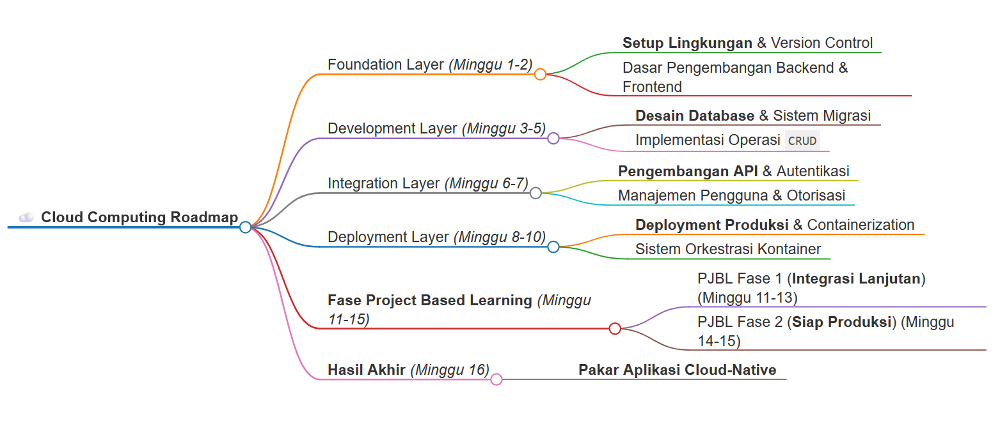

# RENCANA PEMBELAJARAN SEMESTER (RPS)
## 💻 PROGRAM STUDI SISTEM INFORMASI

---

## 📋 IDENTITAS MATA KULIAH

<table class="main-table">
<tr>
<td class="rps-label-alt">MATA KULIAH</td>
<td class="table-cell bold">KOMPUTASI AWAN</td>
<td class="rps-label-alt" style="width: 120px;">KODE</td>
<td class="table-cell">SI2514027</td>
</tr>
<tr>
<td class="rps-label-alt">DOSEN PENGAMPU</td>
<td class="table-cell">Aidil Saputra Kirsan, S.ST., M.Tr.Kom</td>
<td class="rps-label-alt">BOBOT (SKS)</td>
<td class="table-cell">3</td>
</tr>
<tr>
<td class="rps-label-alt">SEMESTER</td>
<td class="table-cell">6</td>
<td class="rps-label-alt">TANGGAL PENYUSUNAN</td>
<td class="table-cell">01 Agustus 2025</td>
</tr>
</table>

### OTORISASI

<table class="main-table center">
<thead>
<tr>
<th class="table-header">KOORDINATOR MATA KULIAH</th>
<th class="table-header">PENYUSUN RPS</th>
<th class="table-header">KOORDINATOR PROGRAM STUDI</th>
</tr>
</thead>
<tbody>
<tr>
<td class="table-cell">Aidil Saputra Kirsan, S.ST., M.Tr.Kom</td>
<td class="table-cell">Aidil Saputra Kirsan, S.ST., M.Tr.Kom</td>
<td class="table-cell">Sri Rahayu Natasia, S.Komp, M.Si., M.Sc.</td>
</tr>
</tbody>
</table>

---

## 🎯 CAPAIAN PEMBELAJARAN (CP)

### CAPAIAN PEMBELAJARAN LULUSAN (CPL)
> Mampu merancang infrastruktur TI, arsitektur jaringan, layanan fisik dan cloud, serta menganalisa konsep identifikasi, otentikasi, otorisasi akses dalam konteks perlindungan data dan informasi

### CAPAIAN PEMBELAJARAN MATA KULIAH (CPMK)
> Mampu mengembangkan, mengintegrasikan, dan mengelola solusi komputasi awan menggunakan arsitektur modern, containerization, CI/CD, dan orkestrasi untuk mendukung skalabilitas dan ketersediaan aplikasi berbasis cloud **(C5)**

---

## 📊 METODE PENILAIAN & SUB-CPMK MAPPING

<table class="main-table">
<thead>
<tr>
<th class="table-header" style="width: 150px;">Komponen Penilaian</th>
<th class="table-header center" style="width: 80px;">%</th>
<th class="table-header center" style="width: 50px;">1</th>
<th class="table-header center" style="width: 50px;">2</th>
<th class="table-header center" style="width: 50px;">3</th>
<th class="table-header center" style="width: 50px;">4</th>
<th class="table-header center" style="width: 50px;">5</th>
<th class="table-header center" style="width: 50px;">6</th>
<th class="table-header center" style="width: 50px;">7</th>
<th class="table-header center" style="width: 50px;">8</th>
</tr>
<tr>
<th class="table-subheader" colspan="2">Sub-CPMK</th>
<th class="table-subheader">1</th>
<th class="table-subheader">2</th>
<th class="table-subheader">3</th>
<th class="table-subheader">4</th>
<th class="table-subheader">5</th>
<th class="table-subheader">6</th>
<th class="table-subheader">7</th>
<th class="table-subheader">8</th>
</tr>
</thead>
<tbody>
<tr>
<td class="table-cell">Tugas 1 - Backend development foundation</td>
<td class="table-cell center bold">15%</td>
<td class="table-cell center">✓</td>
<td class="table-cell center">—</td>
<td class="table-cell center">—</td>
<td class="table-cell center">—</td>
<td class="table-cell center">—</td>
<td class="table-cell center">—</td>
<td class="table-cell center">—</td>
<td class="table-cell center">—</td>
</tr>
<tr>
<td class="table-cell-alt">Tugas 2 - Frontend development implementation</td>
<td class="table-cell-alt center bold">—</td>
<td class="table-cell-alt center">—</td>
<td class="table-cell-alt center">✓</td>
<td class="table-cell-alt center">—</td>
<td class="table-cell-alt center">—</td>
<td class="table-cell-alt center">—</td>
<td class="table-cell-alt center">—</td>
<td class="table-cell-alt center">—</td>
<td class="table-cell-alt center">—</td>
</tr>
<tr>
<td class="table-cell">Tugas 3 - Full-stack application integration</td>
<td class="table-cell center bold">—</td>
<td class="table-cell center">—</td>
<td class="table-cell center">—</td>
<td class="table-cell center">✓</td>
<td class="table-cell center">—</td>
<td class="table-cell center">—</td>
<td class="table-cell center">—</td>
<td class="table-cell center">—</td>
<td class="table-cell center">—</td>
</tr>
<tr>
<td class="table-cell-alt">Tugas 4 - Containerization with Docker</td>
<td class="table-cell-alt center bold">—</td>
<td class="table-cell-alt center">—</td>
<td class="table-cell-alt center">—</td>
<td class="table-cell-alt center">—</td>
<td class="table-cell-alt center">✓</td>
<td class="table-cell-alt center">—</td>
<td class="table-cell-alt center">—</td>
<td class="table-cell-alt center">—</td>
<td class="table-cell-alt center">—</td>
</tr>
<tr>
<td class="table-cell">Tugas 5 - Container orchestration systems</td>
<td class="table-cell center bold">—</td>
<td class="table-cell center">—</td>
<td class="table-cell center">—</td>
<td class="table-cell center">—</td>
<td class="table-cell center">—</td>
<td class="table-cell center">✓</td>
<td class="table-cell center">—</td>
<td class="table-cell center">—</td>
<td class="table-cell center">—</td>
</tr>
<tr>
<td class="table-cell-alt">Tugas 6 - CI/CD pipeline implementation</td>
<td class="table-cell-alt center bold">—</td>
<td class="table-cell-alt center">—</td>
<td class="table-cell-alt center">—</td>
<td class="table-cell-alt center">—</td>
<td class="table-cell-alt center">—</td>
<td class="table-cell-alt center">—</td>
<td class="table-cell-alt center">✓</td>
<td class="table-cell-alt center">—</td>
<td class="table-cell-alt center">—</td>
</tr>
<tr>
<td class="table-cell">Tugas 7 - Microservices architecture design</td>
<td class="table-cell center bold">—</td>
<td class="table-cell center">—</td>
<td class="table-cell center">—</td>
<td class="table-cell center">—</td>
<td class="table-cell center">—</td>
<td class="table-cell center">—</td>
<td class="table-cell center">—</td>
<td class="table-cell center">✓</td>
<td class="table-cell center">—</td>
</tr>
<tr>
<td class="table-cell-highlight bold">Peer-Review</td>
<td class="table-cell-highlight center bold">5%</td>
<td class="table-cell-highlight center">—</td>
<td class="table-cell-highlight center">—</td>
<td class="table-cell-highlight center">—</td>
<td class="table-cell-highlight center">—</td>
<td class="table-cell-highlight center">✓</td>
<td class="table-cell-highlight center">✓</td>
<td class="table-cell-highlight center">✓</td>
<td class="table-cell-highlight center">✓</td>
</tr>
<tr>
<td class="table-cell bold">UTS</td>
<td class="table-cell center bold">10%</td>
<td class="table-cell center">✓</td>
<td class="table-cell center">✓</td>
<td class="table-cell center">✓</td>
<td class="table-cell center">✓</td>
<td class="table-cell center">—</td>
<td class="table-cell center">—</td>
<td class="table-cell center">—</td>
<td class="table-cell center">—</td>
</tr>
<tr>
<td class="table-cell-alt bold">UAS (Proyek PJBL)</td>
<td class="table-cell-alt center bold" style="font-size: 16px;">60%</td>
<td class="table-cell-alt center">—</td>
<td class="table-cell-alt center">—</td>
<td class="table-cell-alt center">—</td>
<td class="table-cell-alt center">—</td>
<td class="table-cell-alt center">✓</td>
<td class="table-cell-alt center">✓</td>
<td class="table-cell-alt center">✓</td>
<td class="table-cell-alt center">✓</td>
</tr>
<tr>
<td class="table-cell bold">Praktikum</td>
<td class="table-cell center bold">10%</td>
<td class="table-cell center">—</td>
<td class="table-cell center">✓</td>
<td class="table-cell center">✓</td>
<td class="table-cell center">✓</td>
<td class="table-cell center">✓</td>
<td class="table-cell center">✓</td>
<td class="table-cell center">✓</td>
<td class="table-cell center">✓</td>
</tr>
<tr>
<td class="table-header center bold">TOTAL</td>
<td class="table-header center bold" style="font-size: 18px;">100%</td>
<td class="table-header center">—</td>
<td class="table-header center">—</td>
<td class="table-header center">—</td>
<td class="table-header center">—</td>
<td class="table-header center">—</td>
<td class="table-header center">—</td>
<td class="table-header center">—</td>
<td class="table-header center">—</td>
</tr>
</tbody>
</table>

## 📖 DESKRIPSI MATA KULIAH

> Mata kuliah Komputasi Awan membahas konsep, pengembangan, dan integrasi solusi komputasi awan dengan fokus pada arsitektur modern, containerization, orkestrasi, serta penerapan CI/CD untuk mendukung skalabilitas dan ketersediaan aplikasi berbasis cloud. Mahasiswa akan mempelajari pengembangan full-stack application, containerization menggunakan Docker, orkestrasi dengan Docker Compose dan Kubernetes, implementasi CI/CD pipeline, serta arsitektur microservices. Pembelajaran menggunakan pendekatan Project-based Learning (PjBL) untuk menghasilkan aplikasi cloud-native yang scalable dan production-ready

## 📚 BAHAN KAJIAN

1. **Pengembangan Backend**
2. **Pengembangan Frontend** 
3. **Integrasi Full-Stack**
4. **Containerization dengan Docker**
5. **Orkestrasi dengan Docker Compose**
6. **CI/CD (Continuous Integration/Continuous Deployment)**
7. **Microservices Architecture**

## 📖 PUSTAKA

### UTAMA
1. **Cloud Native DevOps with Kubernetes**. John Arundel, Justin Domingus. O'Reilly Media
2. **Docker Deep Dive**. Nigel Poulton. Independently Published
3. **Microservices Patterns**. Chris Richardson. Manning Publications

### PENDUKUNG
1. [**Docker Documentation**](https://docs.docker.com/)
2. [**Kubernetes Documentation**](https://kubernetes.io/docs/)
3. [**CI/CD Best Practices**](https://www.atlassian.com/continuous-delivery)
4. [**Cloud Native Computing Foundation**](https://www.cncf.io/)
5. [**Repository GitHub AidilSaputraKirsan**](https://github.com/aidilsaputrakirsan) - Source code, examples, dan materials mata kuliah

## 🎥 MEDIA PEMBELAJARAN

1. **E-book**
2. **File presentasi**
3. **Video pembelajaran**
4. **Tools**: Docker, Kubernetes, GitLab CI/CD, VS Code

## 🗺️ PETA KOMPETENSI

## 📅 RENCANA PEMBELAJARAN SEMESTER

### WEEK 1: Environment Setup & Version Control
<table class="rps-table">
<tr>
<td class="rps-header">Sub-CPMK (1)</td>
<td class="rps-header">Mahasiswa mampu menerapkan environment setup dan version control management untuk pengembangan aplikasi cloud <strong>(C3, A1)</strong></td>
</tr>
<tr>
<td class="rps-label-alt">Bahan Kajian</td>
<td class="rps-content">Kontrak kuliah, CI/CD (environment setup, version control, development workflow)</td>
</tr>
<tr>
<td class="rps-label">Metode</td>
<td class="rps-content">Kuliah, Diskusi, Pre-test</td>
</tr>
<tr>
<td class="rps-label-alt">Online</td>
<td class="rps-content"><strong>LMS Tugas 1:</strong> Environment setup & version control</td>
</tr>
<tr>
<td class="rps-label">Offline</td>
<td class="rps-content"><strong>[K]:</strong> Pemaparan materi, diskusi <strong>[P]:</strong> praktikum environment setup & version control</td>
</tr>
<tr>
<td class="rps-label-alt">Penilaian</td>
<td class="rps-content"><strong>Kriteria:</strong> Tugas | <strong>Indikator:</strong> Ketepatan dalam menerapkan environment setup dan version control</td>
</tr>
<tr>
<td class="rps-label">Durasi</td>
<td class="rps-content"><strong>Tatap Muka:</strong> 100 menit | <strong>Praktikum:</strong> 170 menit | <strong>Tugas & Mandiri:</strong> 240 menit</td>
</tr>
</table>

### WEEK 2: Backend & Frontend Development Foundation
<table class="rps-table">
<tr>
<td class="rps-header">Sub-CPMK (2)</td>
<td class="rps-header">Mahasiswa mampu mengaplikasikan pengembangan backend framework dan frontend UI development <strong>(C3, A1, P2)</strong></td>
</tr>
<tr>
<td class="rps-label-alt">Bahan Kajian</td>
<td class="rps-content">Pengembangan Backend, Pengembangan Frontend (framework installation, UI setup)</td>
</tr>
<tr>
<td class="rps-label">Metode</td>
<td class="rps-content">Kuliah, Diskusi, Praktikum, Pre-test</td>
</tr>
<tr>
<td class="rps-label-alt">Online</td>
<td class="rps-content"><strong>LMS Tugas 2:</strong> Backend & frontend development foundation</td>
</tr>
<tr>
<td class="rps-label">Offline</td>
<td class="rps-content"><strong>[K]:</strong> Pemaparan materi, diskusi <strong>[P]:</strong> praktikum backend & frontend development</td>
</tr>
<tr>
<td class="rps-label-alt">Penilaian</td>
<td class="rps-content"><strong>Kriteria:</strong> Tugas, Praktikum | <strong>Indikator:</strong> Ketepatan dalam mengaplikasikan backend & frontend development</td>
</tr>
<tr>
<td class="rps-label">Durasi</td>
<td class="rps-content"><strong>Tatap Muka:</strong> 100 menit | <strong>Praktikum:</strong> 170 menit | <strong>Tugas & Mandiri:</strong> 240 menit</td>
</tr>
</table>

### WEEK 3: Database Design & Migration Systems
<table class="rps-table">
<tr>
<td class="rps-header">Sub-CPMK (3)</td>
<td class="rps-header">Mahasiswa mampu merancang database dan mengimplementasikan migration systems <strong>(C3, A4, P2)</strong></td>
</tr>
<tr>
<td class="rps-label-alt">Bahan Kajian</td>
<td class="rps-content">Pengembangan Backend (database design, migration systems, data modeling)</td>
</tr>
<tr>
<td class="rps-label">Metode</td>
<td class="rps-content">Kuliah, Diskusi, Praktikum, Pre-test</td>
</tr>
<tr>
<td class="rps-label-alt">Online</td>
<td class="rps-content"><strong>LMS Tugas 3:</strong> Database design & migration systems</td>
</tr>
<tr>
<td class="rps-label">Offline</td>
<td class="rps-content"><strong>[K]:</strong> Pemaparan materi, diskusi <strong>[P]:</strong> praktikum database design & migration</td>
</tr>
<tr>
<td class="rps-label-alt">Penilaian</td>
<td class="rps-content"><strong>Kriteria:</strong> Tugas, Praktikum | <strong>Indikator:</strong> Ketepatan dalam merancang database dan migration systems</td>
</tr>
<tr>
<td class="rps-label">Durasi</td>
<td class="rps-content"><strong>Tatap Muka:</strong> 100 menit | <strong>Praktikum:</strong> 170 menit | <strong>Tugas & Mandiri:</strong> 240 menit</td>
</tr>
</table>

### WEEK 4: CRUD Operations - Create & Read
<table class="rps-table">
<tr>
<td class="rps-header">Sub-CPMK (4)</td>
<td class="rps-header">Mahasiswa mampu mengimplementasikan CRUD operations untuk Create dan Read operations <strong>(C3, A4)</strong></td>
</tr>
<tr>
<td class="rps-label-alt">Bahan Kajian</td>
<td class="rps-content">Integrasi Full-Stack (CRUD implementation, data flow management)</td>
</tr>
<tr>
<td class="rps-label">Metode</td>
<td class="rps-content">Kuliah, Diskusi, Praktikum</td>
</tr>
<tr>
<td class="rps-label-alt">Online</td>
<td class="rps-content"><strong>LMS Tugas 4:</strong> CRUD operations implementation (Create & Read)</td>
</tr>
<tr>
<td class="rps-label">Offline</td>
<td class="rps-content"><strong>[K]:</strong> Pemaparan materi, diskusi <strong>[P]:</strong> praktikum CRUD Create & Read operations</td>
</tr>
<tr>
<td class="rps-label-alt">Penilaian</td>
<td class="rps-content"><strong>Kriteria:</strong> Tugas, Praktikum | <strong>Indikator:</strong> Ketepatan dalam mengimplementasikan CRUD Create & Read</td>
</tr>
<tr>
<td class="rps-label">Durasi</td>
<td class="rps-content"><strong>Tatap Muka:</strong> 100 menit | <strong>Praktikum:</strong> 170 menit | <strong>Tugas & Mandiri:</strong> 240 menit</td>
</tr>
</table>

### WEEK 5: CRUD Operations - Update & Delete
<table class="rps-table">
<tr>
<td class="rps-header">Sub-CPMK (4)</td>
<td class="rps-header">Mahasiswa mampu mengimplementasikan CRUD operations untuk Update dan Delete operations <strong>(C3, A4)</strong></td>
</tr>
<tr>
<td class="rps-label-alt">Bahan Kajian</td>
<td class="rps-content">Integrasi Full-Stack (advanced CRUD operations, data validation, error handling)</td>
</tr>
<tr>
<td class="rps-label">Metode</td>
<td class="rps-content">Kuliah, Diskusi, Praktikum</td>
</tr>
<tr>
<td class="rps-label-alt">Online</td>
<td class="rps-content"><strong>LMS Tugas 4:</strong> CRUD operations implementation (Update & Delete)</td>
</tr>
<tr>
<td class="rps-label">Offline</td>
<td class="rps-content"><strong>[K]:</strong> Pemaparan materi, diskusi <strong>[P]:</strong> praktikum CRUD Update & Delete operations</td>
</tr>
<tr>
<td class="rps-label-alt">Penilaian</td>
<td class="rps-content"><strong>Kriteria:</strong> Tugas, Praktikum | <strong>Indikator:</strong> Ketepatan dalam mengimplementasikan CRUD Update & Delete</td>
</tr>
<tr>
<td class="rps-label">Durasi</td>
<td class="rps-content"><strong>Tatap Muka:</strong> 100 menit | <strong>Praktikum:</strong> 170 menit | <strong>Tugas & Mandiri:</strong> 240 menit</td>
</tr>
</table>

### WEEK 6: API Development & Authentication
<table class="rps-table">
<tr>
<td class="rps-header">Sub-CPMK (5)</td>
<td class="rps-header">Mahasiswa mampu mengembangkan API dan mengimplementasikan authentication systems <strong>(C3, A4)</strong></td>
</tr>
<tr>
<td class="rps-label-alt">Bahan Kajian</td>
<td class="rps-content">Pengembangan Backend (API development, authentication implementation)</td>
</tr>
<tr>
<td class="rps-label">Metode</td>
<td class="rps-content">Kuliah, Diskusi, Praktikum</td>
</tr>
<tr>
<td class="rps-label-alt">Online</td>
<td class="rps-content"><strong>LMS Tugas 5:</strong> API development & authentication</td>
</tr>
<tr>
<td class="rps-label">Offline</td>
<td class="rps-content"><strong>[K]:</strong> Pemaparan materi, diskusi <strong>[P]:</strong> praktikum API development & authentication</td>
</tr>
<tr>
<td class="rps-label-alt">Penilaian</td>
<td class="rps-content"><strong>Kriteria:</strong> Tugas, Praktikum | <strong>Indikator:</strong> Ketepatan dalam mengembangkan API dan authentication</td>
</tr>
<tr>
<td class="rps-label">Durasi</td>
<td class="rps-content"><strong>Tatap Muka:</strong> 100 menit | <strong>Praktikum:</strong> 170 menit | <strong>Tugas & Mandiri:</strong> 240 menit</td>
</tr>
</table>

### WEEK 7: User Authentication & Authorization
<table class="rps-table">
<tr>
<td class="rps-header">Sub-CPMK (6)</td>
<td class="rps-header">Mahasiswa mampu mengimplementasikan user authentication dan authorization management <strong>(C3, A4)</strong></td>
</tr>
<tr>
<td class="rps-label-alt">Bahan Kajian</td>
<td class="rps-content">Pengembangan Backend (user management, authorization systems, role-based access)</td>
</tr>
<tr>
<td class="rps-label">Metode</td>
<td class="rps-content">Kuliah, Diskusi, Praktikum</td>
</tr>
<tr>
<td class="rps-label-alt">Online</td>
<td class="rps-content"><strong>LMS Tugas 6:</strong> User management & authorization</td>
</tr>
<tr>
<td class="rps-label">Offline</td>
<td class="rps-content"><strong>[K]:</strong> Pemaparan materi, diskusi <strong>[P]:</strong> praktikum user authentication & authorization</td>
</tr>
<tr>
<td class="rps-label-alt">Penilaian</td>
<td class="rps-content"><strong>Kriteria:</strong> Tugas, Praktikum | <strong>Indikator:</strong> Ketepatan dalam mengimplementasikan user authentication & authorization</td>
</tr>
<tr>
<td class="rps-label">Durasi</td>
<td class="rps-content"><strong>Tatap Muka:</strong> 100 menit | <strong>Praktikum:</strong> 170 menit | <strong>Tugas & Mandiri:</strong> 240 menit</td>
</tr>
</table>

### WEEK 8: UTS

<strong>🎯 Evaluasi mencakup semua materi dari Week 1-7 dalam bentuk ujian praktik terintegrasi.</strong>

---

## 🚀 PROJECT BASED LEARNING PHASE

### WEEK 9: Production Deployment & Containerization
<table class="rps-table">
<tr>
<td class="rps-header">Sub-CPMK (7)</td>
<td class="rps-header">Mahasiswa mampu menerapkan production deployment dan containerization untuk aplikasi cloud-ready <strong>(C3)</strong></td>
</tr>
<tr>
<td class="rps-label-alt">Bahan Kajian</td>
<td class="rps-content">Containerization dengan Docker, CI/CD (deployment strategies, optimization)</td>
</tr>
<tr>
<td class="rps-label">Metode</td>
<td class="rps-content">Kuliah, Diskusi, Praktikum, Pre-test, <strong>(Project Based Learning)</strong></td>
</tr>
<tr>
<td class="rps-label-alt">Online</td>
<td class="rps-content"><strong>LMS Tugas 7:</strong> Production deployment & containerization</td>
</tr>
<tr>
<td class="rps-label">Penilaian</td>
<td class="rps-content"><strong>Kriteria:</strong> Tugas, Praktikum | <strong>Indikator:</strong> Ketepatan dalam menerapkan deployment & containerization</td>
</tr>
<tr>
<td class="rps-label-alt">Durasi</td>
<td class="rps-content"><strong>Tatap Muka:</strong> 100 menit | <strong>Praktikum:</strong> 170 menit | <strong>Tugas & Mandiri:</strong> 240 menit</td>
</tr>
</table>

### WEEK 10: Container Orchestration Systems
<table class="rps-table">
<tr>
<td class="rps-header">Sub-CPMK (7)</td>
<td class="rps-header">Mahasiswa mampu mengimplementasikan container orchestration untuk skalabilitas aplikasi <strong>(C3)</strong></td>
</tr>
<tr>
<td class="rps-label-alt">Bahan Kajian</td>
<td class="rps-content">Orkestrasi dengan Docker Compose (container orchestration, scaling strategies)</td>
</tr>
<tr>
<td class="rps-label">Metode</td>
<td class="rps-content">Kuliah, Diskusi, Praktikum, Pre-test, <strong>(Project Based Learning)</strong></td>
</tr>
<tr>
<td class="rps-label-alt">Durasi</td>
<td class="rps-content"><strong>Tatap Muka:</strong> 100 menit | <strong>Praktikum:</strong> 170 menit | <strong>Tugas & Mandiri:</strong> 240 menit</td>
</tr>
</table>

### WEEK 11-13: PJBL Progress 1
<table class="rps-table">
<tr>
<td class="rps-header">Sub-CPMK (8)</td>
<td class="rps-header">Mahasiswa mampu merancang dan mengimplementasikan CI/CD pipeline untuk automated deployment <strong>(C3, A4, P2)</strong></td>
</tr>
<tr>
<td class="rps-label-alt">Bahan Kajian</td>
<td class="rps-content">CI/CD (pipeline automation, continuous integration, continuous deployment)</td>
</tr>
<tr>
<td class="rps-label">Metode</td>
<td class="rps-content">Kuliah, Diskusi, Praktikum, Pre-test, <strong>(Project Based Learning)</strong></td>
</tr>
<tr>
<td class="rps-label-alt">Offline</td>
<td class="rps-content"><strong>[K]:</strong> Pemaparan materi, diskusi, <strong>Progress Projek 1</strong> <strong>[P]:</strong> praktikum CI/CD pipeline implementation</td>
</tr>
<tr>
<td class="rps-label">Durasi</td>
<td class="rps-content"><strong>Tatap Muka:</strong> 100 menit | <strong>Praktikum:</strong> 170 menit | <strong>Tugas & Mandiri:</strong> 240 menit</td>
</tr>
</table>

### WEEK 14-15: PJBL Progress 2
<table class="rps-table">
<tr>
<td class="rps-header">Sub-CPMK (8)</td>
<td class="rps-header">Mahasiswa mampu mendesain dan mengimplementasikan microservices architecture untuk aplikasi cloud-native <strong>(C3, A4, P2)</strong></td>
</tr>
<tr>
<td class="rps-label-alt">Bahan Kajian</td>
<td class="rps-content">Microservices Architecture (service decomposition, inter-service communication, distributed systems)</td>
</tr>
<tr>
<td class="rps-label">Metode</td>
<td class="rps-content">Kuliah, Diskusi, Praktikum, Pre-test, <strong>(Project Based Learning)</strong></td>
</tr>
<tr>
<td class="rps-label-alt">Offline</td>
<td class="rps-content"><strong>[K]:</strong> Pemaparan materi, diskusi, <strong>Progress Projek 2</strong> <strong>[P]:</strong> praktikum microservices architecture</td>
</tr>
<tr>
<td class="rps-label">Durasi</td>
<td class="rps-content"><strong>Tatap Muka:</strong> 100 menit | <strong>Praktikum:</strong> 170 menit | <strong>Tugas & Mandiri:</strong> 240 menit</td>
</tr>
</table>

### WEEK 16: UAS

<strong>🏆 Evaluasi komprehensif melalui presentasi dan demonstrasi Proyek Akhir Cloud-Native Application.</strong>

## 📊 KOMPOSISI NILAI EVALUASI

<table class="main-table">
<thead>
<tr>
<th class="table-header" style="text-align: left;">Komponen</th>
<th class="table-header center">Persentase</th>
<th class="table-header" style="text-align: left;">Detail</th>
</tr>
</thead>
<tbody>
<tr>
<td class="table-cell bold">Praktikum</td>
<td class="table-cell center bold" style="font-size: 16px;">10%</td>
<td class="table-cell">Implementasi hands-on setiap minggu</td>
</tr>
<tr>
<td class="table-cell-alt bold">Peer-Review</td>
<td class="table-cell-alt center bold" style="font-size: 16px;">5%</td>
<td class="table-cell-alt">Evaluasi kolaboratif antar mahasiswa</td>
</tr>
<tr>
<td class="table-cell-highlight bold">Perkuliahan</td>
<td class="table-cell-highlight center bold" style="font-size: 18px;">85%</td>
<td class="table-cell-highlight">Komponen utama penilaian</td>
</tr>
<tr>
<td class="table-cell" style="padding-left: 30px;">├── Tugas</td>
<td class="table-cell center bold">15%</td>
<td class="table-cell">7 tugas terstruktur</td>
</tr>
<tr>
<td class="table-cell-alt" style="padding-left: 30px;">├── UTS</td>
<td class="table-cell-alt center bold">10%</td>
<td class="table-cell-alt">Evaluasi tengah semester</td>
</tr>
<tr>
<td class="table-cell-final bold" style="padding-left: 30px;">└── UAS (Proyek PJBL)</td>
<td class="table-cell-final center bold" style="font-size: 18px;">60%</td>
<td class="table-cell-final bold">Project Based Learning</td>
</tr>
</tbody>
</table>

## SKALA PENILAIAN
<table class="main-table">
<thead>
<tr>
<th class="table-header">Nilai Angka</th>
<th class="table-header">Nilai Huruf</th>
<th class="table-header">Kategori</th>
</tr>
</thead>
<tbody>
<tr>
<td class="table-cell center">86 ≤ Nilai ≤ 100</td>
<td class="table-cell center bold" style="font-size: 16px;">A</td>
<td class="table-cell bold">Sangat Baik</td>
</tr>
<tr>
<td class="table-cell-alt center">76 ≤ Nilai < 86</td>
<td class="table-cell-alt center bold">AB</td>
<td class="table-cell-alt">Baik Sekali</td>
</tr>
<tr>
<td class="table-cell center">66 ≤ Nilai < 76</td>
<td class="table-cell center bold">B</td>
<td class="table-cell">Baik</td>
</tr>
<tr>
<td class="table-cell-alt center">56 ≤ Nilai < 66</td>
<td class="table-cell-alt center bold">BC</td>
<td class="table-cell-alt">Cukup Baik</td>
</tr>
<tr>
<td class="table-cell center">51 ≤ Nilai < 56</td>
<td class="table-cell center bold">C</td>
<td class="table-cell">Cukup</td>
</tr>
<tr>
<td class="table-cell-alt center">41 ≤ Nilai < 51</td>
<td class="table-cell-alt center bold">D</td>
<td class="table-cell-alt">Kurang</td>
</tr>
<tr>
<td class="table-cell center">0 ≤ Nilai < 41</td>
<td class="table-cell center bold">E</td>
<td class="table-cell">Sangat Kurang</td>
</tr>
</tbody>
</table>

---

## 📋 KONTRAK KULIAH

### LARANGAN & SANKSI
- **KECURANGAN** (plagiat, menyontek) → **Nilai 0**
- **MANIPULASI PRESENSI** → **Tidak Lulus**

### KETENTUAN PRESENSI
- **Online**: E-Learning (30 menit pertama)
- **Offline**: Tertulis di kelas
- **Syarat**: Baca RPS untuk akses online
- **Keterlambatan**: Diperbolehkan tanpa gaduh
- **Minimum**: 70% kehadiran untuk UAS

### KERJA KELOMPOK
- **Tidak hadir presentasi** → **Nilai 0**
- **Tidak aktif** → **Maksimal -50% nilai kelompok**
- **Izin sakit/izin**: Upload surat dalam 1 minggu

## 📊 RUBRIK PENILAIAN TUGAS (15% Total Nilai)

<table class="main-table">
<thead>
<tr>
<th class="table-header" style="text-align: left;">Aktivitas</th>
<th class="table-header center" style="width: 80px;">%</th>
<th class="table-header center">0-55 (E)</th>
<th class="table-header center">56-65 (BC)</th>
<th class="table-header center">66-75 (B)</th>
<th class="table-header center">76-85 (AB)</th>
<th class="table-header center">86-100 (A)</th>
</tr>
</thead>
<tbody>
<tr>
<td class="table-cell bold">Environment Setup & Version Control</td>
<td class="table-cell center bold">15%</td>
<td class="table-cell center">Tidak mengerjakan</td>
<td class="table-cell center">Tidak sesuai harapan</td>
<td class="table-cell center">Basic setup</td>
<td class="table-cell center">Setup baik</td>
<td class="table-cell center">Environment optimal</td>
</tr>
<tr>
<td class="table-cell-alt bold">Backend & Frontend Foundation</td>
<td class="table-cell-alt center bold">15%</td>
<td class="table-cell-alt center">Tidak mengerjakan</td>
<td class="table-cell-alt center">Tidak sesuai harapan</td>
<td class="table-cell-alt center">Foundation basic</td>
<td class="table-cell-alt center">Foundation baik</td>
<td class="table-cell-alt center">Foundation optimal</td>
</tr>
<tr>
<td class="table-cell bold">Database Design & Migration</td>
<td class="table-cell center bold">15%</td>
<td class="table-cell center">Tidak mengerjakan</td>
<td class="table-cell center">Tidak sesuai harapan</td>
<td class="table-cell center">Database basic</td>
<td class="table-cell center">Design & migration baik</td>
<td class="table-cell center">Database optimal</td>
</tr>
<tr>
<td class="table-cell-alt bold">CRUD Operations Implementation</td>
<td class="table-cell-alt center bold">20%</td>
<td class="table-cell-alt center">Tidak mengerjakan</td>
<td class="table-cell-alt center">Tidak sesuai harapan</td>
<td class="table-cell-alt center">CRUD basic</td>
<td class="table-cell-alt center">CRUD lengkap</td>
<td class="table-cell-alt center">CRUD optimal dengan validation</td>
</tr>
<tr>
<td class="table-cell bold">API Development & Authentication</td>
<td class="table-cell center bold">15%</td>
<td class="table-cell center">Tidak mengerjakan</td>
<td class="table-cell center">Tidak sesuai harapan</td>
<td class="table-cell center">API basic</td>
<td class="table-cell center">API & auth baik</td>
<td class="table-cell center">API & auth optimal</td>
</tr>
<tr>
<td class="table-cell-alt bold">User Management & Authorization</td>
<td class="table-cell-alt center bold">10%</td>
<td class="table-cell-alt center">Tidak mengerjakan</td>
<td class="table-cell-alt center">Tidak ada tahapan</td>
<td class="table-cell-alt center">User management basic</td>
<td class="table-cell-alt center">Authorization baik</td>
<td class="table-cell-alt center">Role-based access optimal</td>
</tr>
<tr>
<td class="table-cell bold">Production Deployment & Containerization</td>
<td class="table-cell center bold">10%</td>
<td class="table-cell center">Tidak mengerjakan</td>
<td class="table-cell center">Tidak sesuai harapan</td>
<td class="table-cell center">Deployment basic</td>
<td class="table-cell center">Containerization baik</td>
<td class="table-cell center">Production-ready optimal</td>
</tr>
</tbody>
</table>

---

## 🏆 RUBRIK PENILAIAN UAS/PJBL (60% Total Nilai)

<table class="main-table">
<thead>
<tr>
<th class="table-header" style="text-align: left;">Kriteria</th>
<th class="table-header center" style="width: 80px;">%</th>
<th class="table-header center">0-55 (E)</th>
<th class="table-header center">56-65 (BC)</th>
<th class="table-header center">66-75 (B)</th>
<th class="table-header center">76-85 (AB)</th>
<th class="table-header center">86-100 (A)</th>
</tr>
</thead>
<tbody>
<tr>
<td class="table-cell bold">Full-Stack Application Architecture</td>
<td class="table-cell center bold" style="font-size: 16px;">20%</td>
<td class="table-cell center">Tidak berfungsi</td>
<td class="table-cell center">Function sederhana</td>
<td class="table-cell center">Berfungsi basic</td>
<td class="table-cell center">Architecture baik</td>
<td class="table-cell center">Scalable & optimal architecture</td>
</tr>
<tr>
<td class="table-cell-alt bold">Database Design & Integration</td>
<td class="table-cell-alt center bold" style="font-size: 16px;">15%</td>
<td class="table-cell-alt center">Tidak sesuai</td>
<td class="table-cell-alt center">Database basic</td>
<td class="table-cell-alt center">Design cukup</td>
<td class="table-cell-alt center">Integration baik</td>
<td class="table-cell-alt center">Optimal database design</td>
</tr>
<tr>
<td class="table-cell bold">API Implementation & Security</td>
<td class="table-cell center bold" style="font-size: 16px;">15%</td>
<td class="table-cell center">Tidak ada API</td>
<td class="table-cell center">API error</td>
<td class="table-cell center">API basic</td>
<td class="table-cell center">Secure API</td>
<td class="table-cell center">RESTful API with authentication</td>
</tr>
<tr>
<td class="table-cell-alt bold">User Management & Authorization</td>
<td class="table-cell-alt center bold" style="font-size: 16px;">10%</td>
<td class="table-cell-alt center">Tidak ada</td>
<td class="table-cell-alt center">Basic login</td>
<td class="table-cell-alt center">User management basic</td>
<td class="table-cell-alt center">Role-based access</td>
<td class="table-cell-alt center">Advanced authorization system</td>
</tr>
<tr>
<td class="table-cell bold">Containerization & Orchestration</td>
<td class="table-cell center bold" style="font-size: 16px;">15%</td>
<td class="table-cell center">Tidak ada</td>
<td class="table-cell center">Container error</td>
<td class="table-cell center">Basic container</td>
<td class="table-cell center">Orchestration baik</td>
<td class="table-cell center">Production-ready containers</td>
</tr>
<tr>
<td class="table-cell-alt bold">CI/CD Pipeline Implementation</td>
<td class="table-cell-alt center bold" style="font-size: 16px;">15%</td>
<td class="table-cell-alt center">Tidak ada</td>
<td class="table-cell-alt center">Pipeline gagal</td>
<td class="table-cell-alt center">Manual deployment</td>
<td class="table-cell-alt center">Semi-automated</td>
<td class="table-cell-alt center">Fully automated CI/CD</td>
</tr>
<tr>
<td class="table-cell bold">Microservices Architecture</td>
<td class="table-cell center bold" style="font-size: 16px;">5%</td>
<td class="table-cell center">Monolithic</td>
<td class="table-cell center">Beberapa service</td>
<td class="table-cell center">Basic microservices</td>
<td class="table-cell center">Service communication</td>
<td class="table-cell center">Advanced microservices</td>
</tr>
<tr>
<td class="table-cell-alt bold">Documentation & Deployment</td>
<td class="table-cell-alt center bold" style="font-size: 16px;">5%</td>
<td class="table-cell-alt center">Tidak ada</td>
<td class="table-cell-alt center">Minimal docs</td>
<td class="table-cell-alt center">Cukup lengkap</td>
<td class="table-cell-alt center">Deployment guide</td>
<td class="table-cell-alt center">Comprehensive documentation</td>
</tr>
</tbody>
</table>

---
